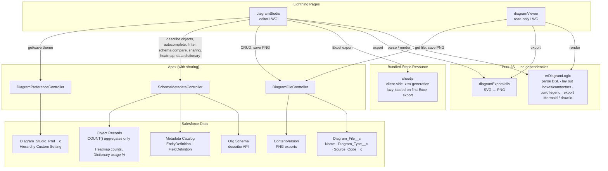

# Salesforce ER Modeller Studio — Phase 2: Data Architecture Intelligence

## Built by Crius Consulting architects — contributed to open source

Salesforce ER Modeller Studio, including the original **Phase 1**, was built by architects at **Crius Consulting**. Phase 2 continues that work by extending the Studio from ER modelling and org-aware documentation into deeper **Data Architecture Intelligence**.

This project reflects a core **Crius Consulting philosophy**: architects should not only design solutions for individual organisations; where appropriate, they should also build useful engineering tools and contribute practical capability back to the **open-source community**. We believe architecture knowledge becomes more valuable when it can be inspected, challenged, improved and reused by other practitioners.

ER Modeller Studio is therefore both a working Salesforce architecture tool and a Crius Consulting open-source contribution. Phase 1 established the modelling, DSL, metadata, visualisation, data-dictionary and export foundations. Phase 2 builds on those foundations with graph-based architecture intelligence, deeper structural analysis, performance guardrails and resilient error handling.

The intent is to keep the project useful to working Salesforce architects and engineers: transparent architecture evidence rather than opaque scores, practical tooling rather than slideware, and clear separation of concerns between **data architecture intelligence in ER Modeller Studio** and **security intelligence in Warden Studio**.

> **Phase 2 development branch** — Data Architecture Intelligence. The preserved Phase 1 release is available on the `phase-1-stable` branch; `main` remains unchanged. Existing Salesforce deployment/install paths are retained. The GitHub deploy buttons below still target `main` intentionally until Phase 2 is promoted as a release.

Phase 2 adds **View → Architecture Intelligence**, a compact graph-analysis workspace for the current model: structural hubs, isolated objects, incoming/outgoing coupling, relationship mix, connected components, relationship depth and cycle detection. These are descriptive architecture metrics, not a synthetic health score. Security posture, permissions and vulnerability analysis are explicitly outside this product and remain a Warden Studio concern. See [Phase 2 architecture notes](docs/PHASE-2-DATA-ARCHITECTURE-INTELLIGENCE.md).

A native Lightning Web Component app for building Entity-Relationship
diagrams of your Salesforce data model. Diagrams are stored as records
(`Diagram_File__c`) inside your org, so they live alongside the metadata
they describe and can be opened, edited, or pinned to a page by anyone
with access.

📄 **Not technical, or just want the short version?** See
[docs/ER-Modeller-Studio-Feature-List.pdf](docs/ER-Modeller-Studio-Feature-List.pdf)
for a plain-language feature overview with no code or setup steps.

## Contents

- [Installing](#installing)
- [What it does](#what-it-does)
  - [Modeling the diagram](#modeling-the-diagram)
  - [Org-aware views](#org-aware-views)
  - [Data Dictionary](#data-dictionary)
  - [Export](#export)
  - [Workspace & appearance](#workspace--appearance)
- [Components](#components)
- [Architecture](#architecture)
  - [How the DSL parser works internally](docs/dsl-compiler-architecture.md)
- [Deploying to an org](#deploying-to-an-org)
- [Setting it up in the org](#setting-it-up-in-the-org)
- [Quick start](#quick-start)
- [Testing](#testing)
- [Security overview](docs/SECURITY.md)
- [Author](#author)
- [License](#license)
- [Contributing](#contributing)

## Installing

> **Important — the unmanaged package is Phase 1 only.** The unmanaged package links below install the stable **Phase 1** version of ER Modeller Studio. They do **not** contain Phase 2 Data Architecture Intelligence or any other changes developed on the `phase-2-data-architecture-intelligence` branch. Phase 2 is currently a development branch and has not yet been promoted into the unmanaged package.

**Phase 1 unmanaged package** — the simplest option for installing the stable Phase 1 release: no GitHub OAuth, no CLI, just a link and a login.

- **Production or Developer Edition:**
  [https://login.salesforce.com/packaging/installPackage.apexp?p0=04taj000000gRTd](https://login.salesforce.com/packaging/installPackage.apexp?p0=04taj000000gRTd)
- **Sandbox:**
  [https://test.salesforce.com/packaging/installPackage.apexp?p0=04taj000000gRTd](https://test.salesforce.com/packaging/installPackage.apexp?p0=04taj000000gRTd)

Same package either way — only the domain changes
(`login.salesforce.com` vs `test.salesforce.com`), since that's what
tells Salesforce which kind of org you're logging into. Click the link
for your org type, log in, choose who to install it for (Admins Only is
the safest default — you assign the `Diagram Studio User` permission
set to specific people afterward), and install. This is an *unmanaged*
package — once installed, every component is fully yours to edit
directly in the org, same as if you'd deployed the source yourself; see
[docs/SECURITY.md](docs/SECURITY.md) for what data it does and doesn't touch.

**Or, deploy the stable Phase 1 release straight from GitHub:**

> The deploy buttons below intentionally target `main`, which is the Phase 1 line. They therefore **do not deploy Phase 2**. This is deliberate while Phase 2 remains under development.

<a href="https://githubsfdeploy.herokuapp.com/app/githubdeploy/vikascohen/Salesforce-ER-Modeller-Studio?ref=main">
  
</a>
&nbsp;&nbsp;
<a href="https://githubsfdeploy-sandbox.herokuapp.com/app/githubdeploy/vikascohen/Salesforce-ER-Modeller-Studio?ref=main">
  
</a>

Left button logs you into Production/Developer Edition, right button lets
you into a Sandbox, and either way you land on a page listing every
component in this repo with checkboxes — review what's about to deploy,
then click Deploy.

This uses [githubsfdeploy](https://github.com/afawcett/githubsfdeploy), a
well-known community tool (not an official Salesforce or Anthropic
product) that reads a GitHub repo over OAuth and pushes it straight into
an org via the Metadata API — no local `sf` CLI or clone required. Since
it's a third-party OAuth flow, only use it with orgs and repos you trust;
if you'd rather not grant OAuth access at all, use the unmanaged package
link above, or the
[`sf project deploy start`](#deploying-to-an-org) route below —
same result, nothing leaves your machine.

## What it does

### Modeling the diagram

- **Live DSL editor** — a resizable, collapsible code panel next to the
  file explorer where you type entity/relationship lines and watch the
  canvas render as you type. Context-aware autocomplete (entity names,
  field names, relationship arrows, target entities) suggests from your
  org's real schema — picking a field inserts its real type (and
  required/roll-up markers, when they apply) automatically, the exact
  same bracket text Import from Org would generate for that field, so
  hand-picking from the dropdown and importing the whole object produce
  identical DSL. See [docs/DSL.md](docs/DSL.md) for the full syntax,
  or [docs/dsl-compiler-architecture.md](docs/dsl-compiler-architecture.md)
  for how parsing and rendering actually work internally.
- **Import from your org** — **File > Import from Org**: give it object
  API names and it describes them from your org's actual fields and
  relationships (Master-Detail, Lookup, Polymorphic Lookup) and generates
  the DSL for you.
- **Roll-Up Summary fields are visible on the canvas** — a small teal Σ
  marker next to any field that's a genuine roll-up summary, the same
  pattern as the gold `*` for primary keys and purple `~` for
  relationships. Populated automatically when importing from your org, or
  written by hand with an optional `[rollup]` suffix on a field
  (`TotalProductAmount[rollup]`) — entirely optional, so DSL written
  before this existed still parses exactly as it always did. Detecting a
  genuine roll-up (vs. an ordinary Formula field, which describes almost
  identically) uses a verified technique, not a guess: a roll-up's
  `getCalculatedFormula()` comes back blank, a real formula's doesn't.
- **Required fields are visible on the canvas too** — a small red `R` at
  the right edge of the field's row, independent of and combinable with
  the PK/relationship/rollup markers on the left. Populated automatically
  when importing from your org (using the field's own schema definition —
  not nillable — never the importing user's own create permission), or
  written by hand with `[Required]` — combinable with a type label or
  `[rollup]` in the same bracket, e.g. `AnnualRevenue[Currency, Required]`.
  Required fields are also sorted to the top of each entity's field list
  automatically on import, ahead of everything else.
- **Object palette** — a searchable list of every object you can access;
  drag one onto the canvas and it auto-wires any relationships it has to
  entities already there.
- **Freeform canvas** — drag boxes to reposition, resize the height or
  width of a box, collapse long field lists, zoom in/out, or use
  **Diagram > Auto Layout** to snap everything back to a grid. A box with
  many fields (Account can easily have 70+) shows a **"+N more (click to
  show all)"** hint at the bottom — click it, or double-click the resize
  handle, to instantly restore the box to its natural height rather than
  manually dragging it there, which for a large object can mean an
  impractically long drag well beyond what fits on screen in one motion.
  Click an entity's header to enter **Focus mode** — everything except
  it and its direct relationships fades out; click it again (or empty
  canvas) to release.
- **Smart relationship linter** — once a couple of related objects are on
  the canvas, the DSL editor notices relationship fields pointing at
  another entity already there but not yet wired up, and suggests adding
  the line.
- **Compare with org schema** — **Diagram > Compare with Org**:
  re-describes every entity on the canvas that maps to a real org object
  and diffs it against the diagram — fields the org has that the diagram
  doesn't, and fields the diagram lists that the org didn't return
  (renamed, deleted, or hidden by field-level security). One click adds
  or removes each.
- A few deliberate parsing refinements: entity names match
  case-insensitively (`account` and `Account` merge into one box, not
  two); a field genuinely polymorphic to more than one object shows every
  target on its row; a self-relationship (`Account.ParentId -> Account`)
  draws as a loop instead of collapsing to nothing; multiple relationships
  between the same two entities fan out instead of overlapping.

### Org-aware views

Two independent, opt-in toggles in the **View** menu that read live org
data and badge or color the canvas — neither is on by default, neither
runs against more than what's currently on the canvas, and both re-fetch
fresh every time (nothing here is cached). A third feature, the hover
card below, needs no toggle of its own — it just aggregates whatever the
other two have already fetched.

- **Sharing View** — badges each object with its org-wide default sharing
  model, sourced from `EntityDefinition` (the same data Setup shows under
  Object Manager > Sharing Settings, not otherwise available via the
  describe API). Shows **internal** (regular org users — solid badge) and
  **external** (Experience Cloud / community / guest users — hollow
  badge, when configured) side by side. A Master-Detail child's internal
  badge naturally comes back as *Controlled by Parent* — exactly what
  shows its sharing is inherited, reasoning that's normally spread across
  several Setup pages. Org-wide defaults are read directly, via
  `EntityDefinition`; role hierarchy is not read at all (there's no
  narrow, per-object question to ask it — see below for why sharing
  rules and Apex Managed Sharing are handled differently, on the hover
  card, not here).
- **Sharing Rules / Apex Sharing (on the hover card, alongside Sharing
  View's org-wide default badges)** — deliberately Tooling-API-free:
  rather than reading the actual `SharingRules` metadata (which would
  need a Named Credential and a Connected App, neither required for
  anything else in this app), this reads the *runtime effect* instead —
  the distinct `RowCause` values present on the object's own `__Share`
  table, which is plain, regular SOQL. `RowCause = 'Rule'` reliably
  means a sharing rule has fired, on any object. Apex Managed Sharing is
  a genuinely different story: it can only be told apart from a person
  manually sharing one record on a **custom** object, since standard
  objects can't define their own Apex Sharing Reason at all and both use
  the exact same `RowCause` ('Manual') there — so the hover card says
  **"Not determinable on standard objects"** rather than guessing, since
  a definite answer there would be actively misleading, not just
  incomplete. An object with no `__Share` table at all (a custom object
  with Public Read/Write, for instance, never gets one) shows "No
  sharing data for this object" instead of a false negative.
- **Heatmap** — colors each box by activity, not just whether it has any
  records: light orange if genuinely empty, light blue if it has records
  and at least one was touched within the last year, light amber if it
  has records but none touched in over a year — a real signal that's
  easy to miss otherwise, since a box with thousands of records nobody's
  touched in three years used to look identical to one being actively
  used today. One aggregate query per object (`COUNT(Id)` and
  `MAX(LastModifiedDate)` together), nothing about the records
  themselves is read. The actual count is badged at the top (e.g.
  `1.2K`, `45`); hovering the badge (or the object summary hover card
  below) shows the exact last-touched date.
- **Object summary hover card** — hover any entity on the canvas (no
  toggle needed) for a small card with its field count and standard/custom
  status, plus whatever the two toggles above have already fetched:
  record count (with the same stale/active distinction the heatmap
  color encodes, stated in words — "Stale — Last touched 14/3/2023" vs.
  "Last touched yesterday" — not left for you to infer from a color),
  internal/external sharing, and Sharing Rules / Apex Sharing (see above
  for the accuracy limit on standard objects — this is stated plainly
  on the card itself, not glossed over). Ties every view together into
  one glance instead of separate badges to read — and for anything from
  a toggle you haven't turned on yet, the card says so directly
  ("Turn on Heatmap to see this") rather than just omitting the row
  silently. Dismisses on **Esc**, or automatically if you delete the
  entity it's showing — it never lingers over a box that's no longer
  there.

### Data Dictionary

A full-screen tab, separate from the canvas, for browsing every
accessible object in the org — toggle it from the **View** menu.

- **Left**: search or scroll the full object list (reuses data already
  loaded for the palette, so it's instant).
- **Right**: select an object for a full field-level table — label,
  description, data type, required, custom, primary key, foreign key
  (and which object it points to), last modified. **Data type** shows
  Setup's actual field-type labels (`Text`, `Number`,
  `Master-Detail Relationship`, `Formula (Number)`, `Roll-Up Summary`,
  `Text Area (Long)`...)
  rather than the raw Apex describe enum name. **Description** and
  **last-modified date** come from `FieldDefinition`, metadata the
  regular describe API doesn't expose at all.
- **Sortable columns** — click **Field API Name**, **Required**, or
  **Custom** to sort (each shows a faint always-on indicator so it's clear
  they're sortable); click again to reverse. A **Clear Selection** button
  resets the right panel back to nothing-selected without touching the
  object list on the left.
- **% Used** (how many existing records have a non-blank value) is a
  genuine data scan, so it's opt-in per object via a **Calculate Usage %**
  button rather than automatic — deliberately, to keep browsing instant.
- **Export** the current object to CSV or a real `.xlsx` (respecting
  whatever sort is currently applied), or **Export All** as one workbook
  with every object on its own tab (bulk export skips % Used, to stay
  fast and safely inside governor limits across potentially hundreds of
  objects, and has no per-object sort to respect).
- The dictionary is an overlay, not a page change — closing it (**← Back
  to Diagram**, or the × close) returns you to the canvas exactly as you
  left it: zoom, position, and open tabs untouched.

### Export

- Render the current diagram to **PNG** at native size, A4 landscape, or
  A3 landscape, with the relationship legend baked into the image.
  Exports are saved as a Salesforce File and downloaded from there (no
  client-side blob tricks, so it works under Lightning Web Security).
- The export modal also gives you **Mermaid `erDiagram` syntax** (paste
  into a GitHub README, Confluence, or Notion page — it renders live
  there) or a **draw.io / diagrams.net file** — laid out using your
  diagram's *actual* canvas positions, not auto-arranged from scratch.
  Both show each field's real Salesforce data type (`Currency`,
  `Text Area (Long)`, `Roll-Up Summary`...) rather than a generic
  placeholder — carried through from whatever was imported from the org,
  or typed by hand with the same optional bracket syntax as
  `[rollup]` (e.g. `AnnualRevenue[Currency]`).
- **Read-only viewer** (`diagramViewer`) — a companion component for
  Record/App/Home pages that pins a saved diagram for people who just
  need to look at it, with its own PNG export and legend.

### Workspace & appearance

- **Multi-file workspace** — a VS Code–style tab strip and sidebar file
  list; open several diagrams at once, rename, duplicate, or delete them.
  Diagram names must be unique — saving or renaming to a name another
  diagram already has (case-insensitive) is rejected with a clear message
  rather than silently creating two records sharing the same name.
- **Themes** — a selector in the toolbar switches between four real VS
  Code themes: **Dark+** and **Light+** (VS Code's own defaults, blue
  accent), **Monokai**, and **Solarized Light** — applies instantly across
  the whole app, Data Dictionary included. Your choice is remembered per
  user (via a Hierarchy Custom Setting, not just the browser you're on),
  so it follows you across sessions and devices.
  Status colors (error red, success green) and the
  Master-Detail/Lookup/Polymorphic relationship colors on the canvas are
  deliberately left out of theming — they're semantic, and the
  relationship colors specifically have to stay identical to what gets
  baked into PNG/Mermaid/draw.io exports, or the on-screen diagram and
  the exported file would disagree with each other.

## Components

| Type | Name | Purpose |
|---|---|---|
| LWC | `diagramStudio` | The main editor — canvas, sidebar, DSL editor with intellisense, tabs, palette, import panel, export modal, zoom, Data Dictionary, themes. Deployable to an App Page, Record Page, Home Page, or its own Tab. |
| LWC | `diagramViewer` | Read-only, drop it on any page and point it at a saved diagram's Id. |
| LWC | `erDiagramLogic` | Pure JS: parses the DSL, lays out boxes/connectors, builds the export legend, and generates Mermaid `erDiagram` / draw.io XML. No UI, no dependencies — imported by both components above. |
| LWC | `diagramExportUtils` | Pure JS: renders an SVG diagram to a PNG (canvas-based). Shared by both components. |
| Apex | `DiagramFileController` | CRUD for `Diagram_File__c` records, plus saving a PNG export as a Salesforce File. |
| Apex | `SchemaMetadataController` | Read-only schema introspection — object/field describe for the import panel/palette/autocomplete, internal + external sharing model for Sharing View, sharing rule and Apex Managed Sharing detection (via `__Share` table `RowCause` values, not Tooling API) for the hover card, per-object record counts and freshness (most recent LastModifiedDate) for the Heatmap, and the Data Dictionary's field descriptions, last-modified dates, and on-demand usage percentages. |
| Apex | `DiagramPreferenceController` | Gets/saves the current user's selected theme, backed by a Hierarchy Custom Setting. |
| Object | `Diagram_File__c` | Stores each diagram: `Name`, `Diagram_Type__c`, `Source_Code__c` (the DSL text). |
| Custom Setting | `Diagram_Studio_Pref__c` | Hierarchy custom setting holding each user's `Theme__c` preference. |
| Static Resource | `sheetjs` | [SheetJS](https://www.npmjs.com/package/xlsx) (Apache-2.0), bundled for real client-side `.xlsx` generation — see [THIRD_PARTY_NOTICES.md](THIRD_PARTY_NOTICES.md). Only loaded on first use of an Excel export. |

## Architecture



`diagramStudio` and `diagramViewer` never talk to each other or duplicate
logic between themselves — both are thin UI shells over the same two pure
JS modules, so a DSL parsing or rendering fix in `erDiagramLogic` applies
identically whether you're editing or just viewing a diagram.
`SchemaMetadataController` is the only Apex class that ever reads live
*record data* (`RECORDS`, for the Heatmap and the Data Dictionary's
opt-in usage-percentage feature) — everything else it does is
metadata-only.

## Deploying to an org

This is a standard Salesforce DX project.

```bash
sf project deploy start --source-dir force-app
```

Then assign the permission set so users can access the object, fields,
and Apex classes:

```bash
sf org assign permset --name Diagram_Studio_User
```

## Setting it up in the org

1. In Setup, create a **Lightning App** (or use an existing one) and add a
   new tab, or drop the `diagramStudio` component straight onto an App
   Page / Home Page via Lightning App Builder.
2. Assign the `Diagram Studio User` permission set to anyone who needs to
   create or edit diagrams.
3. Open the page — it starts with a blank "Untitled ER Diagram" tab and a
   sample entity to get you oriented.

To pin a specific saved diagram somewhere read-only (e.g. on an app's
landing page), drop `diagramViewer` on a page instead and set its
**Diagram Id** property in App Builder to the record's Id (use the "Copy
Id" button in the studio's sidebar to grab it).

## Quick start

1. Type directly into the **DSL editor** panel next to the file explorer
   (click the `</>` toolbar button if it's collapsed, or drag its right
   edge to resize it):

   ```
   entity Account : Name, Industry, Phone
   entity Contact : LastName, FirstName, Email

   Contact.AccountId => Account
   ```

   The canvas updates as you type, and autocomplete suggestions appear
   below the editor as you go — arrow up/down then Enter or Tab to
   accept, Esc to dismiss. See [docs/DSL.md](docs/DSL.md) for the full
   syntax (relationship arrows, comments, self-relationships, etc).

2. Or click **File > Import from Org**, type in object API names (e.g.
   `Account, Contact, Opportunity`), and the tool describes them from
   your org's actual schema and generates the DSL for you — including
   any relationships between the objects you listed.

3. Or open the **object palette** on the side, search for an object, and
   drag it onto the canvas. Dropping an object that already has a
   relationship to something on the canvas wires it up automatically.

4. Drag boxes around to lay them out the way you want; drag the bottom or
   right edge of a box to resize it; use the zoom controls (top-left of
   the canvas) to zoom in/out, or **Diagram > Auto Layout** to reset
   everything to an automatic grid.

5. **Ctrl/Cmd+S**, or **File > Save**, writes the diagram back to its
   `Diagram_File__c` record. Use **File > Export** to render a PNG — the
   relationship legend is baked into the exported image — or to
   copy/download the diagram as **Mermaid** or **draw.io** for pasting
   into a README, wiki page, or editing further in draw.io.

## Testing

**LWC (Jest)**

73 tests across all four LWC bundles: `erDiagramLogic` (parsing,
geometry, Mermaid/draw.io export with real per-field data types, legend,
Roll-Up Summary and Required-field marker handling, including their
combined-bracket syntax), `diagramExportUtils` (PNG rendering,
including a mocked canvas/Image success path, not just error branches),
`diagramViewer`, and `diagramStudio` (core flows — init, DSL typing →
render, import round-trips including friendly data-type and required-field
annotations, the DSL autocomplete inserting those same annotations when a
field is picked from the dropdown, New/Save/Clear/Auto Layout, error
handling, Focus mode, the object summary hover card and its dismissal on
Esc/entity deletion, and a dedicated Data Dictionary suite covering its
Clear button, sortable columns, and a real race-condition regression test).

**Apex** — `DiagramFileControllerTest` (CRUD, including the unique-name
validation on both save and rename), `SchemaMetadataControllerTest`,
and `DiagramPreferenceControllerTest` cover the CRUD, describe/dictionary,
and preference-storage paths respectively. Run them in your org:

## Author

Vikas Cohen — Passionate transhumanist and a programmer when get extremely bored.

## License

MIT — see [LICENSE](LICENSE). Free to use, modify, and distribute; just
keep the copyright notice. Bundles one third-party library (SheetJS,
Apache-2.0) — see [THIRD_PARTY_NOTICES.md](THIRD_PARTY_NOTICES.md).

## Contributing

See [CONTRIBUTING.md](CONTRIBUTING.md) for how the project is laid out
and what to check before opening a PR.
