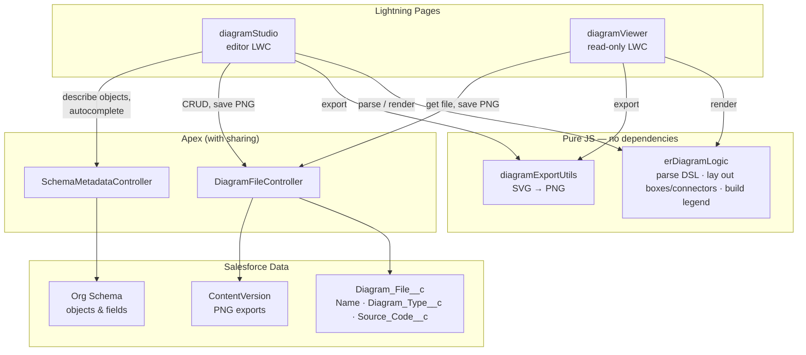

# Salesforce ER Modeller

A native Lightning Web Component app for building Entity-Relationship diagrams
of your Salesforce data model.
Diagrams are stored as records (`Diagram_File__c`) inside your org, so they
live alongside the metadata they describe and can be opened, edited, or
pinned to a page by anyone with access.

## One-click deploy

<a href="https://githubsfdeploy.herokuapp.com/app/githubdeploy/vikascohen/SalesforceERModeller?ref=main">
  
</a>
&nbsp;&nbsp;
<a href="https://githubsfdeploy-sandbox.herokuapp.com/app/githubdeploy/vikascohen/SalesforceERModeller?ref=main">
  
</a>

Left button logs you into Production/Developer Edition, right button logs
you into a Sandbox, and either way you land on a page listing every
component in this repo with checkboxes — review what's about to deploy,
then click Deploy.

This uses [githubsfdeploy](https://github.com/afawcett/githubsfdeploy), a
well-known community tool (not an official Salesforce or Anthropic
product) that reads a GitHub repo over OAuth and pushes it straight into
an org via the Metadata API — no local `sf` CLI or clone required. It
understands this repo's Salesforce DX source format directly. Since it's
a third-party OAuth flow, only use it with orgs and repos you trust, and
if you'd rather not grant a third party OAuth access at all, use the
`sf project deploy start` route in the section below instead — same
result, nothing leaves your machine.

## What it does

- **Live DSL editor** — a resizable, collapsible code panel next to the file
  explorer where you type entity/relationship lines directly and watch the
  canvas render as you type. Includes context-aware autocomplete (entity
  names, field names, relationship arrows, target entities) that suggests
  from your org's real schema — see [docs/DSL.md](docs/DSL.md) for the full
  syntax.
- **Import from your org** — pull in real objects (standard or custom) by
  API name and auto-generate the DSL from their actual fields and
  relationships, including Master-Detail, Lookup, and Polymorphic Lookup.
- **Object palette** — a searchable list of every object you can access;
  drag one onto the canvas to add it (and auto-wire any relationships it
  has to entities already on the canvas).
- **Freeform canvas** — drag boxes to reposition them, resize the height
  or width of a box, collapse long field lists, zoom in/out, or hit
  **Auto Layout** to snap everything back to an automatic grid.
- **Multi-file workspace** — a VS Code–style tab strip and sidebar file
  list; open several diagrams at once, rename, duplicate, or delete them.
- **Export** — render the current diagram to PNG at native size, A4
  landscape, or A3 landscape, with the relationship legend baked into the
  image. Exports are saved as a Salesforce File and downloaded from there
  (no client-side blob tricks, so it works under Lightning Web Security).
- **Read-only viewer** — a companion component for Record/App/Home pages
  that pins a saved diagram somewhere for people who just need to look at
  it, with its own PNG export button and legend.

Relationship handling has a few deliberate refinements worth knowing about:
entity names are matched case-insensitively so a typo like `account` vs
`Account` merges into one box instead of silently duplicating it; a field
that's genuinely polymorphic to more than one object (declared with two
separate relationship lines) shows every target on its row; a relationship
from an entity to itself (e.g. `Account.ParentId -> Account`) draws as a
loop instead of collapsing to nothing; and multiple relationships between
the same two entities fan out instead of drawing directly on top of each
other.

## Components

| Type | Name | Purpose |
|---|---|---|
| LWC | `diagramStudio` | The main editor — canvas, sidebar, DSL editor with intellisense, tabs, palette, import panel, export modal, zoom. Deployable to an App Page, Record Page, Home Page, or its own Tab. |
| LWC | `diagramViewer` | Read-only, drop it on any page and point it at a saved diagram's Id. |
| LWC | `erDiagramLogic` | Pure JS: parses the DSL, lays out boxes/connectors, and builds the export legend. No UI, no dependencies — imported by both components above. |
| LWC | `diagramExportUtils` | Pure JS: renders an SVG diagram to a PNG (canvas-based). Shared by both components. |
| Apex | `DiagramFileController` | CRUD for `Diagram_File__c` records, plus saving a PNG export as a Salesforce File. |
| Apex | `SchemaMetadataController` | Read-only schema introspection — lists accessible objects and describes their fields/relationships for the import panel, palette, and DSL autocomplete. |
| Object | `Diagram_File__c` | Stores each diagram: `Name`, `Diagram_Type__c`, `Source_Code__c` (the DSL text). |

## Architecture



`diagramStudio` and `diagramViewer` never talk to each other or duplicate logic between themselves — both are thin UI shells over the same two pure-JS modules, so a DSL parsing or rendering fix in `erDiagramLogic` applies identically whether you're editing or just viewing a diagram.

## Deploying to an org

This is a standard Salesforce DX project.

```bash
sf project deploy start --source-dir force-app
```

Then assign the permission set so users can access the object, fields, and
Apex classes:

```bash
sf org assign permset --name Diagram_Studio_User
```

## Setting it up in the org

1. In Setup, create a **Lightning App** (or use an existing one) and add a
   new tab, or drop the `diagramStudio` component straight onto an App
   Page / Home Page via Lightning App Builder.
2. Assign the `Diagram Studio User` permission set to anyone who needs to
   create or edit diagrams.
3. Open the page — it starts with a blank "Untitled ER Diagram" tab and a
   sample entity to get you oriented.

To pin a specific saved diagram somewhere read-only (e.g. on an app's
landing page), drop `diagramViewer` on a page instead and set its
**Diagram Id** property in App Builder to the record's Id (use the "Copy
Id" button in the studio's sidebar to grab it).

## Quick start

1. Type directly into the **DSL editor** panel next to the file explorer
   (click the `</>` toolbar button if it's collapsed, or drag its right
   edge to resize it):

   ```
   entity Account : Name, Industry, Phone
   entity Contact : LastName, FirstName, Email

   Contact.AccountId => Account
   ```

   The canvas updates as you type, and autocomplete suggestions appear in
   a panel below the editor as you go — arrow up/down then Enter or Tab to
   accept, Esc to dismiss. See [docs/DSL.md](docs/DSL.md) for the full
   syntax (relationship arrows, comments, self-relationships, etc).

2. Or click **Import**, type in object API names (e.g. `Account, Contact,
   Opportunity`), and the tool describes them from your org's actual
   schema and generates the DSL for you — including any relationships
   between the objects you listed.

3. Or open the **object palette** on the side, search for an object, and
   drag it onto the canvas. Dropping an object that already has a
   relationship to something on the canvas wires it up automatically.

4. Drag boxes around to lay them out the way you want; drag the bottom or
   right edge of a box to resize it; use the zoom controls (top-left of
   the canvas) to zoom in/out, or **Auto Layout** to reset everything to
   an automatic grid.

5. **Ctrl/Cmd+S** or the Save button writes the diagram back to its
   `Diagram_File__c` record. Use **Export** to render a PNG — the
   relationship legend is baked into the exported image.

## Notes

- Only objects you have access to (readable/queryable) show up in the
  palette or can be imported — the Apex layer respects field- and
  object-level security throughout.
- Diagrams are plain text under the hood (`Source_Code__c`), so they diff
  and version cleanly if you ever want to track them outside Salesforce
  too.

## Author

Vikas Cohen- Passionate transhumanist and a programmer when get extremely bored.

## License

MIT — see [LICENSE](LICENSE). Free to use, modify, and distribute; just keep the copyright notice.
