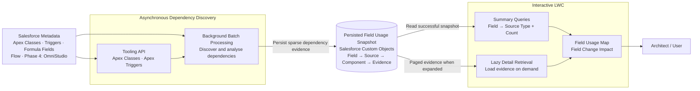
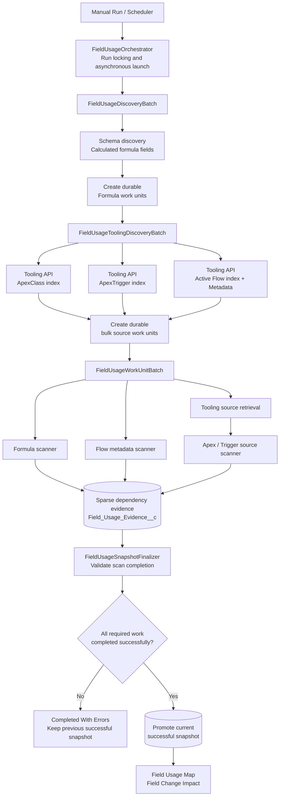

# Salesforce ER Modeller Studio — Phase 3 Field Usage Intelligence

> **Phase 3 development branch:** `version-3-field-usage-intelligence`  
> **Understand where Salesforce fields are used from a persisted, asynchronous org snapshot.**

> Phase 3 is isolated from `main`, `version-1-stable` and `version-2-stable`. The deploy button above targets only the Phase 3 branch.

## Phase 3 — Field Usage Intelligence

Phase 3 introduces an asynchronous, persisted Salesforce field-dependency index. The Lightning UI does **not** scan Apex, formulas or metadata interactively. A manual or scheduled run discovers scan work in Batch Apex, persists dependency evidence, and promotes a successful snapshot for the UI to query.

### Current scanner coverage

The current Phase 3 branch indexes:

- **Formula fields** through Salesforce Schema Describe and calculated-formula metadata.
- **Apex classes** through the Salesforce **Tooling API**.
- **Apex triggers** through the Salesforce **Tooling API**.
- **Active Flows** through asynchronous Tooling API metadata retrieval and schema-validated metadata analysis.

**OmniStudio is intentionally deferred to Phase 4.** It is outside the Phase 3 implementation boundary.

Tooling API access is intentionally restricted to the asynchronous server-side scan pipeline. The LWC never calls Tooling API and never receives Salesforce source bodies. Apex and Trigger discovery/retrieval is performed by Batch Apex callouts through `FieldUsageToolingApiClient`.

The Tooling client uses Salesforce API **v60.0** and expects a Named Credential called **`Salesforce_Tooling_API`**. It queries unmanaged/local `ApexClass` and `ApexTrigger` records with `NamespacePrefix = null`, so managed-package vendor source is deliberately excluded from this scanner.

### Architecture overview

```mermaid
flowchart LR
    META["Salesforce Metadata<br/>Apex Classes · Triggers · Formula Fields<br/>Flow · Phase 4: OmniStudio"]

    subgraph BG["Asynchronous Dependency Discovery"]
        BATCH["Background Batch Processing<br/>Discover and analyse dependencies"]
        TOOLING["Tooling API<br/>Apex Classes · Apex Triggers"]
    end

    STORE[("Persisted Field Usage Snapshot<br/>Salesforce Custom Objects<br/>Field → Source → Component → Evidence")]

    subgraph UI["Interactive LWC"]
        SUMMARY["Summary Queries<br/>Field → Source Type + Count"]
        DETAIL["Lazy Detail Retrieval<br/>Load evidence on demand"]
        MAPS["Field Usage Map<br/>Field Change Impact"]
    end

    USER["Architect / User"]

    META --> BATCH
    META --> TOOLING
    TOOLING --> BATCH
    BATCH -->|"Persist sparse dependency evidence"| STORE
    STORE -->|"Read successful snapshot"| SUMMARY
    STORE -->|"Paged evidence when expanded"| DETAIL
    SUMMARY --> MAPS
    DETAIL --> MAPS
    MAPS --> USER
```

The architectural boundary is deliberate. The LWC is an interactive presentation layer, not a metadata scanner. In a large Salesforce org, opening a page should not trigger request-time analysis of thousands of Apex classes, triggers, formulas and other metadata or make the browser responsible for Tooling API source retrieval.

Phase 3 therefore performs expensive discovery asynchronously and treats the persisted successful snapshot as a dependency index. The LWC reads lightweight aggregate results first and retrieves detailed evidence only when the user expands a source. This keeps interactive work bounded as org size and dependency volume grow.

In short:

> **Batch Apex performs expensive dependency discovery, Salesforce custom objects persist the evidence, and the LWC reads that index to build the maps.**

### Scan pipeline

The architecture diagram above explains **why** Phase 3 separates background discovery from the LWC. The following execution flow shows **how** an individual scan moves through that architecture.

```mermaid
flowchart TD
    START["Manual Run / Scheduler"]
    ORCH["FieldUsageOrchestrator<br/>Run locking and asynchronous launch"]

    DISC["FieldUsageDiscoveryBatch"]
    FORMULA["Schema discovery<br/>Calculated formula fields"]
    FWORK["Create durable<br/>Formula work units"]

    TDISC["FieldUsageToolingDiscoveryBatch"]
    APEXIDX["Tooling API<br/>ApexClass index"]
    TRIGGERIDX["Tooling API<br/>ApexTrigger index"]
    FLOWIDX["Tooling API<br/>Active Flow index + Metadata"]
    TWORK["Create durable<br/>bulk source work units"]

    WORKER["FieldUsageWorkUnitBatch"]
    FSCAN["Formula scanner"]
    FLOWSCAN["Flow metadata scanner"]
    SOURCE["Tooling source retrieval"]
    ASCAN["Apex / Trigger source scanner"]
    EVIDENCE[("Sparse dependency evidence<br/>Field_Usage_Evidence__c")]

    FINAL["FieldUsageSnapshotFinalizer<br/>Validate scan completion"]
    DECISION{"All required work<br/>completed successfully?"}
    ERROR["Completed With Errors<br/>Keep previous successful snapshot"]
    CURRENT[("Promote current<br/>successful snapshot")]
    UI["Field Usage Map<br/>Field Change Impact"]

    START --> ORCH --> DISC
    DISC --> FORMULA --> FWORK
    FWORK --> TDISC
    TDISC --> APEXIDX
    TDISC --> TRIGGERIDX
    TDISC --> FLOWIDX
    APEXIDX --> TWORK
    TRIGGERIDX --> TWORK
    FLOWIDX --> TWORK
    TWORK --> WORKER

    WORKER --> FSCAN
    WORKER --> FLOWSCAN
    WORKER --> SOURCE --> ASCAN

    FSCAN --> EVIDENCE
    FLOWSCAN --> EVIDENCE
    ASCAN --> EVIDENCE

    EVIDENCE --> FINAL --> DECISION
    DECISION -->|"Yes"| CURRENT --> UI
    DECISION -->|"No"| ERROR
```

This separation is important: the **architecture diagram** describes the system boundary and scalability rationale, while the **execution flow** describes orchestration, discovery, durable work, scanning, persistence and safe snapshot promotion.

Apex/Trigger Tooling work is chunked into groups of **12 component IDs** so the durable `Target_Key__c` value remains within its 255-character field limit. Worker execution uses a batch scope of one work unit per transaction, giving each checkpoint a fresh asynchronous governor-limit budget.

Tooling API access is minimised according to the retrieval capability of each metadata type. Apex classes and triggers support bulk source retrieval and therefore use 12-ID `IN (...)` work units. Active Flows are discovered in one paged Tooling query, but full Flow metadata is retrieved per Flow through the Tooling sObject resource; Flow therefore uses one durable work unit per active version. This avoids pretending that metadata-heavy retrieval is bulk-safe where Salesforce imposes per-component metadata boundaries, while still eliminating per-Flow discovery calls. It also isolates retries so one problematic Flow does not force unrelated Flow metadata to be fetched again.

### Sparse dependency model

Phase 3 deliberately does **not** persist a dense row for every field in the org. `Field_Usage_Evidence__c` stores only detected dependency evidence.

Object and field selectors use Salesforce Schema information, so a real field remains selectable even when no evidence row exists for it. If a selected field has no evidence in the current successful snapshot, the UI reports:

> **No dependency detected — 0 dependencies**

That means no dependency was detected by the scanners covered by that successful snapshot. It is **not** a universal claim that the field is unused. Integrations, reports, dynamic code, managed-package internals, unsupported metadata types and other sources may remain outside current scanner coverage.

### Apex and Trigger evidence

`FieldUsageApexScanner` analyses source returned asynchronously by Tooling API. The current scanner recognises:

- explicit object/field references such as `Account.Name`;
- typed-variable references such as `Account acc` followed by `acc.Name`;
- straightforward static SOQL such as `SELECT Name, Industry FROM Account`.

Candidates are validated against Salesforce Schema before evidence is persisted. Comments and string literals are stripped from the normal source-reference path to reduce false positives.

This is intentionally described as dependency evidence rather than a complete Apex compiler. Dynamic SOQL, complex relationship expressions, runtime-generated field names and other indirect references may require future scanner improvements.

### Resumable work and failure safety

Each scan owns a `Field_Usage_Run__c` and durable `Field_Usage_Work_Unit__c` checkpoints. Work units record scanner type, target, status, attempts, completion and error information.

A work unit may retry up to **three attempts**. Evidence persistence for a work unit is transactional: if any evidence insert fails, the work unit transaction rolls back rather than being marked successfully completed with partial evidence. Idempotency checks also prevent intentional duplicate evidence for the same field/source/component/location identity within a run.

`FieldUsageSnapshotFinalizer` independently checks for incomplete work units before promotion. A run with failed or incomplete work becomes **Completed With Errors** and does not replace the previous successful current snapshot.

On successful promotion the previous run is unset as current and the new run becomes authoritative. **Historical-run deletion is not currently performed by the finaliser**, so the README does not claim old snapshots are already purged.

### Scheduling without CRON knowledge

Phase 3 bootstraps two default daily schedules: **03:00** and **21:00** in the scheduling user's Salesforce timezone. Admins can configure daily scan times without writing CRON expressions; Apex owns the scheduled-job representation.

Manual **Run Scan Now** and scheduled execution use the same orchestration path. Run locking prevents a second manual or scheduled scan from intentionally starting while another run is queued or running.

### Scalable snapshot reads

The UI reads persisted snapshot data rather than source metadata. Initial map construction is **summary first**:

~~~text
Object
  → Field
      → Source Type + authoritative aggregate count
~~~

The map does not initially transfer every evidence record. Clicking a source type lazily requests detail for only that object/field/source combination.

Detail retrieval is bounded to at most **500 rows per request** and uses **Id-based keyset pagination**, not SOQL OFFSET. Repeated expansion loads the next page until `hasMore = false`. This avoids Salesforce's OFFSET ceiling and prevents a field with thousands of dependencies from forcing thousands of evidence records into the browser at initial render.

The aggregate summary remains authoritative while detail is partially loaded. For example, a node can correctly show `Apex Class — 1,247 usages` even when only the first 500 evidence rows have been expanded.

Both Field Usage Map and Architecture Intelligence → Field Change Impact use this summary/lazy-detail model.

### Field Usage Map

Open **View → Field Usage Map** to analyse the latest successful snapshot. Select an object and one or more Schema fields, then build the map.

The initial hierarchy is:

~~~text
Object → Field → Source Type
~~~

Source Type nodes can be expanded on demand to load component evidence. Zero-evidence selected fields remain visible and explicitly show **No dependency detected**.

The map uses deterministic geometry, cached nodes/edges, zoom controls and two-axis scrolling. **Clear Map** resets only the current visual selection; it does not delete persisted scan data.

### Architecture Intelligence: Field Change Impact

Architecture Intelligence includes **Field Change Impact** for field-level change investigation. It uses the same successful snapshot and the same summary/lazy-detail API as the Field Usage Map rather than launching a second scan.

A selected field is presented as:

~~~text
Selected Field
  → Source Type + total
      → Component details loaded on demand
~~~

This gives architects a bounded blast-radius view while preserving the evidence boundary: structural evidence found by the implemented scanners is shown, but absence of evidence is not presented as proof of universal non-use.

### Search and persisted evidence

`FieldUsageController` exposes bounded snapshot/search APIs for the LWC. Exact field analysis uses `Field_Key__c` values such as `Account.Name`. Summary queries aggregate by field and source type. Detailed expansion is separately paged.

`Field_Usage_Evidence__c` records include object, field, source type, component, component id, evidence type, confidence, observed time, occurrence count and location so new scanners can reuse the same persistence model.

### Phase 4 boundary: OmniStudio

Flow is implemented in Phase 3 through asynchronous Tooling API retrieval of active Flow metadata. Flow evidence is written into the same `Field_Usage_Evidence__c` model and consumed by the existing maps.

Phase 4 will extend the same durable work-unit and sparse evidence architecture to **OmniStudio**. OmniStudio must be treated as an **optional capability** because it is not present in every Salesforce org and its available object model can differ by runtime/package model. Phase 4 must therefore use runtime Schema/Describe discovery before querying OmniStudio data. Phase 4 should implement that optional discovery directly around runtime Schema/Describe checks and dynamic queries: only objects and fields that actually exist in the target org should be queried. If no supported OmniStudio model is present, the Omni scanner must create no work and the overall field-usage scan must continue normally rather than fail.

The Phase 4 OmniStudio scanner should create durable work units and persist evidence through the existing snapshot pipeline so the Field Usage Map and Field Change Impact views can consume the additional source type without changing the LWC architecture.

### Main Phase 3 components

- `FieldUsageController` — LWC-facing snapshot, summary, detail, search and scheduling API.
- `FieldUsageOrchestrator` — duplicate-run protection and asynchronous launch.
- `FieldUsageDiscoveryBatch` — Schema/formula discovery and formula work-unit creation.
- `FieldUsageToolingDiscoveryBatch` — asynchronous Tooling API discovery of Apex classes and triggers.
- `FieldUsageToolingApiClient` — Named-Credential Tooling API client for Apex/Trigger index and source retrieval.
- `FieldUsageWorkUnitBatch` — resumable worker, scanner dispatch, retry and atomic evidence persistence.
- `FieldUsageFormulaScanner` — formula dependency scanner.
- `FieldUsageApexScanner` — Apex/Trigger source-reference scanner.
- `FieldUsageSnapshotFinalizer` — promotion guard for successful snapshots.
- `FieldUsageScheduler` / `FieldUsageScheduleService` — human-readable daily scheduling without exposing CRON.
- `Field_Usage_Run__c` — scan lifecycle, progress and audit information.
- `Field_Usage_Work_Unit__c` — durable resumable scan checkpoints.
- `Field_Usage_Evidence__c` — sparse dependency evidence.
- `Field_Usage_Schedule__c` — schedule configuration.
- `diagramStudio` — integrated Field Usage Map, scan console and Architecture Intelligence Field Change Impact.
- `fieldUsageIntelligence` — standalone Field Usage Intelligence experience.

### Deployment requirement: Tooling API Named Credential

Phase 3 Apex/Trigger/Flow scanning requires a Salesforce Named Credential named exactly:

~~~text
Salesforce_Tooling_API
~~~

It must authenticate to the Salesforce org whose metadata is being scanned and permit the asynchronous Apex callouts used by the Tooling API client.

Do **not** hard-code access tokens, session IDs, client secrets or user credentials in Apex, LWC, repository files or Custom Metadata. OAuth authentication is deliberately owned by the target Salesforce org.

## 🛡️ ADMINISTRATOR SETUP — REQUIRED FOR FIELD USAGE

> [!IMPORTANT]
> **ADMIN ACTION REQUIRED — THIS IS A ONE-TIME SETUP STEP FOR EACH SALESFORCE ORG**  
> This configuration is an important prerequisite for **Apex Class and Apex Trigger scanning** in Phase 3. Field Usage uses the Salesforce Tooling API to discover and analyse Apex dependencies, so the Apex scan cannot run successfully until this connection is configured and authenticated.  
> Complete this setup once in each target org (Developer Edition, sandbox, SIT/UAT or production). After it is configured, normal users do not need to repeat these OAuth setup steps every time they run a Field Usage scan.  
> **Do not skip the principal-access step. Do not copy OAuth tokens or secrets between environments.**

### 🔧 Tooling API OAuth connection — administrator instructions

Complete the following setup in **each target org** after deploying Phase 3. The OAuth application, authenticated principal and endpoint are environment-specific. A Developer Edition, sandbox, SIT/UAT environment and production org should authenticate locally rather than sharing another org's token or secret.

**1. Create an External Auth Identity Provider**

Go to **Setup → Named Credentials → External Auth Identity Providers → New** and create:

~~~text
Label: Salesforce Tooling API Provider
Name: Salesforce_Tooling_API_Provider
Authentication Protocol: OAuth 2.0
Authentication Flow Type: Authorization Code (Browser Flow)
~~~

The provider requires a Client ID and Client Secret. During the initial bootstrap, temporary placeholder values can be used so that Salesforce can create the provider and display its generated **Callback URL**. Copy the Callback URL exactly as Salesforce generates it; do not construct or rewrite it manually.

For the identity-provider endpoints, use the OAuth endpoints for the Salesforce org being scanned. Prefer that org's **My Domain** so the authentication boundary is explicit:

~~~text
Authorize Endpoint URL:
https://<your-my-domain>.my.salesforce.com/services/oauth2/authorize

Token Endpoint URL:
https://<your-my-domain>.my.salesforce.com/services/oauth2/token
~~~

The exact hostname varies by org type and My Domain configuration. Use the target org's own Salesforce My Domain; do not copy a Developer Edition or production hostname into a sandbox.

Leave **User Info Endpoint URL** blank unless your organisation has a specific requirement. The Phase 3 setup does not require client credentials in the request body.

**2. Create an External Client App**

> [!NOTE]
> **Why is an External Client App needed?** Phase 3 needs an OAuth trust relationship so Salesforce can authorise the Named Credential to call the **same Salesforce org's Tooling API** for Apex Class, Apex Trigger and active Flow dependency discovery. The External Client App supplies that OAuth client identity; the External Auth Identity Provider, External Credential and Named Credential then let Salesforce manage the authenticated callout without placing access tokens, session IDs or client secrets in Apex or LWC.
>
> **This does not expose the org to an external application or send Salesforce metadata outside Salesforce.** In the documented Phase 3 configuration, the OAuth authorisation endpoint, token endpoint and Named Credential endpoint all point to the **target Salesforce org's own My Domain**. The callout is Salesforce Apex → Salesforce Named Credential → that same Salesforce org's Salesforce API. Apex/Trigger/Flow metadata retrieved by the scanner is processed server-side in Salesforce and the resulting Field Usage evidence is persisted in Salesforce custom objects. The browser/LWC does not receive Apex source bodies from the Tooling API.
>
> The External Client App is therefore an **authentication mechanism for an internal Salesforce-to-Salesforce API call**, not an integration that publishes the org or its metadata to a third-party service. Administrators should still apply their organisation's normal OAuth, integration-user and credential-governance policies.

Go to **Setup → External Client App Manager** and create a local External Client App:

~~~text
External Client App Name: Salesforce Tooling API
API Name: Salesforce_Tooling_API
Distribution State: Local
~~~

Enable OAuth and paste the **Callback URL generated by the External Auth Identity Provider** into the External Client App's Callback URL.

Select these OAuth scopes:

~~~text
Manage user data via APIs (api)
Perform requests at any time (refresh_token, offline_access)
~~~

Enable **Authorization Code and Credentials Flow**. Current Salesforce External Client App security settings can require **PKCE**. If PKCE is required/enabled on the External Client App, enable **Use Proof Key for Code Exchange (PKCE) Extension** on the External Auth Identity Provider as well.

Create the app and obtain its **Consumer Key / Client ID** and **Consumer Secret / Client Secret**. Treat the secret as sensitive information: do not commit it to source control, paste it into documentation, or share it with users who do not administer the connection.

Return to **External Auth Identity Providers → Salesforce Tooling API Provider → Edit** and replace the bootstrap placeholders with the real Client ID and Client Secret from the External Client App. Save the provider.

**3. Create the External Credential**

Go to **Setup → Named Credentials → External Credentials → New** and create:

~~~text
Label: Salesforce Tooling API
Name: Salesforce_Tooling_API
Authentication Protocol: OAuth 2.0
Authentication Flow Type: Browser Flow
Identity Provider: Salesforce Tooling API Provider
Scope: api refresh_token
~~~

Leave **Additional Status Codes for Token Refresh** blank unless your organisation has a specific requirement.

**4. Create and authenticate the Named Principal**

Open the new **Salesforce Tooling API** External Credential. Under **Principals**, click **New** and create:

~~~text
Parameter Name: ToolingAPIPrincipal
Sequence Number: 1
Identity Type: Named Principal
Scope: <blank>
~~~

Save the principal. From the principal's Actions menu choose **Authenticate**, sign in to the target Salesforce org with the authorised account, and approve access when prompted. The principal should no longer show **Not Configured** after successful authentication.

If authentication returns:

~~~text
error=invalid_scope
error_description=the requested scope is not allowed
~~~

verify both sides of the OAuth configuration. The External Client App must contain **Manage user data via APIs (api)** and **Perform requests at any time (refresh_token, offline_access)**, while the External Credential scope used by this setup is:

~~~text
api refresh_token
~~~

**5. Create the Named Credential used by Phase 3**

Go to **Setup → Named Credentials → Named Credentials → New** and create:

~~~text
Label: Salesforce Tooling API
Name: Salesforce_Tooling_API
URL: https://<target-org-my-domain>.my.salesforce.com
External Credential: Salesforce Tooling API
Enabled for Callouts: On
Generate Authorization Header: On
~~~

Use the target org's own My Domain URL as the endpoint. Leave the client certificate blank unless your organisation explicitly requires one. Leave **Allow Formulas in HTTP Header**, **Allow Formulas in HTTP Body** and **Outbound Network Connection** at their normal/default values unless required by your network architecture.

The Named Credential API name is significant. Phase 3 Apex calls:

~~~text
callout:Salesforce_Tooling_API
~~~

so renaming the Named Credential will break the Tooling API connection unless the code is changed accordingly.

**6. Grant External Credential Principal Access**

The user that starts a Field Usage scan must be allowed to use the named principal. Open the permission set assigned to Phase 3 users (for the supplied permission set, **Diagram Studio User**) and go to:

~~~text
External Credential Principal Access
~~~

Click **Edit**, enable the principal belonging to **Salesforce_Tooling_API / ToolingAPIPrincipal**, save the permission set, and make sure the permission set is assigned to the user who will run Field Usage.

> [!WARNING]
> **Verify this access after authentication and before the first scan.** If **External Credential Principal Access** is blank or the `Salesforce_Tooling_API - ToolingAPIPrincipal` entry is not enabled, Salesforce rejects the callout with a credential-access error even when the Named Principal itself shows **Configured**.

For OAuth Browser Flow with a Named Principal, also grant the Phase 3 permission set the required access to **Object Settings → User External Credentials**. In the target org, verify the user has the Salesforce-required object access used to read/update the stored OAuth credential, including **Modify All Records** where required by the Salesforce UI/security model.

For scheduled execution, the scheduling/executing user must also retain the permissions and principal access required by the scan.

**7. Verify before relying on a scan**

Open **Field Usage** and choose **Run Scan Now**. Phase 3 performs a fail-fast Tooling API connection check before creating a new scan run. If the Named Credential is missing, unauthenticated or inaccessible, the UI reports the connection problem instead of deliberately starting a scan that cannot retrieve Tooling API metadata.

A successful connection allows the asynchronous discovery pipeline to proceed. Administrators should verify that Tooling discovery and the subsequent work-unit batches complete successfully before treating the resulting snapshot as authoritative.

### 🌐 Environment guidance

Do not copy OAuth tokens or secrets between environments. Repeat the authentication/configuration step in each target org:

~~~text
Developer Edition / scratch or development org → that org's My Domain
Sandbox / SIT / UAT                          → that sandbox's My Domain
Production                                   → the production My Domain
~~~

The Phase 3 Apex code remains the same across environments; the endpoint, OAuth client configuration and authenticated principal belong to the target environment. In enterprise environments, use an organisation-controlled integration identity and the organisation's normal credential-governance process rather than a developer's personal identity where policy requires it.

If the Named Credential is absent, the principal is not authorised, or the Tooling API connection cannot be established, Phase 3 intentionally fails the preflight and does not start a new Field Usage scan.

> [!TIP]
> **Admin completion check:** External Client App → External Auth Identity Provider → External Credential → authenticated Named Principal → Named Credential `Salesforce_Tooling_API` → External Credential Principal Access → successful Field Usage preflight.

### Testing and CI

The branch has Jest CI for the LWC layer and a Salesforce CLI validation workflow for Apex/org validation.

At the time of this README update, the latest Jest CI run on the Phase 3 branch completed with **128/128 tests passing across 6 suites**.

The Salesforce CLI workflow requires the GitHub Actions repository secret `SFDX_AUTH_URL`. If that secret is absent, the workflow intentionally fails before Salesforce authentication, deployment validation or Apex tests. A red run caused by the missing secret is therefore **not evidence that Apex tests executed and failed**.

### Current evidence boundary

Phase 3 currently provides persisted evidence from **Formula fields, local/unmanaged Apex classes, local/unmanaged Apex triggers and active Flows**.

**OmniStudio is Phase 4 scope.** Phase 3 also does not claim complete coverage of managed-package internals, reports, integrations, dynamic SOQL, runtime-generated references or every possible Salesforce dependency mechanism.

The design principle is: **persist what the scanners can prove, keep the successful snapshot queryable, and make unsupported coverage explicit rather than inventing certainty.**

---

## Version 2 foundation

> **Salesforce Data Architecture Intelligence & ER Modelling**  
> **Understand your Salesforce data architecture before you change it.**

Salesforce ER Modeller Studio is an open-source, Salesforce-native workspace for **visualising, modelling and analysing complex Salesforce data architectures**.

As Salesforce orgs grow, the data model often becomes harder to reason about. Custom objects accumulate, relationships multiply, ownership changes, implementations span multiple teams, and important architectural knowledge can end up distributed across diagrams, spreadsheets, documentation and people's heads. A schema change that looks small in isolation may sit inside a much larger network of structural dependencies.

ER Modeller Studio is designed to make that architecture easier to see and investigate. It combines **ER modelling, Salesforce metadata, data dictionaries and architecture intelligence** in one workspace so architects and engineering teams can move from simply drawing a schema to asking useful architectural questions about it.

### What problems does it solve?

**Architecture visibility**  
Import or model Salesforce objects and relationships and turn them into an explorable architecture rather than relying only on static diagrams or tribal knowledge.

**Understanding dependencies**  
See incoming and outgoing relationships, direct neighbours, connected areas of the model, structural paths between objects and explicit references beyond the declared diagram.

**Change investigation**  
Explore the represented blast radius around an object and understand what is structurally connected before making schema changes. The Studio presents evidence rather than pretending that structural reach automatically means something will break.

**Complex-org discovery**  
Use topology, connectivity, depth, density, isolation, bounded cycle detection and highly connected object analysis to identify areas that deserve architectural attention.

**Data model design**  
Create and modify ER models visually or through the Studio DSL with live rendering, relationship linting, Salesforce-aware field types and point-and-click custom-object modelling.

**Documentation and knowledge sharing**  
Generate a Data Dictionary, inspect object and field metadata, and export architecture artefacts so knowledge is easier to share across architecture, engineering, administration and delivery teams.

**Salesforce-aware analysis**  
Complement the model with org-aware capabilities including schema import, sharing-model views, record-count heatmaps and metadata inspection.

### Who is it for?

The Studio is designed for **Enterprise Architects, Solution Architects, Salesforce Architects, Developers, Technical Leads, Administrators, Platform Teams and Consulting/Delivery Teams** working with Salesforce environments where understanding the data architecture matters.

It can be particularly useful during **solution discovery, architecture reviews, legacy-org assessment, schema redesign, technical due diligence, change planning, documentation and engineering handover**.

### More than an ER diagrammer

Traditional ER diagrams are useful for showing entities and relationships. ER Modeller Studio extends that idea into an **interactive Salesforce architecture workspace**.

Version 2 combines the modelling foundation with Data Architecture Intelligence, including:

- Architecture Overview and graph-based topology analysis
- Object Map and structural change-impact / blast-radius evidence
- Relationship Path Finder
- Object Usage & Change Readiness
- Relationship Insights and dependency summaries
- Junction Intelligence
- Salesforce schema import and metadata-aware modelling
- Data Dictionary and field-usage analysis
- Sharing-model and org-aware views
- Record-count heatmaps
- Visual and DSL-based modelling
- PNG, Mermaid and draw.io / diagrams.net export

The goal is simple: **help teams understand the structure they have, investigate the consequences of what they intend to change, and make architecture conversations more evidence-based.**

> **Evidence boundary:** Architecture Intelligence analyses relationships and information represented by the current model and the Salesforce information available to the Studio. It does not claim that an ER model alone can discover every Apex, Flow, integration, report, security configuration or runtime dependency.

## Deploy Version 2 Stable to Salesforce

Deploy **Version 2 Stable** directly to a Salesforce org using the button above.

> **Note:** This deploy button points specifically to the `version-2-stable` branch. For Version 1, use the `version-1-stable` branch.

## Installing

All package links below are **unmanaged Salesforce packages**. Once installed, the components are available in the target org as editable metadata.

### Latest Release — Version 2

**Version 2 Stable** includes the complete Version 1 modelling foundation plus Version 2 Data Architecture Intelligence.

- **Production or Developer Edition:** [Install Version 2 unmanaged package](https://login.salesforce.com/packaging/installPackage.apexp?p0=04taj000000hugT)
- **Sandbox:** [Install Version 2 unmanaged package](https://test.salesforce.com/packaging/installPackage.apexp?p0=04taj000000hugT)

### Previous Release — Version 1

Version 1 remains available for users who specifically need the previous stable release.

- **Production or Developer Edition:** [Install Version 1 unmanaged package](https://login.salesforce.com/packaging/installPackage.apexp?p0=04taj000000gRTd)
- **Sandbox:** [Install Version 1 unmanaged package](https://test.salesforce.com/packaging/installPackage.apexp?p0=04taj000000gRTd)

For both releases, the package is the same for Production/Developer Edition and Sandbox; only the Salesforce login domain changes. **Admins Only** is the safest default installation option, after which access can be assigned deliberately through the provided permission set.

## Contents

- [Installing](#installing)
- [Version 1 release notes](docs/RELEASE-NOTES-V1.md)
- [Version 2 release notes](docs/RELEASE-NOTES-V2.md)
- [Data Architecture Intelligence](#data-architecture-intelligence)
- [Product capabilities](#product-capabilities)
  - [Version 1 vs Version 2](#version-1-vs-version-2)
- [What it does](#what-it-does)
  - [Modeling the diagram](#modeling-the-diagram)
  - [Org-aware views](#org-aware-views)
  - [Data Dictionary](#data-dictionary)
  - [Export](#export)
  - [Workspace & appearance](#workspace--appearance)
- [Components](#components)
- [Architecture](#architecture)
  - [How the DSL parser works internally](docs/dsl-compiler-architecture.md)
- [Deploying to an org](#deploying-to-an-org)
- [Setting it up in the org](#setting-it-up-in-the-org)
- [Quick start](#quick-start)
- [Testing](#testing)
- [Security overview](docs/SECURITY.md)
- [Contributors](#contributors)
- [License](#license)
- [Contributing](#contributing)

## Product capabilities

### Version 1 vs Version 2

**Version 1 Stable** is the original modelling foundation. It includes the visual ER modelling experience, DSL/compiler workflow, Salesforce schema visualisation, diagram editing, Import from Org, Data Dictionary capabilities, export options, themes and the supporting Salesforce components used by the Studio.

**Version 2 Stable** is the current complete release. It includes everything in Version 1 and adds the **Data Architecture Intelligence** layer: Architecture Overview, Object Map & Impact, Relationship Path Finder, Object Usage & Change Readiness, Relationship Insights, explicit external-reference detection, junction intelligence, shared graph analysis, Clear / Refresh and active-file visibility.

You do **not** need to install Version 1 before Version 2. Version 1 remains available as a preserved stable release for users who specifically need the earlier modelling-only release.

For detailed release history, see [Version 1 release notes](docs/RELEASE-NOTES-V1.md) and [Version 2 release notes](docs/RELEASE-NOTES-V2.md).

### Modelling and DSL
- Live text-to-visual ER modelling with the Studio DSL and shared parser/compiler.
- Lookup, Master Detail, polymorphic and self relationships, including multiple relationships between the same objects.
- Mimic New ER for point-and-click creation of custom-object models. Mimic owns the Salesforce custom suffix, automatically generates `__c`, normalises accidental `_c` / `_C` / `__...` suffix input, and starts with a clean draft each time.
- Import from Org, object palette drag-and-drop, relationship linting, schema comparison and context-aware DSL autocomplete.
- Freeform canvas, object resizing, collapsing, focus mode, zoom and automatic layout.
- Multi-file workspace with save, rename, duplicate and delete flows.

### Salesforce-aware architecture workspace
- Data Dictionary with object and field metadata, sorting, usage calculation and CSV/XLSX export.
- Sharing View for internal and external object sharing-model values.
- Record-count heatmap for represented objects.
- Object summary hover cards combining available structural and org-aware evidence.

### Data Architecture Intelligence
- Architecture Overview with topology, connected-component, density, depth, isolation, connectivity and bounded cycle evidence.
- Object Map & Impact with incoming/outgoing dependencies, neighbours, bounded reach and change-impact/blast-radius evidence.
- Relationship Path Finder for minimum-hop structural routes between two objects.
- Object Usage & Change Readiness for custom objects, including represented dependencies and explicit references outside the declared diagram.
- Relationship Insights with a layered dependency graph, relationship detail and per-object dependency summaries. Self relationships are intentionally omitted from this interpretation view.
- Junction Intelligence for custom objects with multiple parent relationships and stronger Master Detail junction patterns.
- Clear / Refresh analysis and active-file visibility so architecture evidence is rebuilt from the current ER source.

### Export, viewing and appearance
- PNG export, Mermaid ER syntax and draw.io / diagrams.net export.
- Read-only `diagramViewer` for publishing saved diagrams on Salesforce pages.
- Dark+, Light+, Monokai and Solarized Light themes, including theme-aware Mimic New ER.
- Per-user theme persistence.

### Reliability and engineering
- Shared graph-analysis engine rather than duplicate parsers for individual Architecture Intelligence screens.
- Analysis caching, breadth-first traversal, bounded expensive operations, malformed-model safeguards, stale-response protection and lifecycle cleanup.
- Automated GitHub Actions Jest CI for the Version 2 release line and `main`.
- **112 Jest tests across 5 suites are currently passing on `main`.**
- Version 2 makes no claim that diagram evidence proves unrepresented Apex, Flow, report, integration, security or live-record dependencies.

## Data Architecture Intelligence

The architecture layer builds on the original modelling engine and analyses the ER model currently open on the canvas. It does not generate an opaque architecture score or pretend that a diagram contains runtime facts it cannot know. Instead, it turns relationships already represented in the model into readable structural evidence.

Open **View → Architecture Intelligence** to analyse the current file. The header identifies the file being analysed, and **Clear / Refresh** resets Architecture Intelligence and rebuilds the analysis from the current ER source.

### Architecture Overview

Architecture Overview answers: **what does this model look like structurally?**

It combines object, field and relationship totals with graph evidence such as connected components, depth, relationship density, highly connected objects, isolated objects and bounded cycle detection. The purpose is to help an architect decide where to investigate first rather than repeat counts already visible on the canvas.

Analysis is cached for unchanged DSL and expensive graph operations are deliberately bounded for interactive use.

### Object Map & Impact

Object Map is the one-object architecture view. Select an object to understand its immediate architectural context without creating a second copy of the full ER canvas.

For the selected object it shows structural role, relationship degree, incoming and outgoing relationships, parent or target objects, child or dependant objects, direct neighbours, bounded one, two and three hop reach, cycles involving the object, and **Change Impact / Blast Radius** evidence.

Blast Radius is deliberately part of Object Map rather than a competing top-level feature. Reachability means an object is structurally connected within the model; it does **not** claim that every reachable object will break when a change is made.

### Relationship Path Finder

Relationship Path Finder answers: **how are two objects connected?**

Choose a source and target object and Phase 2 calculates a minimum-hop structural route between them. It is an A-to-B navigation tool, not an impact assessment.

### Object Usage & Change Readiness

Object Usage & Change Readiness answers: **what does this model tell me about changing a custom object?**

The selector deliberately contains **custom objects only**. Standard Salesforce objects can still appear as dependencies because they are part of the architecture, but Phase 2 does not present standard objects as removal candidates.

The assessment uses only evidence represented by the current ER model, including incoming and outgoing dependencies and explicit references to objects outside the set of entities declared in the DSL. For example, a custom object may reference Account even when Account was not explicitly declared as an entity in the current file; Phase 2 surfaces that as a known external diagram reference.

This feature deliberately does **not** use the Tooling API and does not invent live-org facts. It does not claim to know record counts, last usage, Apex references, Flow references, reports, integrations or dependencies absent from the ER source. An isolated custom object is therefore **not** automatically described as unused or safe to remove.

### Relationship Insights

Relationship Insights keeps the relationship diagram but makes it an interpretation view rather than another full ER canvas.

The diagram omits **self relationships** because they do not represent a dependency between two different objects and add visual noise in this view. It uses a layered dependency layout instead of the previous degree-sorted square grid, positions objects in structural bands to reduce connector crossing, uses vertical anchors between layers and side anchors for same-row relationships, and does not print Lookup, Master Detail or Polymorphic on every connector because the relationship legend already communicates those semantics.

Below the diagram, **Relationship Detail** explains represented child-to-parent dependencies and their relationship types. **Object Dependency Summary** presents, per declared object, what it depends on and what depends on it.

Record and schema impact wording is deliberately conservative. Master Detail can carry strong lifecycle semantics, while a Lookup shown in the ER model does not by itself prove cascade behaviour, automation behaviour or runtime data impact. Polymorphic relationships are treated as dependencies that may target more than one represented type.

### Junction Intelligence

Phase 2 identifies custom objects with multiple parent relationships and distinguishes stronger junction patterns where two or more different parents are connected through Master Detail relationships. This is structural evidence, not a claim about business intent. Standard Salesforce relationships are treated as platform context rather than redesign suggestions.

### Evidence boundaries

Architecture Intelligence analyses the **current ER model**. It can state what objects and relationships are represented, what is connected, what is isolated, what paths exist, what is reachable within bounded hops and which explicitly referenced targets sit outside the declared diagram. It cannot infer unrepresented Apex, Flow, reporting, integration, security or live-record behaviour.

Phase 2 therefore follows a simple principle: **show what the model proves, identify what remains unknown, and avoid synthetic certainty.**

### Architecture at a glance

~~~mermaid
flowchart LR
    DSL["Current ER source"] --> PARSER["Phase 1 DSL parser"]
    PARSER --> GRAPH["Architecture graph"]
    GRAPH --> OVERVIEW["Architecture Overview"]
    GRAPH --> MAP["Object Map & Impact"]
    GRAPH --> PATH["Relationship Path Finder"]
    GRAPH --> USAGE["Object Usage & Change Readiness"]
    GRAPH --> REL["Relationship Insights"]
    GRAPH --> JUNCTION["Junction Intelligence"]
~~~

### Reliability and performance hardening

Phase 2 also protects the existing Studio experience. It includes stale-response protection for rapid file changes and asynchronous org-aware views, lifecycle cleanup for delayed work, architecture-analysis caching, breadth-first graph traversal, bounded cycle analysis, defensive malformed-model handling, graceful treatment of incomplete relationship endpoints and recoverable Architecture Intelligence errors.

The Architecture Intelligence engine is shared rather than implementing separate parsers for each screen. This keeps Object Map, Path Finder, usage analysis, relationship analysis and overview metrics grounded in the same parsed model.

### Scope

Phase 2 is intentionally about **Salesforce data architecture intelligence**: objects, fields, relationships, topology, reachability, dependency evidence and change-readiness evidence.

### Testing

**LWC / Jest CI**

Version 2 currently has **112 Jest tests across 5 suites**, covering the shared ER/diagram logic, export utilities, viewer, Studio workflows and Architecture Intelligence. The suite includes regression coverage for graph metrics, malformed/incomplete models, path finding, blast radius, junction detection, custom-only Object Usage, explicit external references, Relationship Insights self-relationship filtering, Clear / Refresh, Mimic draft reset and custom `__c` suffix normalisation.

The GitHub Actions workflow runs the Version 2 Jest suite on the Version 2 release line and on `main`. The latest release promotion to `main` completed successfully with **112/112 tests passing**.

**Apex**

The existing Apex production and test classes remain the original Salesforce foundation; the Data Architecture Intelligence work did not change those Apex classes. `DiagramFileControllerTest`, `SchemaMetadataControllerTest` and `DiagramPreferenceControllerTest` cover their Salesforce-side paths. Apex tests must be run in a Salesforce org and are not included in the Jest pass count above.

## Contributors

Developed and maintained by **Crius Consulting Architects**.

**Lead Architect & Author:** Vikas Cohen

## License

MIT — see [LICENSE](LICENSE). Free to use, modify, and distribute; just
keep the copyright notice. Bundles one third-party library (SheetJS,
Apache-2.0) — see [THIRD_PARTY_NOTICES.md](THIRD_PARTY_NOTICES.md).

## Contributing

See [CONTRIBUTING.md](CONTRIBUTING.md) for how the project is laid out
and what to check before opening a PR.
