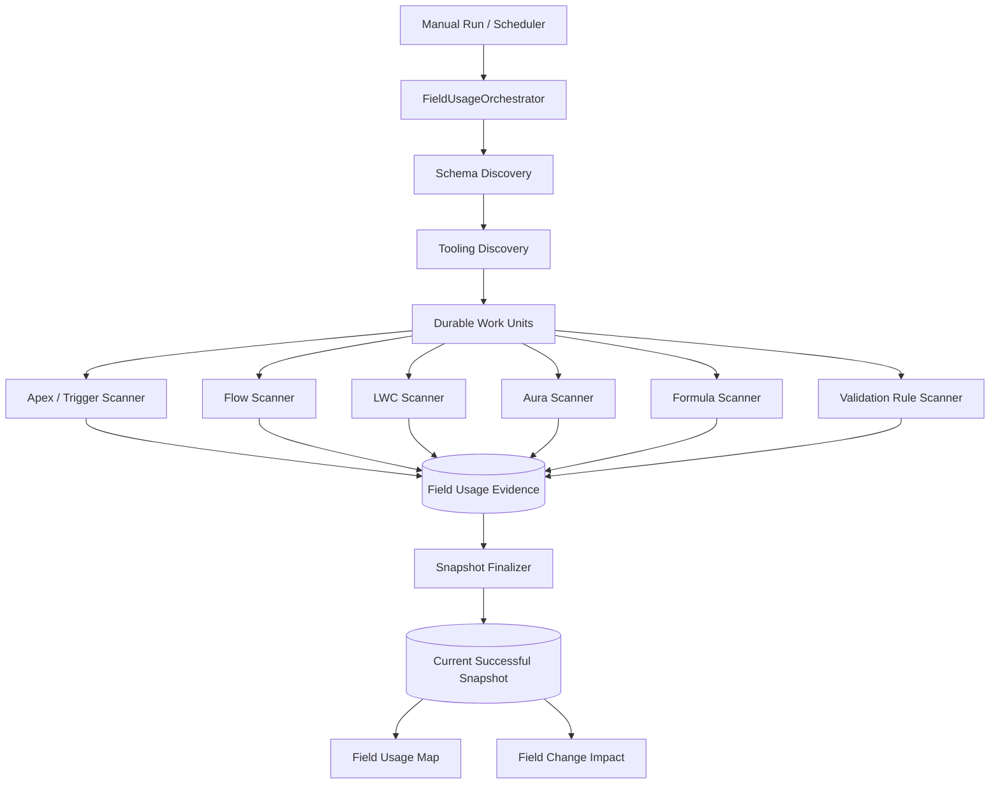

# Salesforce ER Modeller Studio — Version 3

> **Salesforce Data Architecture Intelligence & ER Modelling**

Version 3 extends ER Modeller Studio from visual data modelling and Architecture Intelligence into persisted **Field Usage Intelligence**: asynchronous dependency discovery across Salesforce metadata, durable evidence, change-impact visualisation, operational monitoring and safe snapshot promotion.

[](https://githubsfdeploy.herokuapp.com/app/githubdeploy/vikascohen/Salesforce-ER-Modeller-Studio?ref=version-3-field-usage-intelligence&continue)

## Version 3 highlights

Version 3 adds a persisted Field Usage dependency index to the existing ER Modeller Studio capabilities. Heavy metadata analysis runs asynchronously in Salesforce; interactive screens query the latest successful snapshot instead of rescanning the org every time a user opens a map.

### Field Usage scanner coverage

The Version 3 architecture supports these source families:

- Apex Classes
- Apex Triggers
- Active Flows
- Lightning Web Components (LWC)
- Aura components
- Formula Fields
- Validation Rules

Evidence is normalised into a common persistence model so the UI does not need scanner-specific storage logic.

> **Important:** Field Usage is dependency evidence from supported scanners. A zero-evidence field is not proof that the field is universally unused. Reports, integrations, dynamic code, managed-package internals and unsupported metadata may still reference it.

## Field Usage architecture


```mermaid
flowchart TD
    START[Manual Run / Scheduler] --> ORCH[FieldUsageOrchestrator]
    ORCH --> DISC[Schema Discovery]
    DISC --> TOOL[Tooling Discovery]
    TOOL --> WORK[Durable Work Units]
    WORK --> APEX[Apex / Trigger Scanner]
    WORK --> FLOW[Flow Scanner]
    WORK --> LWC[LWC Scanner]
    WORK --> AURA[Aura Scanner]
    WORK --> FORMULA[Formula Scanner]
    WORK --> VR[Validation Rule Scanner]
    APEX --> E[(Field Usage Evidence)]
    FLOW --> E
    LWC --> E
    AURA --> E
    FORMULA --> E
    VR --> E
    E --> FINAL[Snapshot Finalizer]
    FINAL --> CURRENT[(Current Successful Snapshot)]
    CURRENT --> MAP[Field Usage Map]
    CURRENT --> IMPACT[Field Change Impact]
```

The design deliberately separates discovery, scanning, persistence and presentation. A failed or incomplete replacement scan must not destroy the previous successful snapshot.

## Field Usage Map

The Field Usage Map lets an architect select an accessible Salesforce object and one or more fields, then visualise dependency evidence as:

```text
Object → Field → Source Type → Component → Evidence
```

The map uses summary-first loading. Detailed evidence is loaded only when a source branch is expanded. Detail retrieval is bounded and paginated so a heavily referenced field does not require every evidence row to be sent to the browser during initial rendering.

Object and field selectors are Schema-driven rather than evidence-driven. This means fields with no detected evidence remain selectable and can explicitly show **No dependency detected**.

## Field Change Impact

Architecture Intelligence includes **Field Change Impact**, which uses the same successful Field Usage snapshot. It is intended to answer a practical architecture question:

> If I change this field, what known Salesforce components could be affected?

The view reuses the persisted evidence rather than launching another scan.

## Operational Console

Version 3 includes a Field Usage operational console for scan execution and observability:

- Run Scan Now
- automatic polling while a scan is active
- live Batch Apex status
- live batch processed/total counts
- persisted pipeline phase and progress
- dependency and error counts
- scanner coverage display
- configurable automatic scan schedules
- scheduled-job monitoring
- recent scan history
- expandable persisted error detail for failed / Completed With Errors runs

The scan history keeps the latest runs visible so architects can distinguish a Salesforce Batch Apex job that technically completed from a Field Usage run that completed with incomplete work or scanner errors.

## Snapshot safety

Each scan owns a `Field_Usage_Run__c` and durable `Field_Usage_Work_Unit__c` records. Evidence is written to `Field_Usage_Evidence__c`.

The finalizer checks required work before promotion:

```text
Existing successful snapshot
        |
New scan starts
        |
   work executes
     /      \
 success   incomplete/error
   |             |
promote       preserve previous
new snapshot   successful snapshot
```

A run can therefore be **Completed With Errors** even when the final Batch Apex job itself reports `Completed`. The Studio run is judging completeness of the full dependency pipeline, not merely the terminal Salesforce batch transaction.

## Error diagnostics

Persisted scan errors are stored with the run and surfaced from **Last 10 Scans**. Failed and **Completed With Errors** statuses can expose the stored diagnostic detail so administrators can see the actual scanner/API failure instead of relying only on Setup → Apex Jobs.

## Scheduling

Manual and scheduled scans use the same orchestration path. The scheduling service allows administrators to configure scan times without manually writing CRON expressions. Run locking prevents intentional overlapping scans.

## Tooling API configuration

Field Usage metadata retrieval requires a Salesforce Named Credential named exactly:

```text
Salesforce_Tooling_API
```

Configure OAuth using an External Credential / principal that is authorised to call the Tooling API in the target org. Grant the relevant permission set access to the External Credential principal.

Do not hard-code Salesforce access tokens, session IDs, client secrets or credentials in Apex, LWC, Custom Metadata or repository files.

The Tooling connection is used server-side by asynchronous Apex. Salesforce source bodies are not sent to the LWC merely to perform scanning.

### Validation Rule retrieval

Validation Rule metadata must be retrieved through supported Tooling API resources. Do not attempt to embed Tooling API requests inside the standard Data API `/composite` resource; Salesforce rejects that combination. Version 3 treats Tooling transport as a dedicated integration boundary.

## System Information and Diagnostics

The Settings experience includes system information and diagnostics intended to help administrators verify the environment, Studio build/runtime context and Field Usage configuration. These screens should load independently of an ER diagram.

## Themes

Studio appearance settings are persisted independently from Field Usage scan data. Theme changes affect presentation only and must not change snapshot or architecture-analysis semantics.

## Existing ER Modeller Studio capabilities

Version 3 builds on the Version 1 and Version 2 feature set, including:

- interactive ER modelling
- automatic Salesforce relationship discovery
- Lookup, Master-Detail and polymorphic relationship visualisation
- DSL import/export and bidirectional model editing
- Data Dictionary generation
- Schema Drift analysis
- sharing and field-usage visualisation
- architecture metrics and topology analysis
- hotspots, isolated objects and connected components
- bounded cycle analysis
- Object Map & Impact
- relationship path finding
- junction-object intelligence
- Object Usage & Change Readiness
- Architecture Overview
- custom model / Mimic New ER workflows
- PNG, Mermaid and Draw.io export capabilities where supported by the relevant view

## Performance principles

Version 3 follows these guardrails:

- expensive discovery belongs in asynchronous processing;
- durable work units are preferred to giant transactions;
- interactive APIs are bounded;
- summary data is loaded before detailed evidence;
- detail is paginated and lazy-loaded;
- scanners share a normalised evidence contract;
- previous successful data remains usable while a replacement scan runs;
- a failed scan cannot silently become the trusted current snapshot;
- API callouts, SOQL, DML, heap and CPU limits are treated as architectural constraints.

## Main Version 3 components

### Apex

- `FieldUsageOrchestrator`
- `FieldUsageDiscoveryBatch`
- `FieldUsageToolingDiscoveryBatch`
- `FieldUsageWorkUnitBatch`
- `FieldUsageApexScanner`
- `FieldUsageFlowScanner`
- `FieldUsageLwcScanner`
- `FieldUsageAuraScanner`
- `FieldUsageFormulaScanner`
- `FieldUsageValidationRuleScanner`
- `FieldUsageToolingApiClient`
- `FieldUsageUiToolingClient`
- `FieldUsageSnapshotFinalizer`
- `FieldUsageController`
- `FieldUsageScheduleService`
- `FieldUsageScheduler`

### Persistence

- `Field_Usage_Run__c`
- `Field_Usage_Work_Unit__c`
- `Field_Usage_Evidence__c`
- `Field_Usage_Schedule__c`

### Lightning

- Field Usage operational console
- Field Usage Map
- Architecture Intelligence → Field Change Impact
- Settings → System Information
- Settings → Diagnostics
- Settings → Theme

## Documentation

- [Version 3 Release Notes](docs/RELEASE-NOTES-V3.md)
- [Version 3 Feature Guide](docs/V3-FEATURE-GUIDE.md)
- [Field Usage Architecture](docs/FIELD_USAGE_ARCHITECTURE.md)
- [Phase 2 Data Architecture Intelligence](docs/PHASE-2-DATA-ARCHITECTURE-INTELLIGENCE.md)
- [DSL Guide](docs/DSL.md)
- [DSL Compiler Architecture](docs/dsl-compiler-architecture.md)
- [Security](docs/SECURITY.md)
- [Contributing](CONTRIBUTING.md)

## Phase 4 direction

The following are intentionally future work rather than Version 3 release claims:

- optional OmniStudio dependency scanning;
- configurable Architecture Health / governance rule engine;
- organisation-specific naming and metadata-quality standards;
- richer technical-debt policy packs.

These should extend the existing durable-work and evidence architecture rather than introducing interactive full-org scans.

## Contributors

Developed and maintained by **Crius Consulting Architects**.

**Lead Architect & Author:** Vikas Cohen

## Licence

MIT — see [LICENSE](LICENSE).
