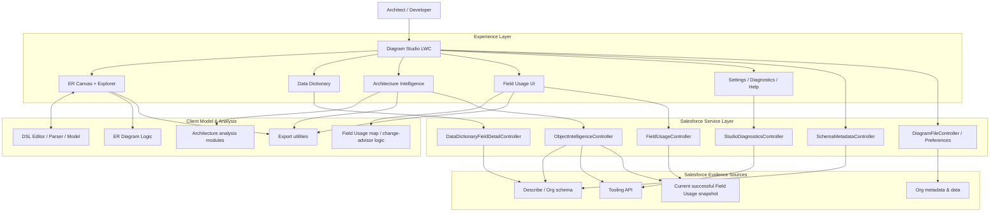
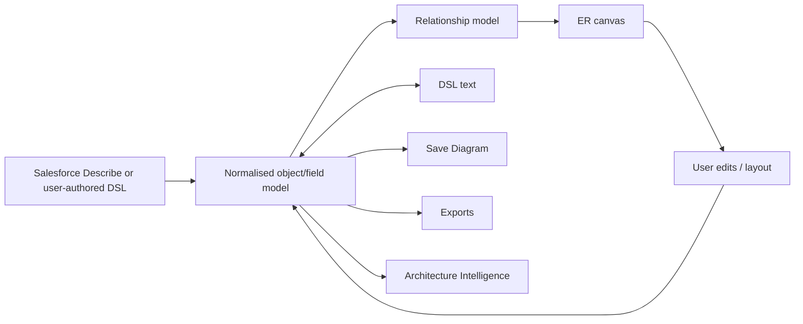
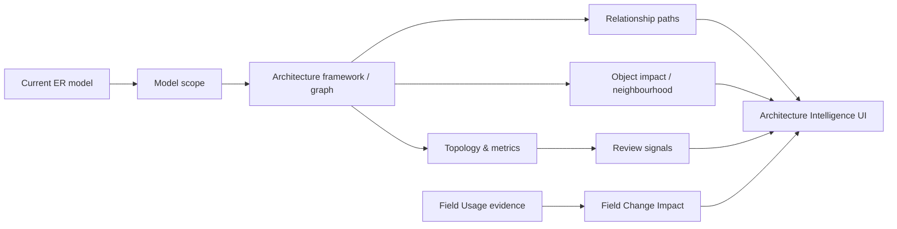
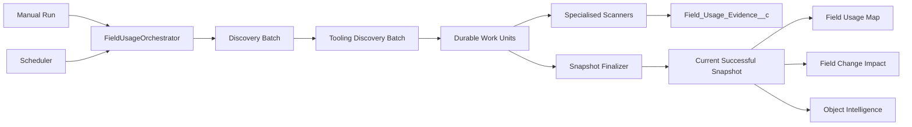
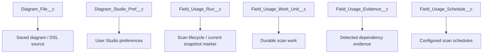
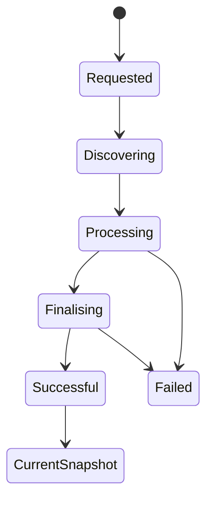

# ER Modeller Studio — Architecture

**Author: Vikas Cohen**

This document explains the architecture of ER Modeller Studio as a whole: how the UI, schema model, DSL, Salesforce metadata services, Architecture Intelligence and Version 3 Field Usage pipeline fit together. It is intentionally a **map of the system**, not a duplicate of the specialist documents.

## 1. Architectural philosophy

ER Modeller Studio is built around a simple idea: **understand the Salesforce data architecture before changing it**.

The architecture therefore separates four kinds of responsibility:

- **Acquisition** — obtain schema, metadata and dependency evidence from Salesforce.
- **Model** — represent objects, fields and relationships in a stable in-memory/DSL form.
- **Intelligence** — derive structural or dependency-oriented insights from evidence.
- **Experience** — let a human explore, compare, visualise and export those insights.

The system deliberately avoids treating an architectural signal as an automatic defect. Graph topology, dependency evidence, field population, record types and metadata counts answer different questions and remain separate until the user interprets them together.

## 2. Whole-system view

The large `diagramStudio` component is the application shell/orchestrator, but specialist logic is progressively extracted into focused modules and child components. This is important: the architecture is **modular by responsibility even when the Studio shell coordinates many features**.

## 3. Core modelling path

The normal modelling path is:

Salesforce schema import and DSL authoring converge on the same conceptual model. That is why the Studio can support a visual workflow and a code-like workflow without maintaining two independent definitions of the diagram.

For grammar, syntax and compiler internals, see [DSL.md](DSL.md) and [dsl-compiler-architecture.md](dsl-compiler-architecture.md).

## 4. Schema and metadata acquisition

`SchemaMetadataController` is the main server-side schema/metadata boundary for the modelling experience. It supplies Salesforce object information that the Studio normalises into the ER model. Other controllers are deliberately narrower:

- `DataDictionaryFieldDetailController` serves detailed field-oriented information.
- `ObjectIntelligenceController` supplies selected-object intelligence such as record types, layouts, triggers, validation rules, Flows and related evidence, using the appropriate Salesforce source.
- `StudioDiagnosticsController` verifies runtime/configuration conditions.
- `DiagramFileController` and `DiagramPreferenceController` handle Studio persistence concerns rather than architecture analysis.

This separation prevents every UI feature from independently implementing Salesforce metadata access.

## 5. Architecture Intelligence

Architecture Intelligence consumes the **model**, not raw UI markup. Its JavaScript modules isolate responsibilities such as framework construction, model scoping, visual-model generation, recommendations, performance handling, progress, map viewport behaviour, impact exploration and relationship-path experience.

A key boundary is that **structural impact** and **field dependency impact** are related but not identical. Structural analysis derives from the ER graph. Field Change Impact uses persisted scanner evidence. Keeping those sources explicit avoids presenting an inferred graph relationship as if it were runtime dependency evidence.

Detailed refactor notes live in [architecture-intelligence-refactor.md](architecture-intelligence-refactor.md); Version 2 history remains in its existing Version 2 documents.

## 6. Version 3 Field Usage pipeline

Field Usage is an asynchronous evidence pipeline rather than a synchronous page request. At a high level:

The specialised scanners are intentionally separate. A scanner knows how to recognise field evidence in one artefact family; orchestration knows how to schedule and progress work; persistence knows how to represent evidence; the UI knows how to visualise it. This is the central modularity rule of Version 3.

The authoritative implementation-level description of this pipeline is [FIELD_USAGE_ARCHITECTURE.md](FIELD_USAGE_ARCHITECTURE.md). This document does not repeat its work-unit, retry, snapshot or scanner algorithms.

## 7. Persistence model

The Studio uses separate persistence for separate concerns:

This is deliberate. Diagram persistence is not mixed with scanner evidence, and operational work-unit state is not treated as architecture evidence.

## 8. Evidence lifecycle

The Field Usage lifecycle protects users from partially refreshed intelligence:

A new run can be processing while the previous successful run remains the current consumable snapshot. Only finalisation promotes successful evidence. This is safer than clearing the user's trusted view at scan start and exposing partial results.

## 9. UI modularity

The UI is split into a shell plus specialist components/modules:

- `diagramStudio` — application shell, navigation and cross-feature orchestration.
- `architectureIntelligence` — architecture workspace with extracted analysis modules.
- `objectArchitectureHealth` — selected-object architecture/metadata intelligence.
- `fieldUsageIntelligence` — field dependency exploration.
- `fieldUsageSettings` — schedules and operational controls.
- `fieldUsageScannerCoverage` — scanner-coverage presentation.
- `dataDictionaryFieldDetail` — field-detail intelligence.
- `studioHelp` and `toolingApiConfigurationHelp` — embedded guidance/configuration.
- `diagramViewer`, `diagramExportUtils`, `fieldUsageMapLogic`, `fieldUsageMapExport`, `erDiagramLogic` — focused reusable presentation/logic utilities.

The design direction is to keep extracting cohesive logic from the shell when that logic has its own lifecycle, tests or reuse value. Extraction is preferred over copying.

## 10. Modularity rules

When extending the project:

1. **Do not duplicate metadata acquisition.** Reuse or extend the appropriate Apex boundary.
2. **Do not duplicate graph algorithms inside UI handlers.** Put reusable analysis in focused modules.
3. **Do not make scanners responsible for orchestration.** Scanner code detects evidence; pipeline code manages execution.
4. **Do not make the UI infer evidence that was not returned.** Preserve provenance and scanner limitations.
5. **Do not persist presentation state as dependency evidence.** Operational, model and evidence records have different meanings.
6. **Prefer current-successful-snapshot semantics.** Consumers should not silently mix runs.
7. **Keep exports downstream of the model/intelligence layer.** Exporters serialise results; they should not become a second analysis engine.
8. **Keep documentation specialised.** This file owns the whole-system map; specialist files own implementation detail.

## 11. Security and trust boundaries

The Studio runs inside Salesforce and relies on the running user's Salesforce access plus configured authenticated callouts for Tooling API operations. Credentials must not be embedded in client code. The Tooling API configuration is a trust boundary because it permits metadata/source retrieval required by scanners and object intelligence.

See [SECURITY.md](SECURITY.md) and the in-product **Help → Configuration** instructions for configuration and security details.

## 12. Testing architecture

The repository uses both Apex tests and Jest tests. Apex tests validate controllers, scanner/orchestration behaviour and persistence/service boundaries. Jest tests validate LWC behaviour and extracted JavaScript analysis modules. Architecture Intelligence in particular has focused tests for framework behaviour, recommendations, model scope, performance, progress, exports, visual model, impact exploration and relationship-path experience.

This split mirrors the product architecture: server-side evidence acquisition is tested server-side; client analysis and interaction are tested in JavaScript.

## 13. Documentation ownership — avoiding duplication

Each document has one primary job:

- **ARCHITECTURE.md** — whole-product architecture and module boundaries.
- **VERSION-3-FEATURES.md** — Version 3 user-visible capability catalogue.
- **FIELD_USAGE_ARCHITECTURE.md** — detailed Field Usage implementation.
- **dsl-compiler-architecture.md** — DSL compiler internals.
- **DSL.md** — DSL language reference.
- **architecture-intelligence-refactor.md** — Architecture Intelligence refactor design/history.
- **PHASE-2-DATA-ARCHITECTURE-INTELLIGENCE.md** and **RELEASE-NOTES-V2.md** — Version 2 historical documentation.
- **SECURITY.md** — security-specific guidance.
- **In-product Help** — operational/user instructions and configuration steps.

New documentation should link to the owning document instead of copying large sections from it.
