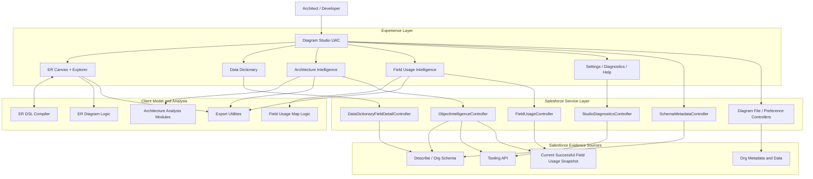
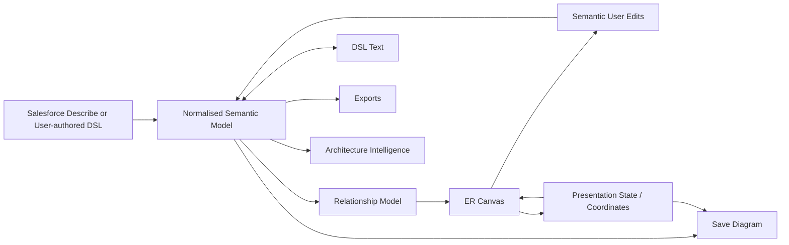
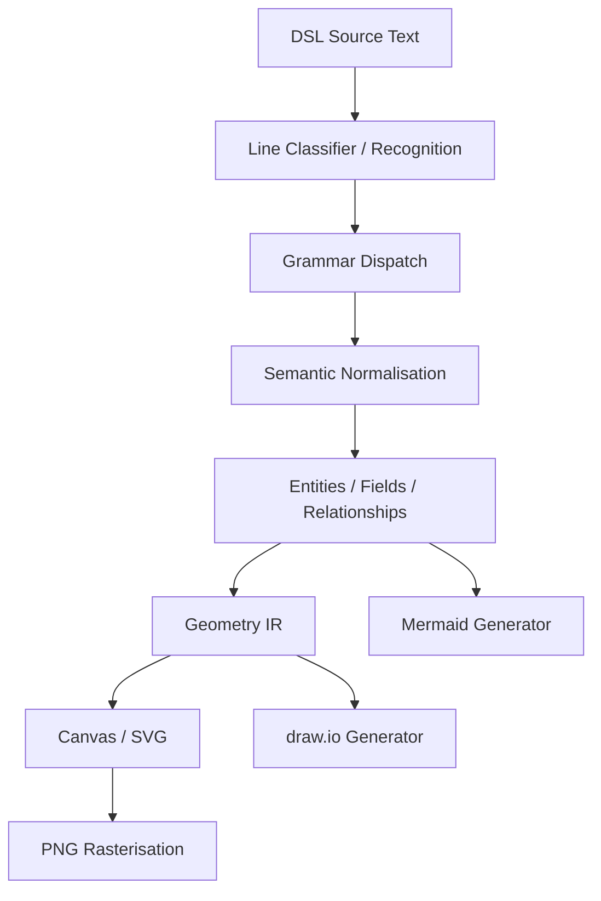
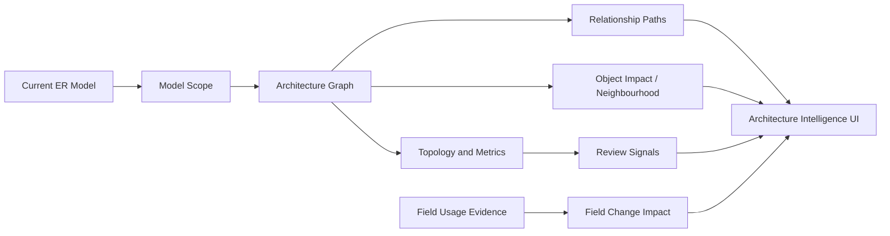
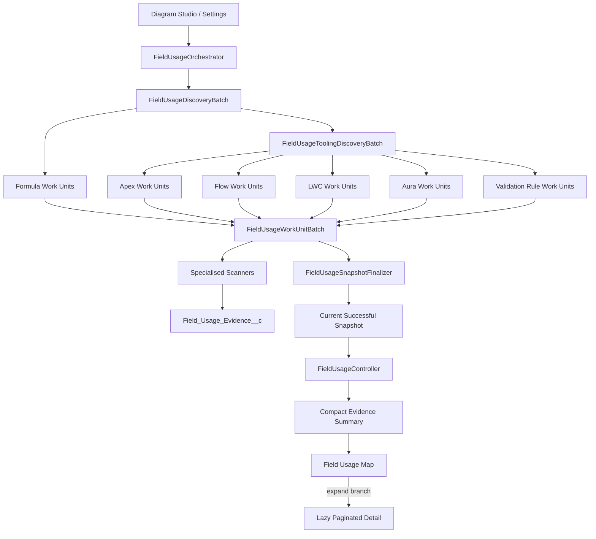
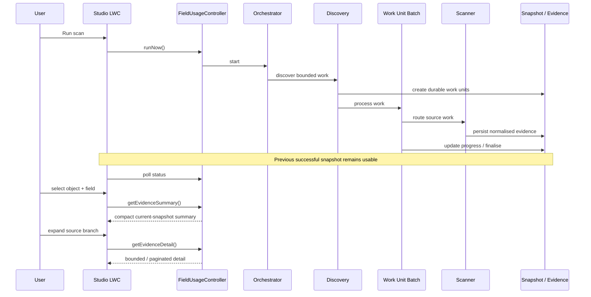
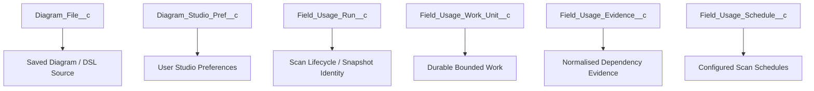
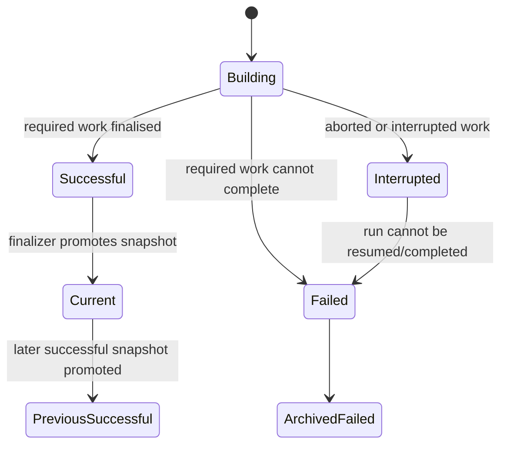

# ER Modeller Studio Architecture

**Author: Vikas Cohen**  
**Lead Architect and System Designer**

This is the authoritative technical architecture document for ER Modeller Studio. It describes the product as one system: visual ER modelling, the ER DSL compiler, Salesforce metadata acquisition, Data Dictionary, Architecture Intelligence, Object Intelligence, Version 3 Field Usage Intelligence, persistence, security boundaries, testing and extension principles.

The product philosophy is simple: **understand the Salesforce data architecture before changing it**.

## 1. Architectural philosophy

ER Modeller Studio separates four responsibilities:

1. **Acquisition**: obtain schema, metadata and dependency evidence from Salesforce.
2. **Model**: represent objects, fields, relationships and evidence in stable forms.
3. **Intelligence**: derive structural and dependency-oriented insight from those models.
4. **Experience**: let a human explore, compare, visualise and export the result.

The implementation layers in the next section are how those responsibilities are realised. They are not four competing classifications. Acquisition is primarily implemented by the Salesforce service/evidence layers; Model and Intelligence span the client model, analysis modules and persisted evidence; Experience is the user-facing layer.

The system follows several rules:

- Evidence before opinion.
- Structural signals are review prompts, not automatic defects.
- Heavy org-wide work is asynchronous; interactive reads should remain bounded.
- The last successful dependency snapshot remains trusted until a replacement completes successfully.
- Meaning is separated from presentation.
- Acquisition, parsing, persistence, analysis and visualisation are separate concerns.
- New capability should normally become a focused module rather than another monolithic block.
- Absence of detected evidence is not proof of absence of dependency.

## 2. Whole-system architecture



`diagramStudio` is the application shell and cross-feature orchestrator. Specialist behaviour is progressively extracted into focused components and JavaScript modules. The shell coordinates; it should not become a second implementation of every subsystem.

## 3. Core modelling path



Salesforce schema import and DSL authoring converge on the same conceptual model. Visual edits that change meaning can update the model. Coordinates and layout remain presentation state and do not become source semantics merely because they are persisted with a diagram.

## 4. ER DSL compiler architecture

The ER DSL is declarative. It describes entities, fields and relationships rather than an execution sequence. The compiler follows this invariant:

```text
source text -> semantic model -> optional geometry IR -> target artifact
```

The **semantic model is authoritative**. Canvas geometry, SVG, Mermaid, draw.io XML and PNG are derived representations.



### Compiler responsibilities

`erDiagramLogic.js` owns the core compiler-style logic: parsing, semantic construction, relationship normalisation, geometry generation and target generation. `diagramStudio.js` owns editor state, persisted positions, interaction and compiler invocation.

The grammar is intentionally line-oriented and flat. A parser generator or full AST would add ceremony without improving the current language. If the language later gains nesting, expressions, aliases, blocks or multiline declarations, an AST can be introduced without changing the semantic-model contract.

A compact grammar is:

```text
program        ::= line*
line           ::= blank | comment | entity | relationship
entity         ::= "entity" identifier (":" field-list)?
field-list     ::= field ("," field)*
field          ::= identifier field-metadata?
field-metadata ::= "[" metadata-text "]"
relationship   ::= identifier "." identifier operator identifier
operator       ::= "->" | "=>" | "~>"
```

Entity identity is case-insensitive while display casing is preserved. Relationship targets may be referenced before declaration. Exact duplicate relationships are normalised. Field bracket metadata belongs to the semantic field representation; saved coordinates do not.

The compiler deliberately does not calculate Salesforce access, execute business logic or query Salesforce. Those concerns belong to other boundaries.

### Compiler extension rule

A language feature is not complete merely because the parser recognises it. Extend from the semantic model outward: syntax, recognition, semantic model, geometry, every relevant backend, diagnostics/tests and documentation.

The language syntax and examples remain in [DSL.md](DSL.md). This document owns the compiler architecture.

## 5. Schema and metadata acquisition

`SchemaMetadataController` is the main server-side schema boundary for modelling. Other controllers remain deliberately narrower:

- `DataDictionaryFieldDetailController`: field-oriented detail.
- `ObjectIntelligenceController`: selected-object intelligence such as record types, layouts, triggers, validation rules, Flows and related evidence.
- `StudioDiagnosticsController`: runtime and configuration checks.
- `DiagramFileController` / `DiagramPreferenceController`: Studio persistence rather than architecture analysis.
- `FieldUsageController`: current Field Usage snapshot, status, schedules, summaries and bounded evidence detail.

This prevents every UI feature from independently implementing Salesforce metadata access.

## 6. Architecture Intelligence

Architecture Intelligence consumes the model rather than raw UI markup.



Structural impact and field dependency impact are related but different. Structural analysis derives from the ER graph. Field-level dependency impact derives from persisted scanner evidence. The UI must not present an inferred structural relationship as if it were source dependency evidence.

Architecture Intelligence includes architecture overview, topology/complexity metrics, hotspots, isolated objects, connected components, bounded-cycle analysis, relationship paths, object impact, review findings and field-change exploration backed by Field Usage evidence.

## 7. Object Intelligence and Data Dictionary

The Data Dictionary provides object/field metadata browsing, filtering, detail and export. Object Intelligence adds selected-object context such as custom-field review signals, relationships and metadata/dependency evidence.

Counts such as page layouts or record types are evidence, not defects by themselves. Potential custom-to-standard overlap is presented for human review rather than asserted as a guaranteed duplicate.

Record population percentage and dependency usage are separate concepts and remain separately labelled.

## 8. Version 3 Field Usage architecture

Field Usage is an asynchronous evidence pipeline. Discovery, scanning, persistence, querying and visualisation are separate concerns.



### Main Field Usage responsibilities

- `FieldUsageOrchestrator` starts scans and prevents conflicting runs.
- `FieldUsageDiscoveryBatch` performs schema-oriented discovery and formula work discovery.
- `FieldUsageToolingDiscoveryBatch` discovers source/metadata work for Apex, Flow, LWC, Aura and supported metadata scanners.
- `FieldUsageWorkUnitBatch` routes bounded durable work and maintains progress.
- Source scanners detect evidence for one artefact family.
- Tooling API client classes own authenticated transport rather than duplicating HTTP/authentication logic in scanners.
- `FieldUsageSnapshotFinalizer` promotes only a successful replacement snapshot.
- `FieldUsageController` provides the LWC-facing read/operation boundary.

### Scanner contract and matching model

A scanner receives bounded source work plus scan context. It retrieves only the source required for its artefact family, applies source-specific detection, resolves candidate field references against Salesforce schema where applicable, emits normalised evidence and reports meaningful failures.

This is **not a universal semantic compiler for Salesforce source**. Different artefact families require different detection strategies. The design therefore keeps parsing/detection inside specialised scanners rather than claiming one text-matching rule understands Apex, Flow XML, Lightning source, formulas and validation rules equally.

Schema resolution reduces ambiguity by grounding candidate names in Salesforce object/field metadata and by persisting canonical API names. It does not turn inherently dynamic source into statically provable dependency information. Dynamically constructed names, runtime indirection and unsupported artefact families can escape static detection. Conversely, source text can contain syntactically plausible names that require scanner-specific context to avoid false matches. The architecture treats scanner output as evidence, not mathematical proof of complete dependency closure.

Supported evidence families in V3 are Apex Classes, Apex Triggers, active Flows, LWC, Aura, Formula Fields and Validation Rules where supported by the current pipeline.

### Why source-specific scanners

The V3 architecture deliberately owns a normalised evidence pipeline rather than treating a single platform dependency feed as the whole product contract. This allows each supported artefact family to preserve provenance, scanner identity, component detail and snapshot semantics behind one query model.

This document does **not** claim that Salesforce dependency metadata is useless or interchangeable with the current scanners. A formal comparison with Salesforce dependency APIs, including `MetadataComponentDependency`, has not yet been established here as a measured design decision. If that source is introduced later, it should enter through the acquisition/scanner boundary and be reconciled with the same evidence contract rather than bypassing snapshot semantics.

### Canonical field identity

Matching may be case-insensitive internally, but persisted field identity uses the canonical API name returned by Salesforce Describe. This keeps evidence stable across standard fields, custom fields and namespaced/non-namespaced environments.

## 9. Evidence boundaries and safe interpretation

**An empty Field Usage result is not a safe-to-delete signal.** It means the supported scanners did not persist dependency evidence for that field in the current successful snapshot.

The V3 scanner contract currently covers the evidence families listed above. It does not claim complete dependency coverage for every Salesforce feature or every possible runtime reference. In particular, users should not infer coverage for artefact families that are not listed as supported scanners, such as reports, dashboards, list views, email templates or arbitrary external systems. Page Layout information can appear in Object Intelligence, but that does not make Page Layouts part of the Field Usage source-scanner contract.

Managed-package implementation source may not be available to the running org/tooling context. Inactive Flows are outside the stated active-Flow scanner scope. Dynamic references assembled from strings or resolved only at runtime may not be statically discoverable.

Therefore:

```text
no evidence found != field is unused
```

Field Usage should be one input into change analysis alongside Salesforce configuration review, package/vendor knowledge, integration knowledge, runtime testing and the organisation's normal release controls.

## 10. Field Usage runtime sequence



The initial map must not hydrate every evidence row. Summary data builds the first graph; detail is loaded progressively and may be cached only within the current snapshot/context identity.

## 11. Persistence model



Diagram persistence, operational scan state and dependency evidence are intentionally separate.

## 12. Snapshot and recovery semantics



**Only a successfully finalised snapshot can become current.** Starting a new scan does not remove the last good state. Failed, partial, aborted or otherwise incomplete work must not masquerade as complete intelligence or replace the last successful snapshot.

Work units are durable checkpoints with Pending, Processing, Completed and Failed semantics. Retry/recovery behaviour is intentionally bounded. Operational monitoring and administrative controls exist so incomplete work remains visible rather than silently becoming trusted evidence.

## 13. Performance and governor-limit architecture

Salesforce governor limits are architectural constraints. The project therefore prefers:

- bounded Batch Apex scopes;
- durable work units instead of giant transaction state;
- collection-based SOQL/DML;
- batched API retrieval where safe;
- aggregation instead of unnecessary hydration;
- paginated/lazy interactive detail;
- `Map`/`Set` indexes rather than repeated large-array scans;
- snapshot-scoped client caching;
- separate measurement of scan throughput and interactive map latency.

The architecture does not publish a universal scan-duration, org-size ceiling, evidence-growth rate or retention guarantee because those have not been established here as controlled benchmarks. They depend on org composition, source volume, API behaviour and the evidence produced. Such numbers should be published only from repeatable measurements, not inferred from design intent.

An optimisation is unacceptable if it weakens evidence correctness, provenance or snapshot consistency.

## 14. UI modularity

Important UI/component boundaries include:

- `diagramStudio`: application shell and cross-feature orchestration.
- `architectureIntelligence`: architecture workspace and analysis modules.
- `objectArchitectureHealth`: selected-object intelligence.
- `fieldUsageIntelligence`: field dependency exploration.
- `fieldUsageSettings`: schedules and operational controls.
- `fieldUsageScannerCoverage`: scanner coverage/status.
- `dataDictionaryFieldDetail`: field-detail intelligence.
- `studioHelp` / `toolingApiConfigurationHelp`: embedded user/configuration guidance.
- `diagramViewer`, `diagramExportUtils`, `fieldUsageMapLogic`, `fieldUsageMapExport`, `erDiagramLogic`: reusable focused logic.

Extraction is preferred over copying. A method that begins owning acquisition, parsing, persistence and presentation at once is a refactoring signal.

## 15. Security, access and trust boundaries

The Studio runs inside Salesforce and relies on the running user's Salesforce access plus configured authenticated callouts for Tooling API operations. Credentials are not embedded in client code. The Named Credential / External Credential configuration is a deliberate trust boundary for source and metadata retrieval.

Field Usage evidence is persisted in Salesforce custom objects. Access to that persisted evidence is therefore part of the application's Salesforce permission model, not a substitute for Salesforce source-authoring permissions. A user being able to read evidence should not be interpreted as that user having `Author Apex`, edit access to the underlying component, or independent permission to retrieve arbitrary source outside the application's configured boundaries.

Beta testers must receive the packaged **Diagram Studio User** permission set and the required External Credential principal access as described in the installation guide and in-product Help. Organisations should review those permissions and the evidence stored in their org before broader deployment.

Dynamic metadata identifiers must be validated. Unsafe dynamic SOQL, credential logging and persistence of session identifiers/secrets are prohibited.

Detailed guidance remains in [SECURITY.md](SECURITY.md) and **Help > Configuration**.

## 16. Testing architecture

The repository uses Apex and Jest tests.

Apex tests cover controllers, scanner behaviour, orchestration, durable work, snapshot finalisation, Tooling API boundaries and persistence/service behaviour. Jest covers LWC behaviour, map logic, architecture-analysis modules, exports, progress, performance and interaction behaviour.

The split mirrors the product: server-side evidence acquisition is tested server-side; client-side analysis and interaction are tested in JavaScript.

A beta candidate should be considered green only when Salesforce CLI validation and the full Jest suite both pass.

## 17. Extension rules

1. Do not duplicate metadata acquisition.
2. Do not duplicate graph algorithms inside UI event handlers.
3. Do not make scanners responsible for orchestration.
4. Do not let the UI invent evidence that was not returned.
5. Do not mix presentation state with dependency evidence.
6. Preserve current-successful-snapshot semantics.
7. Keep exporters downstream of the semantic/intelligence layer.
8. Keep source-specific parsing inside the appropriate scanner.
9. Preserve canonical Salesforce API identity at persistence boundaries.
10. Extend the DSL from semantic model outward, not renderer inward.
11. Prefer focused modules over expanding monolithic files.
12. Treat diagnostics, failure visibility and limitations as part of the product contract.

## 18. Architectural principle

The architecture can be reduced to one flow:

```text
Salesforce schema / metadata / supported source
              |
              v
       acquisition boundaries
              |
              v
 semantic model + durable evidence
              |
              v
 modelling / compiler / intelligence
              |
              v
 human-readable maps, review signals and exports
```

The visual modeller and DSL share one semantic meaning. Architecture Intelligence reasons over the ER model. Field Usage gathers durable source evidence asynchronously. Object Intelligence combines selected-object metadata with appropriate dependency context. The UI progressively discloses detail without pretending that structural signals or missing evidence are definitive conclusions.

That separation of **meaning, evidence, analysis and presentation** is the core architectural principle of ER Modeller Studio.
