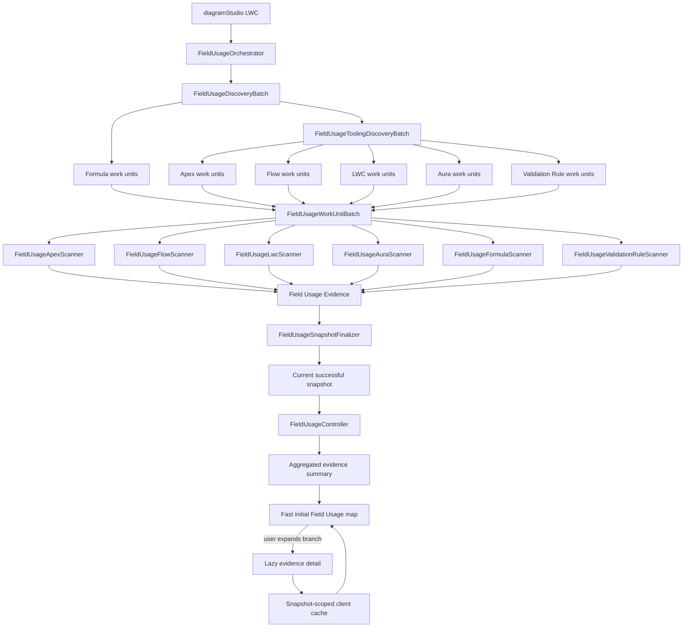
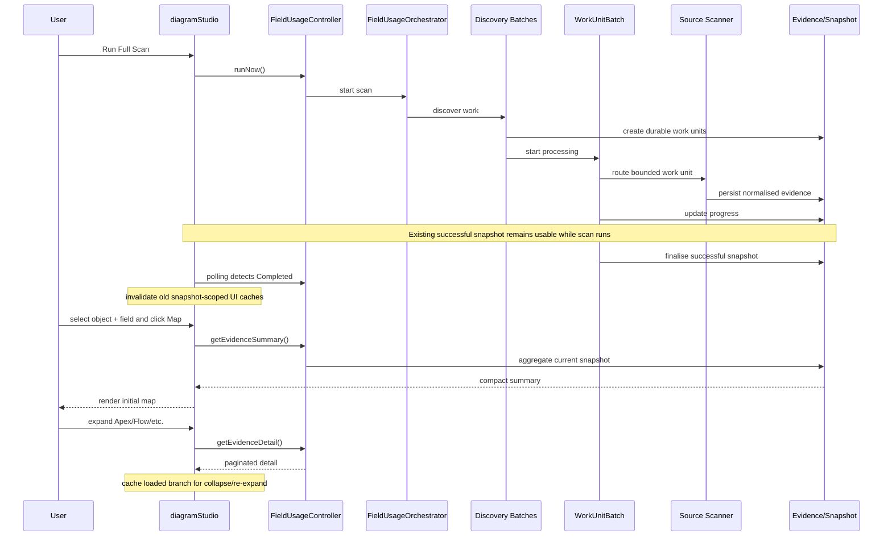
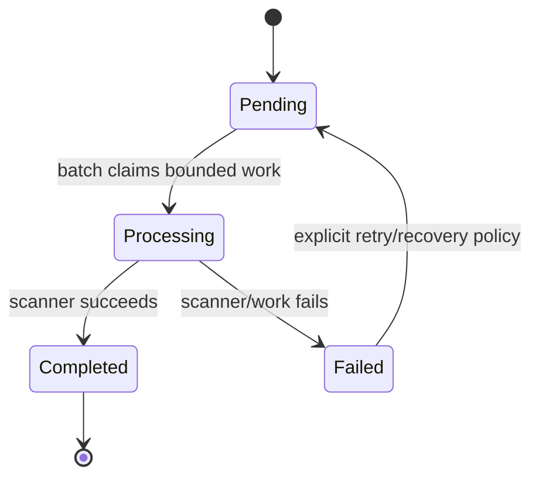
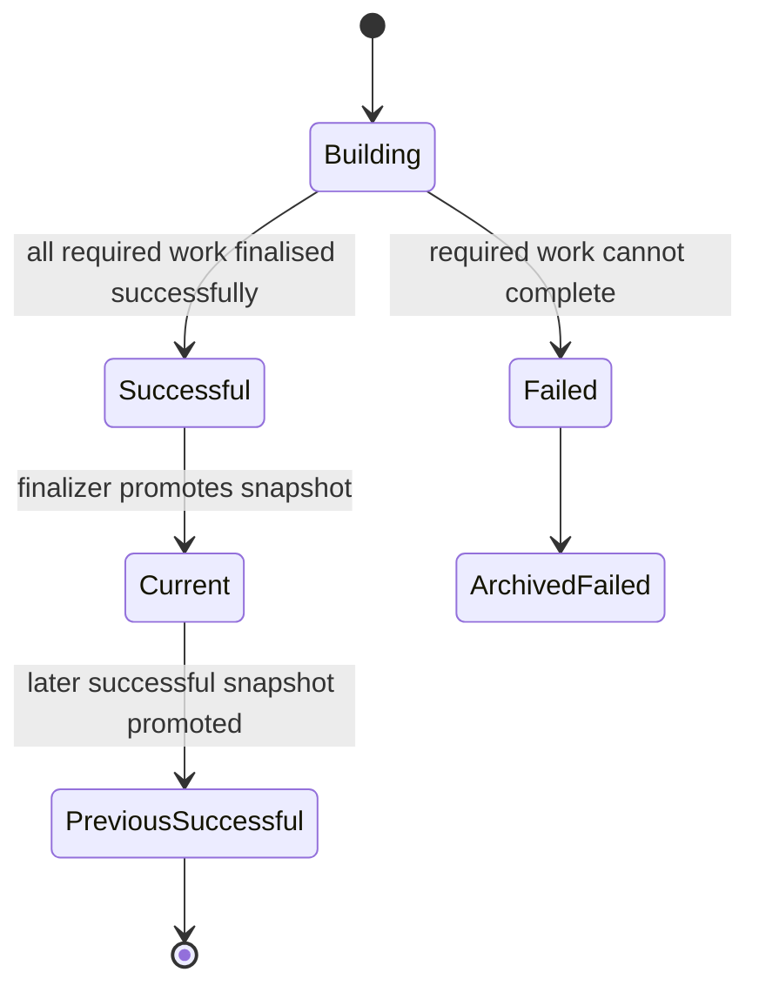

# Salesforce ER Modeller Studio V3 — Field Usage Architecture

## Purpose

This document is the developer architecture guide for V3 Field Usage Intelligence. It summarises the main Apex classes and LWC modules, how the scan pipeline works, the coding philosophy used in V3, the standards that future changes should follow, and the main areas for improvement.

The central principle is:

> Discovery, scanning, persistence, querying and visualisation are separate concerns.

A developer should be able to change one scanner without having to understand or modify every other scanner.

---

# 1. Complete architecture



## Runtime sequence



---

# 2. Coding philosophy

V3 follows a small set of deliberate engineering principles.

## Modular before monolithic
A new capability should normally become a focused class/module rather than another large block inside an existing giant file. `diagramStudio.js`, `FieldUsageController` and `FieldUsageWorkUnitBatch` are orchestration boundaries, not dumping grounds.

## Bulk first
Salesforce governor limits are an architectural constraint. Prefer grouped discovery, bounded Batch Apex scopes, durable work units, collection-based SOQL/DML, Composite API where appropriate, aggregation, pagination and lazy retrieval. Avoid SOQL, DML or avoidable network requests inside item-by-item loops.

## Fast reads, asynchronous heavy work
Scanning an enterprise org can take time. Opening Field Usage and building a map should not. Heavy discovery/analysis belongs asynchronously; the UI consumes compact snapshots and lazy detail.

## Persist progress, not giant transaction state
Large operations should be represented by durable run/work-unit records rather than one giant transaction or in-memory collection.

## One source type, one scanner responsibility
Apex logic belongs in the Apex scanner; Flow in Flow; likewise LWC, Aura, Formula and Validation Rules. All converge into the common evidence model.

## Correctness before cleverness
Optimisation must not make field matching unreliable. Prefer understandable, testable parsing over obscure micro-optimisations.

## Progressive disclosure
Do not load information before the user needs it. Build a lightweight map first and load detailed evidence on expansion.

## Cache safely
Cache expensive UI detail only within the current successful snapshot identity. A newly successful scan invalidates the old snapshot cache.

## Preserve the last good state
A failed scan must not destroy the previous successful snapshot.

## Refactor when responsibility changes
If a method starts doing discovery + HTTP + parsing + persistence + presentation, split it. Mixed responsibility is a stronger warning sign than file size alone.

---

# 3. Coding standards

## Apex standards

### Naming
- Classes: `PascalCase`.
- Methods/variables: `camelCase`.
- Scanner classes: `FieldUsage<Source>Scanner`.
- API/client classes describe the external boundary they own.
- Batch names describe the batch responsibility.
- Avoid vague names such as `Helper2`, `UtilsNew`, `processStuff()` or `data1`.

### Methods
Methods should have one primary responsibility. Prefer `discover -> create work units -> process -> scanner parses -> persist evidence` rather than one method owning the entire lifecycle. Keep public/global surface area small.

### SOQL and DML
- No intentional SOQL/DML in per-record loops.
- Query only required fields.
- Use Sets/Maps for indexing.
- Aggregate in SOQL when cheaper than Apex hydration.
- Bulk DML evidence/work records.
- Bound interactive query results.

### Callouts
- HTTP/Tooling/REST transport belongs in client classes.
- Do not duplicate endpoint/authentication/error handling across scanners.
- Batch requests where APIs permit it.
- Respect callout count, response size and heap limits.
- Do not arbitrarily increase chunks simply to improve a benchmark.

### Batch Apex
- Scopes are intentionally bounded.
- Persist enough state for observability/recovery.
- `execute()` processes its scope rather than rediscovering the org.
- `finish()` coordinates the next stage/finalisation, not an unbounded second scan.

### Error handling
- Fail work explicitly when processing fails.
- Preserve diagnostic source/component context.
- Never silently swallow exceptions that make a failed scan look successful.
- Partial/failed scans cannot replace the current successful snapshot.

### Evidence
Scanners emit the common evidence shape. Avoid scanner-specific persistence models unless there is a strong architectural requirement.

### Security
Respect the application's Salesforce security model, validate dynamic metadata identifiers, avoid unsafe dynamic SOQL and never persist credentials/session identifiers/secrets in logs or evidence.

## LWC / JavaScript standards

### Keep `diagramStudio.js` as an orchestrator
Extract cohesive behaviour into modules: map logic, evidence/cache, scan console, help/configuration, exports and feature calculations.

### Avoid repeated large-array scans
Index with `Map`/`Set` once rather than repeatedly filtering/finding across large arrays during map construction.

### Lazy loading
Initial UI actions request only what is needed for the current screen. Never load all evidence because the user might click it later.

### Cache behaviour
Loaded branches may be cached for instant collapse/re-expand. Cache identity must prevent cross-snapshot/object/field/source leakage.

### UI state
Do not clear previous successful data when a scan starts. Invalidate old client state only after the replacement Full Scan successfully completes and becomes current.

### Rendering
Keep expensive calculations outside repeated render/getter paths. Recompute when input changes, not on every render cycle.

---

# 4. Main Apex classes

## `FieldUsageOrchestrator`
Creates/starts scan context, prevents conflicting scans and begins discovery. It does not parse metadata.

## `FieldUsageDiscoveryBatch`
Schema-based discovery. Iterates objects safely, discovers Formula work, creates durable work units and chains Tooling discovery.

## `FieldUsageToolingDiscoveryBatch`
Discovers Apex, Flow, LWC, Aura and Validation Rule metadata and creates bounded work units. It does not own source parsers.

## `FieldUsageWorkUnitBatch`
Common execution/routing engine. Reads pending work, processes bounded scopes, routes by source/scanner type and maintains progress/completion state.

## Scanner classes
- `FieldUsageApexScanner` — Apex Class/Trigger references.
- `FieldUsageFlowScanner` — Flow metadata references.
- `FieldUsageLwcScanner` — Lightning Web Component references.
- `FieldUsageAuraScanner` — Aura resource references.
- `FieldUsageFormulaScanner` — Formula Field dependencies.
- `FieldUsageValidationRuleScanner` — Validation Rule formula dependencies.

## API clients
- `FieldUsageToolingApiClient` — shared core Tooling API transport.
- `FieldUsageUiToolingClient` — UI metadata/REST retrieval including LWC, Aura and Validation Rule bulk retrieval where appropriate.

## `FieldUsageSnapshotFinalizer`
Finalises run status and promotes only a successful replacement snapshot to current.

## `FieldUsageController`
LWC-facing service. Important concepts/methods include `runNow()`, `getStatus()`, `getSnapshotAvailability()`, `getSnapshotObjects()`, `getSnapshotFields()`, `getEvidenceSummary()`, `getEvidenceDetail()`, `searchEvidence()` and `getSourceTypes()`.

**Critical rule:** `getEvidenceSummary()` is compact Map input, not a full evidence hydration endpoint.

---

# 5. Persistence model

- `Field_Usage_Run__c` — one scan attempt/lifecycle.
- `Field_Usage_Work_Unit__c` — durable bounded scan work/checkpoint.
- `Field_Usage_Evidence__c` — common normalised scanner output.

---

# 6. Field Usage map architecture

```text
Object + Field selection
        |
       Map
        |
getEvidenceSummary()
        |
Compact indexed graph
        |
 Apex / Flow / LWC / Aura / Formula / Validation Rule
        |
 user expands branch
        |
getEvidenceDetail()
        |
paginated evidence
        |
client-side snapshot cache
```

The Map button must not pay the cost of loading every source snippet/evidence row. Collapse hides a loaded branch; re-expand uses cache where snapshot/context is unchanged.

---

# 7. Batch polling console boundary

Batch polling is separate from map rendering. It shows durable scan/Batch Apex progress. Map optimisation, lazy loading and cache invalidation must not break polling cadence or the scan-console experience.

---

# 8. Successful scan refresh rule

```text
Previous successful snapshot
          |
     Full Scan starts
          |
Keep previous UI usable
          |
      Scan result
      /        \
   Failed    Successful
     |           |
keep old      promote new snapshot
snapshot          |
              invalidate old UI cache
                  |
              load new data on demand
```

Starting a scan is not permission to remove the last good data.

---

# 9. Scanner contract

Every source scanner should conceptually follow the same contract even if an explicit Apex interface is introduced later.

## Input contract
A scanner receives a **bounded unit of source work** plus the current scan/run context. It should not rediscover the whole org. Input must contain enough source identity to retrieve/parse the intended component(s).

## Processing contract
A scanner:
1. retrieves only the metadata/resources required by its work unit;
2. parses source-specific content;
3. resolves candidate references against known Salesforce object/field context;
4. produces zero or more normalised evidence records;
5. reports a meaningful failure rather than silently dropping failed work.

## Output contract
Evidence should consistently identify, where applicable:
- scan/run identity;
- Salesforce object;
- Salesforce field;
- source type;
- source/component name;
- source/component identity;
- useful location/context/snippet information;
- enough information for map/search/detail APIs without requiring scanner-specific UI logic.

## Scanner invariants
A scanner must not promote snapshots, control the polling UI, perform unrelated discovery or directly construct the Field Usage map.

---

# 10. Work-unit state machine



Work units are durable checkpoints. A future retry implementation should make retry policy explicit rather than creating hidden recursive retries. Repeated failure must remain observable and must not allow an incomplete run to masquerade as successful.

---

# 11. Snapshot lifecycle



Core invariant: **only a successfully finalised snapshot can become current**. A Building, partial, failed or completed-with-errors snapshot must never replace the last trusted snapshot unless product semantics are deliberately changed and documented.

---

# 12. Dependency / change-impact matrix

| Change area | Primary owner | Common impact to check |
|---|---|---|
| Start/scan lifecycle | `FieldUsageOrchestrator` | run creation, concurrency, discovery start, polling |
| Schema discovery | `FieldUsageDiscoveryBatch` | Formula work units, chaining, batch volume |
| Metadata discovery | `FieldUsageToolingDiscoveryBatch` | Apex/Flow/LWC/Aura/Validation work counts and routing |
| Work routing | `FieldUsageWorkUnitBatch` | **all scanners**, progress, failures, finalisation |
| Apex parsing | `FieldUsageApexScanner` | Apex Class/Trigger evidence only, shared evidence contract |
| Flow parsing | `FieldUsageFlowScanner` | Flow evidence, heap/callout behaviour |
| LWC parsing | `FieldUsageLwcScanner` | LWC evidence/resources |
| Aura parsing | `FieldUsageAuraScanner` | Aura evidence/resources |
| Formula parsing | `FieldUsageFormulaScanner` | Formula dependencies, cross-object resolution |
| Validation parsing | `FieldUsageValidationRuleScanner` | rule evidence and formula resolution |
| API transport | Tooling/UI clients | every scanner using that client, pagination/callout limits |
| Snapshot finalisation | `FieldUsageSnapshotFinalizer` | current snapshot correctness, last-good preservation |
| Summary/detail API | `FieldUsageController` | Map latency, pagination, search, selectors |
| Map logic | `fieldUsageMapLogic` | first render, expand/collapse, layout |
| Main LWC orchestration | `diagramStudio` | potentially broad UI regression; prefer extracting modules |
| Cache invalidation | LWC Field Usage state | stale evidence, new-scan refresh, expand/re-expand |
| Polling console | scan-console/polling path | progress UI only; avoid coupling to map rendering |

A change to a shared layer should trigger broader regression checks than a change isolated to one scanner.

---

# 13. Performance guardrails

These are architectural guardrails rather than exact benchmark promises:

- Interactive APIs must not perform unbounded evidence queries.
- Map construction starts from summary/aggregate data.
- Detail APIs remain bounded/paginated.
- Avoid one-callout-per-component designs when safe batching/Composite retrieval exists.
- Work-unit chunk size must respect heap, CPU, DML and callout limits.
- Do not hydrate full metadata/evidence collections solely to calculate a count that can be aggregated.
- Do not repeatedly scan the same large JS array when an index can be built once.
- Cached detail is scoped to snapshot/context and invalidated after successful snapshot replacement.
- A performance improvement is unacceptable if it weakens evidence correctness or snapshot consistency.
- Measure scan throughput and Map latency separately; they are different performance problems.

---

# 14. Failure and recovery architecture

## Individual work-unit failure
Record the failure with source context. The run must know that required work did not complete successfully. Do not silently omit the component.

## Metadata/API timeout or transient failure
Keep the work/run state observable. Any retry strategy should be bounded and explicit. Never create infinite chaining/retry behaviour.

## One scanner family fails while others succeed
Successful evidence may exist for diagnostic purposes, but the incomplete replacement snapshot must not silently become the trusted current snapshot.

## Batch chain interruption
Durable run/work-unit records are the recovery source of truth. Recovery should resume/retry bounded work rather than restart arbitrary hidden state where possible.

## UI polling failure
A browser/network polling problem must not determine server-side scan correctness. Reopening the console should be able to reconstruct status from persisted run/Async Apex state.

## New scan fails
Keep the previous successful snapshot and its usable UI data.

---

# 15. Concrete extension example — Email Template scanner

Suppose a future V3 requirement is to identify Salesforce field references in supported Email Templates.

A developer should:

1. research the appropriate Salesforce metadata/API source and limits;
2. extend discovery to create bounded `EMAIL_TEMPLATE` work units;
3. add `FieldUsageEmailTemplateScanner.cls` rather than adding template parsing to `FieldUsageWorkUnitBatch`;
4. use/reuse an API client for retrieval instead of embedding HTTP code in the scanner when practical;
5. parse merge-field references and resolve them against object/field context;
6. emit the existing common evidence shape with source type `Email Template`;
7. add routing for the new work-unit type;
8. expose the source type through controller/UI filtering;
9. add a map node/style only if the generic source rendering is insufficient;
10. add parser tests, routing tests, metadata validation and realistic-volume performance testing.

The expected architecture remains:

```text
Discovery -> EMAIL_TEMPLATE work unit -> FieldUsageEmailTemplateScanner
          -> common evidence -> existing snapshot/controller/map pipeline
```

The new feature should not require rewriting Apex, Flow or Formula scanners.

---

# 16. Anti-patterns

Avoid the following:

- adding a large new scanner directly inside `FieldUsageWorkUnitBatch`;
- adding metadata parsing to `FieldUsageController`;
- adding server/data-processing logic to `diagramStudio.js` merely because the screen lives there;
- SOQL or DML per record;
- one Tooling/REST callout per item when a bounded bulk alternative is available;
- loading all evidence when the user clicks Map;
- returning thousands of detail records without pagination;
- repeatedly filtering the same large JS arrays during graph construction;
- creating multiple clients that duplicate authentication/HTTP/error logic;
- clearing the previous successful table/map when a new scan merely starts;
- promoting partial/failed data to current;
- caching evidence without snapshot identity;
- swallowing exceptions and marking work successful;
- making chunk sizes huge without measuring heap/CPU/callout consequences;
- modifying the polling console as a side effect of unrelated map optimisation.

---

# 17. Testing strategy

Testing should be layered.

## Scanner/parser unit tests
Test each scanner's reference extraction independently with positive, negative and edge-case metadata/source examples.

## Bulk tests
Exercise multiple components/fields in one execution and verify no design accidentally depends on a single-record scope.

## Routing/orchestration tests
Verify work-unit type -> correct scanner routing, progress transitions and finalisation behaviour.

## Failure tests
Verify scanner failure, callout error, partial work and failed runs do not promote an invalid snapshot.

## Controller/read-path tests
Verify summary aggregation, pagination, selectors, search bounds and current-snapshot filtering.

## LWC tests
Verify Map construction, source expansion, collapse/re-expand cache behaviour, successful-scan invalidation and polling regression.

## Salesforce metadata validation
Compile/deploy validation against Salesforce should occur before a scanner change is considered deployment-ready. This catches metadata/API/Apex constraints that static inspection alone can miss.

## Large-volume/performance tests
Use realistic component/evidence volumes. Measure at least scan throughput, callouts, heap-sensitive stages, Map-button latency and lazy expansion latency.

---

# 18. Architecture decisions / ADR guidance

Important architectural decisions should remain discoverable so a future developer understands **why**, not merely **what**.

For major decisions, either add a short ADR under `docs/adr/` or record the decision in a dedicated section/document. A lightweight ADR should contain:

- context/problem;
- decision;
- alternatives considered;
- consequences/trade-offs;
- date/version/branch context.

Good candidates for ADRs include:

- durable work units instead of a monolithic scan transaction;
- successful snapshot promotion/last-good preservation;
- summary-first Map and lazy detail hydration;
- snapshot-scoped client caching;
- source-specific scanner modularity;
- Composite API use for suitable metadata retrieval;
- future incremental-scan strategy if adopted.

Do not rewrite historical ADRs simply because a later decision changes direction; add a superseding decision so architectural history remains understandable.

---

# 19. How to add a future scanner — checklist

1. Decide efficient discovery strategy.
2. Create bounded work units.
3. Add a dedicated scanner.
4. Add routing in the work-unit execution layer.
5. Emit the common evidence format.
6. Add source type to controller/UI.
7. Add map representation only if required.
8. Add focused tests.
9. Validate Salesforce metadata/compilation.
10. Performance-test realistic volume.
11. Update this architecture document/change-impact matrix when responsibilities change.

---

# 20. Definition of done for Field Usage changes

A meaningful change is not complete merely because it works with one record in a Developer Edition org. Check:

- Salesforce metadata compiles/deploys.
- Bulk behaviour is preserved.
- No SOQL/DML-in-loop regression.
- Callout/heap/CPU limits considered.
- Work units remain bounded.
- Existing scanner types still route correctly.
- Failed scans do not replace the last successful snapshot.
- Map initial load avoids unnecessary detail hydration.
- Lazy detail remains paginated/bounded.
- Cache cannot leak between snapshots.
- Batch polling remains functional.
- Tests cover important scanner/parser behaviour.
- Large-org performance implications considered.
- Documentation updated when architecture/responsibility changes.

---

# 21. Areas for improvement

## High priority
**Post-success client invalidation** — invalidate old Field Usage table/map/detail caches only after a replacement Full Scan successfully becomes current.

**Map time-to-first-render** — measure Map-button latency independently from scan duration; keep initial graph summary-only.

**Salesforce validation** — metadata compile/deployment validation should be part of scanner-change workflow.

**Large-org testing** — test realistic evidence/component volumes and heap/callout behaviour.

## Medium priority
**Formula dependency depth** — chained formulas and richer cross-object paths.

**Validation Rule intelligence** — richer dependency/context representation and active/inactive visibility.

**Formal scanner interface** — as scanner count grows, consider an Apex interface/abstract contract for uniform routing/evidence production.

**Configuration** — selectively externalise safe chunk/feature configuration where maintainability benefits.

**Further LWC modularisation** — continue reducing unrelated responsibility in `diagramStudio.js`.

## Longer term
**Incremental scans** — investigate safe metadata-change-based scanning after a baseline snapshot.

**Observability** — scanner duration, work-unit throughput, evidence count, callout/API cost and failure metrics.

**Architecture intelligence** — use the evidence graph for transitive blast radius, dependency paths, hotspots and change-readiness analysis.

---

# 22. Quick developer decision rule

Before adding code, ask:

> Is this orchestration, discovery, API transport, source-specific scanning, persistence, querying, caching or presentation?

Put it in the layer that owns that responsibility.

Then ask:

> Will this still behave safely if the org contains 10x or 100x more metadata?

If the answer depends on loading everything into memory, querying inside a loop, making one callout per item, or putting another large unrelated block into `diagramStudio.js`, reconsider the design before committing it.
