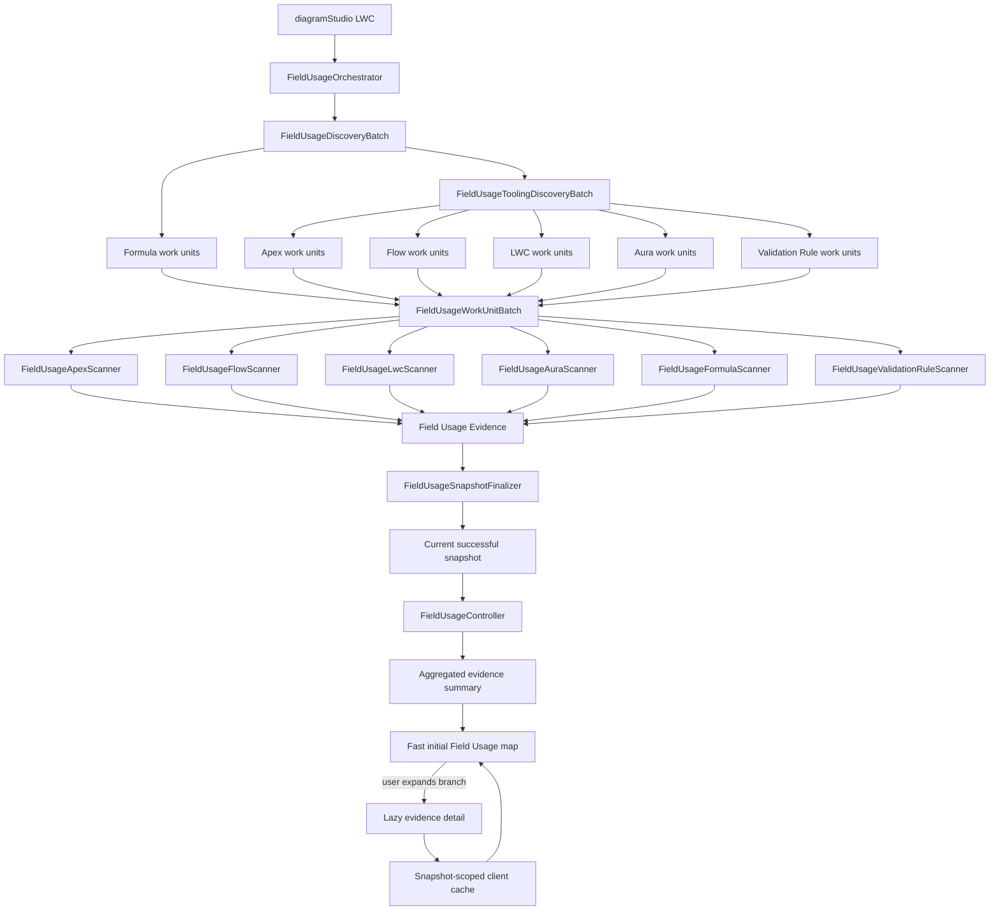
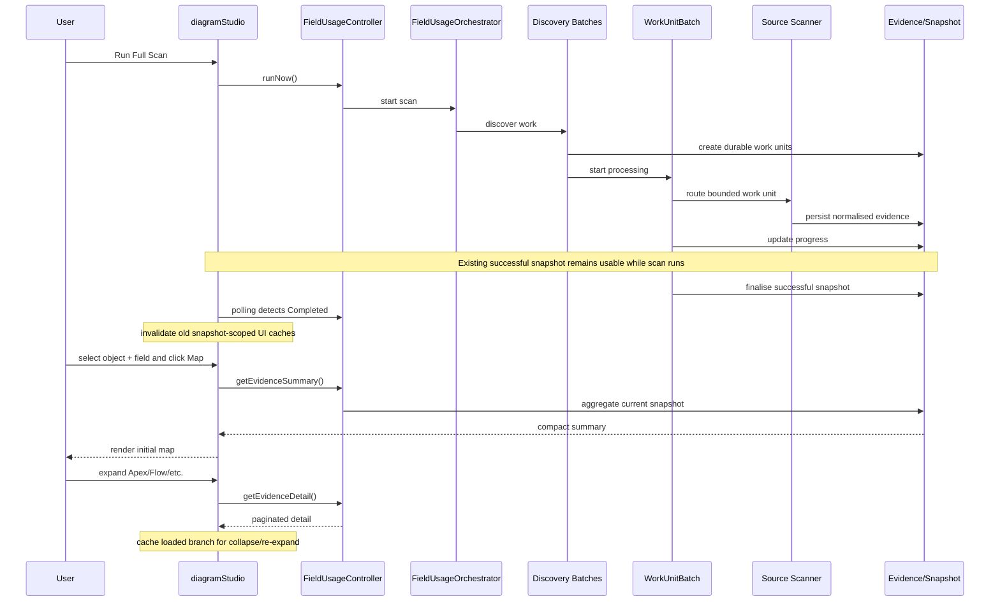

# Salesforce ER Modeller Studio V3 — Field Usage Architecture

## Purpose

This document is the developer architecture guide for V3 Field Usage Intelligence. It summarises the main Apex classes and LWC modules, how the scan pipeline works, the coding philosophy used in V3, the standards that future changes should follow, and the main areas for improvement.

The central principle is:

> Discovery, scanning, persistence, querying and visualisation are separate concerns.

A developer should be able to change one scanner without having to understand or modify every other scanner.

---

# 1. Complete architecture



## Runtime sequence



---

# 2. Coding philosophy

V3 follows a small set of deliberate engineering principles.

## Modular before monolithic

A new capability should normally become a focused class/module rather than another large block inside an existing giant file.

`diagramStudio.js`, `FieldUsageController` and `FieldUsageWorkUnitBatch` are orchestration boundaries. They should not become dumping grounds for unrelated functionality.

## Bulk first

Salesforce governor limits are an architectural constraint, not an afterthought.

Prefer:

- grouped discovery;
- bounded Batch Apex scopes;
- durable work units;
- collection-based SOQL/DML;
- Composite API where appropriate;
- aggregated queries;
- pagination;
- lazy retrieval.

Avoid SOQL, DML or avoidable network requests inside item-by-item loops.

## Fast reads, asynchronous heavy work

Scanning an enterprise org can legitimately take time. Opening Field Usage and building a map should not.

Heavy discovery and analysis belongs in asynchronous scan processing. The UI should consume compact snapshots, summaries and lazy detail.

## Persist progress, not giant transaction state

Large operations should be represented by durable run/work-unit records. Do not rely on a single transaction or huge in-memory collection to represent an entire enterprise scan.

## One source type, one scanner responsibility

Apex logic belongs in the Apex scanner. Flow logic belongs in the Flow scanner. The same applies to LWC, Aura, Formula and Validation Rules.

All scanners converge into the same normalised evidence model.

## Correctness before cleverness

Optimisation must not make field matching unreliable. Prefer understandable parsing/matching logic that can be tested over obscure micro-optimisations.

## Progressive disclosure

Do not load information before the user needs it.

The map should first show a useful lightweight structure. Detailed evidence is loaded when a source/component is expanded.

## Cache safely

Cache expensive UI detail only within the identity of the current successful snapshot. A newly successful scan invalidates the old snapshot cache.

## Preserve the last good state

A failed scan must not destroy the last successful snapshot. Users should continue to have usable data while a replacement scan is running or if it fails.

## Refactor when responsibility changes

If a method starts doing discovery + HTTP + parsing + persistence + presentation, split it. File size alone is not the only trigger; mixed responsibility is the stronger warning sign.

---

# 3. Coding standards

These are the standards future V3 work should follow.

## Apex standards

### Naming

- Classes: `PascalCase`.
- Methods/variables: `camelCase`.
- Constants: clear immutable names consistent with the existing codebase.
- Scanner classes: `FieldUsage<Source>Scanner`.
- API/client classes: describe the external boundary they own.
- Batch classes: make the batch responsibility explicit in the name.

Names should explain intent. Avoid vague names such as `Helper2`, `UtilsNew`, `processStuff()` or `data1`.

### Methods

Methods should have one primary responsibility.

Prefer:

```text
discover metadata
-> create work units
-> process work unit
-> scanner parses source
-> persist evidence
```

rather than one method performing the complete lifecycle.

Keep public/global surface area as small as practical. Helper methods should normally be `private` unless another class genuinely requires them.

### SOQL and DML

- Never intentionally place SOQL/DML inside per-record loops.
- Query only fields needed by the operation.
- Use Sets and Maps for lookup/indexing.
- Aggregate in SOQL where the database can do the work more cheaply than Apex.
- Bulk insert/update evidence and work records.
- Bound query result sizes for interactive APIs.

### Callouts

- Keep HTTP/Tooling/REST transport in client classes.
- Do not duplicate endpoint/authentication/error handling across scanners.
- Batch requests where Salesforce APIs allow it.
- Respect callout count, response size and heap limits.
- Do not increase chunk size merely to make a benchmark look faster.

### Batch Apex

- Batch scopes must be intentionally bounded.
- Batch jobs should be restartable from persisted state where practical.
- `execute()` should process the supplied scope, not rediscover the entire org.
- `finish()` should co-ordinate the next stage/finalisation, not perform an unbounded second scan.
- Progress should be observable through durable run/work-unit state.

### Error handling

- Fail a work unit explicitly when its processing fails.
- Preserve enough error context to diagnose the source/component.
- Do not silently swallow exceptions that make a scan appear successful.
- A partial/failed scan must not replace the current successful snapshot.

### Evidence

Every scanner should emit the common evidence shape rather than invent a scanner-specific persistence model unless there is a strong architectural reason.

Source-specific details belong in the appropriate evidence fields/context, while common object/field/source identity remains consistent.

### Security

- Respect Salesforce sharing/security decisions already established by the application.
- Avoid dynamically constructing unsafe SOQL from untrusted values.
- Validate/normalise metadata identifiers used in dynamic operations.
- Never place credentials, session identifiers or secrets into logs/evidence.

---

## LWC / JavaScript standards

### Keep `diagramStudio.js` as an orchestrator

New cohesive behaviour should be extracted into modules when practical.

Good module candidates include:

- map construction/layout;
- evidence/cache handling;
- scan console behaviour;
- help/configuration content;
- export logic;
- feature-specific calculations.

### Avoid repeated large-array scans

When map construction repeatedly needs the same relationships, build indexes (`Map`/`Set`) once and perform lookups rather than repeatedly calling `filter()`/`find()` across the same large arrays.

### Lazy loading

Initial UI actions should request only what is needed to render the current screen.

Do not retrieve all evidence because the user might click it later.

### Cache behaviour

A branch that has already been expanded may be cached so collapse/re-expand is instant.

Cache keys should include enough identity to prevent evidence from one snapshot/object/field/source from appearing in another context.

### UI state

Do not clear the previous successful Field Usage data when a scan merely starts.

Only invalidate old Field Usage client state when the replacement Full Scan has successfully completed and become current.

### Rendering

Keep expensive calculations outside repeated render/getter paths where possible. Compute/index once when input changes rather than recomputing on every render cycle.

### User experience

Long operations should show state/progress. Fast interactive operations such as Map should not inherit scan-time work.

---

# 4. Main Apex classes

## `FieldUsageOrchestrator`

Entry point/co-ordinator for Field Usage scans.

**Does:** create/start scan context, prevent conflicting scans, begin discovery.

**Does not:** parse individual metadata types.

## `FieldUsageDiscoveryBatch`

Schema-based discovery.

**Does:** iterate objects safely, discover Formula work, create durable work units, chain Tooling discovery.

## `FieldUsageToolingDiscoveryBatch`

Metadata discovery.

**Does:** discover Apex, Flow, LWC, Aura and Validation Rule metadata and convert it into bounded work units.

**Does not:** contain every source parser.

## `FieldUsageWorkUnitBatch`

Common execution engine.

**Does:** read pending work units, process bounded scopes, route by scanner type, maintain progress and completion state.

This is a routing/execution layer, not the correct location for large source-specific parsing implementations.

## `FieldUsageApexScanner`

Parses Apex Classes/Triggers and emits field-use evidence.

## `FieldUsageFlowScanner`

Parses Flow metadata and emits field-use evidence.

## `FieldUsageLwcScanner`

Parses Lightning Web Component resources and emits field-use evidence.

## `FieldUsageAuraScanner`

Parses Aura resources and emits field-use evidence.

## `FieldUsageFormulaScanner`

Parses Formula Field expressions and resolves field dependencies.

Future enhancement: chained formulas and richer cross-object traversal.

## `FieldUsageValidationRuleScanner`

Parses Validation Rule `errorConditionFormula` metadata and emits field-use evidence.

Validation Rule retrieval should remain bulk/chunk oriented.

## `FieldUsageToolingApiClient`

Shared Tooling API transport for core metadata retrieval.

## `FieldUsageUiToolingClient`

UI metadata/REST client used for LWC, Aura and Validation Rule retrieval, including Composite retrieval where appropriate.

## `FieldUsageSnapshotFinalizer`

Finalises run status and promotes a newly successful snapshot to current while protecting the last successful snapshot from failed replacements.

## `FieldUsageController`

LWC-facing service/controller.

Important API concepts:

- `runNow()` — start manual scan.
- `getStatus()` — polling/progress state.
- `getSnapshotAvailability()` — usable snapshot check.
- `getSnapshotObjects()` / `getSnapshotFields()` — selectors.
- `getEvidenceSummary()` — compact aggregated Map input.
- `getEvidenceDetail()` — paginated lazy detail.
- `searchEvidence()` — bounded search.
- `getSourceTypes()` — supported evidence categories.

**Critical rule:** do not turn `getEvidenceSummary()` into a full evidence hydration API.

---

# 5. Persistence model

## `Field_Usage_Run__c`

One complete scan attempt, including lifecycle/progress.

## `Field_Usage_Work_Unit__c`

Durable bounded unit of scan work. This provides checkpointing, scalability and observability.

## `Field_Usage_Evidence__c`

Common normalised output from all scanners. This shared model is what allows one search/map/impact architecture to work across many metadata types.

---

# 6. Field Usage map architecture

The target read path is:

```text
Object + Field selection
        |
        v
       Map
        |
        v
getEvidenceSummary()
        |
        v
Compact indexed graph
        |
        +---- Apex
        +---- Flow
        +---- LWC
        +---- Aura
        +---- Formula
        +---- Validation Rule
                |
          user expands branch
                |
                v
       getEvidenceDetail()
                |
                v
       paginated evidence
                |
                v
        client-side cache
```

The Map button should therefore not pay the cost of loading every source snippet or evidence record.

Collapse should hide an already-loaded branch. Re-expand should use cached detail where the snapshot/context is unchanged.

---

# 7. Batch polling console boundary

The Batch Apex polling console is a separate concern from map rendering.

It should continue to show durable scan progress, Batch Apex status and completion/failure information while scan processing runs.

Map optimisation, lazy loading and cache invalidation must not accidentally break polling cadence or the scan-console experience.

---

# 8. Successful scan refresh rule

```text
Previous successful snapshot
          |
     Full Scan starts
          |
Keep previous UI usable
          |
      Scan result
      /        \
   Failed    Successful
     |           |
keep old      promote new snapshot
snapshot          |
              invalidate old UI cache
                  |
              load new data on demand
```

This is intentional. Starting a scan is not permission to remove the user's last good data.

---

# 9. How to add a future scanner

Example: adding another metadata dependency source.

1. Decide how the source is discovered efficiently.
2. Create bounded `Field_Usage_Work_Unit__c` records.
3. Add a dedicated `FieldUsage<Source>Scanner`.
4. Add routing in the work-unit execution layer.
5. Emit the common evidence format.
6. Add the source type to controller/UI options.
7. Add map representation if required.
8. Add scanner-focused tests.
9. Validate Salesforce metadata/compilation.
10. Performance-test against realistic metadata volume.

Do not implement the entire new scanner inside `FieldUsageWorkUnitBatch`, `FieldUsageController` or `diagramStudio.js`.

---

# 10. Definition of done for Field Usage changes

A Field Usage change should not be considered complete merely because it works with one record in a Developer Edition org.

Before calling a meaningful scanner change complete, check:

- Salesforce metadata compiles/deploys.
- Bulk behaviour is preserved.
- No SOQL/DML-in-loop regression was introduced.
- Callout limits are considered.
- Work units remain bounded.
- Existing scanner types still route correctly.
- Failed scans do not replace the last successful snapshot.
- Map initial load does not hydrate unnecessary detail.
- Lazy detail remains paginated/bounded.
- Cache cannot leak between snapshots.
- Batch polling remains functional.
- Tests cover important scanner/parser behaviour.
- Large-org performance implications have been considered.

---

# 11. Areas for improvement

## High priority

**Post-success client invalidation** — invalidate old Field Usage table/map/detail caches only after a replacement Full Scan successfully becomes current.

**Map time-to-first-render** — measure Map-button latency independently from scan duration. Keep initial graph construction summary-only.

**Salesforce validation** — metadata compile/deployment validation should be part of the workflow for scanner changes.

**Large-org testing** — test realistic evidence/component volumes and heap/callout behaviour.

## Medium priority

**Formula dependency depth** — chained formulas and richer cross-object paths.

**Validation Rule intelligence** — richer dependency/context representation and active/inactive visibility.

**Formal scanner contract** — as scanner count grows, consider an Apex interface/abstract contract for more uniform routing and evidence creation.

**Configuration** — selectively externalise safe chunk/feature configuration where it improves maintainability.

**Further LWC modularisation** — continue reducing unrelated responsibility in `diagramStudio.js`.

## Longer term

**Incremental scans** — investigate safe metadata-change-based scanning after a baseline snapshot.

**Observability** — scanner duration, work-unit throughput, evidence count, callout/API cost and failure metrics.

**Architecture intelligence** — use the common evidence graph for transitive blast radius, dependency paths, hotspots and change-readiness analysis.

---

# 12. Why the architecture matters

V3 is moving beyond ER drawing into Salesforce data architecture intelligence. A large org can contain thousands of fields and many thousands of metadata components.

The architecture therefore intentionally separates:

**orchestration → discovery → durable work → source scanner → normalised evidence → snapshot → query API → lazy visualisation**.

This gives developers clear extension points and prevents every new feature from increasing coupling across the whole application.

---

# 13. Quick developer decision rule

Before adding code, ask:

> Is this orchestration, discovery, API transport, source-specific scanning, persistence, querying, caching or presentation?

Put the code in the layer that owns that responsibility.

Then ask:

> Will this still behave safely if the org contains 10× or 100× more metadata?

If the answer depends on loading everything into memory, querying inside a loop, making one callout per item, or putting another large unrelated block into `diagramStudio.js`, reconsider the design before committing it.
