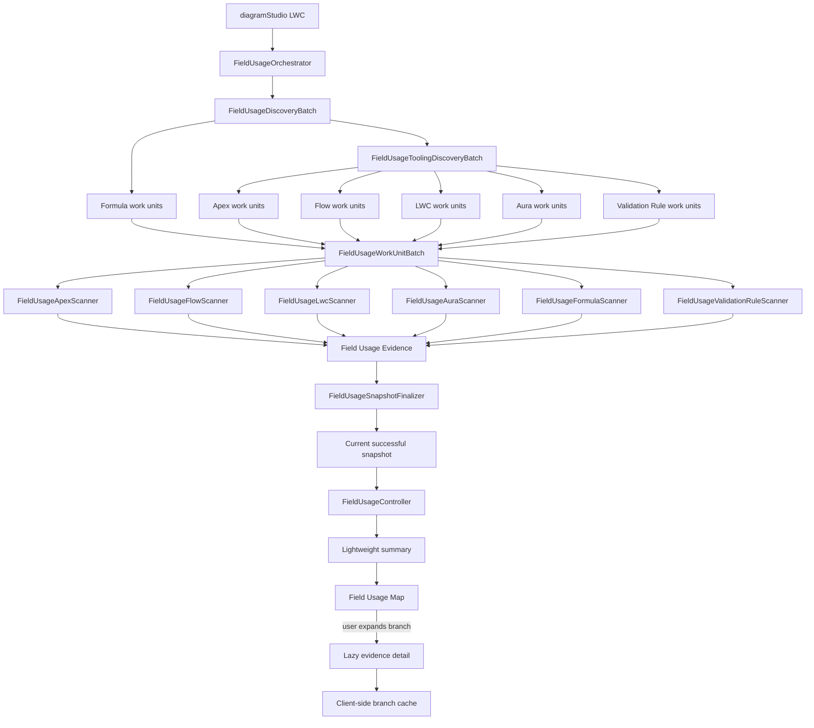

# Salesforce ER Modeller Studio V3 — Field Usage Architecture

## Purpose

This document is a concise architectural guide to the V3 Field Usage Intelligence implementation. It explains the responsibility of the main Apex classes and LWC modules, how the scan pipeline fits together, why the design is modular, and where future improvements should go.

The core principle is simple:

> Discovery, scanning, persistence, querying and visualisation should remain separate concerns.

That separation allows new metadata scanners to be added without turning one Apex class or `diagramStudio.js` into a monolith.

---

## Architecture at a glance



---

## Scan lifecycle

A normal scan follows this sequence:

1. `FieldUsageOrchestrator` creates and starts a scan run.
2. `FieldUsageDiscoveryBatch` discovers schema-driven work such as Formula Fields.
3. `FieldUsageToolingDiscoveryBatch` discovers metadata-driven work such as Apex, Flow, LWC, Aura and Validation Rules.
4. Discovery creates durable `Field_Usage_Work_Unit__c` records rather than attempting to scan everything in one transaction.
5. `FieldUsageWorkUnitBatch` processes those work units in controlled chunks.
6. The appropriate source-specific scanner analyses each work unit.
7. Evidence is persisted as `Field_Usage_Evidence__c` records.
8. `FieldUsageSnapshotFinalizer` completes the run and promotes a successful snapshot to current.
9. `FieldUsageController` exposes lightweight summaries and lazy detail APIs to the LWC.

The important architectural point is that **discovery decides what must be scanned, while scanners decide how a particular metadata type is interpreted**.

---

## Main Apex classes

### `FieldUsageOrchestrator`

Entry point for a Field Usage scan.

**Responsibilities**

- Starts manual or scheduled scans.
- Creates the scan/run context.
- Prevents conflicting active scans.
- Starts the discovery pipeline.

**Should not become:** a metadata parser or scanner implementation.

---

### `FieldUsageDiscoveryBatch`

Schema-based discovery stage.

**Responsibilities**

- Iterates Salesforce objects safely through Batch Apex.
- Discovers Formula Field work.
- Creates durable work units.
- Chains into Tooling API discovery.

Formula work is grouped so scanning remains bulk-oriented instead of creating unnecessary tiny transactions.

---

### `FieldUsageToolingDiscoveryBatch`

Metadata discovery stage.

**Responsibilities**

- Discovers Apex Classes and Triggers.
- Discovers active Flows.
- Discovers LWC bundles.
- Discovers Aura bundles.
- Discovers Validation Rules.
- Converts discovered metadata into durable work units.

This class should remain a **discovery/co-ordination layer**, not contain detailed parsing rules for every metadata type.

---

### `FieldUsageWorkUnitBatch`

Execution engine for discovered work.

**Responsibilities**

- Reads pending work units.
- Processes work in bounded chunks.
- Routes each work unit to the correct scanner.
- Records completion/failure state.
- Maintains scan progress and heartbeat information.
- Chains further batches when required.

This is one of the most important scalability boundaries in V3. New scanners should plug into this execution model rather than introduce an unrelated scan pipeline.

---

### `FieldUsageApexScanner`

Analyses Apex source for field references.

**Typical inputs:** Apex Classes and Apex Triggers.

**Output:** normalised Field Usage evidence.

Keep Apex-specific parsing and matching logic here rather than in the batch/orchestration classes.

---

### `FieldUsageFlowScanner`

Analyses Flow metadata for field references.

**Responsibilities**

- Understand Flow metadata structure.
- Identify references to Salesforce fields.
- Produce normalised evidence for the common persistence layer.

Flow metadata can be large, so future changes should continue to favour chunked retrieval and bounded processing.

---

### `FieldUsageLwcScanner`

Analyses Lightning Web Component resources.

**Responsibilities**

- Inspect LWC source resources.
- Detect field references.
- Produce evidence using the same model as the other scanners.

The scanner is deliberately separate so JavaScript/HTML-specific analysis can evolve without affecting Apex or Flow scanning.

---

### `FieldUsageAuraScanner`

Analyses Aura component resources.

It follows the same scanner contract and persistence approach as LWC while keeping Aura-specific source interpretation isolated.

---

### `FieldUsageFormulaScanner`

Analyses calculated Salesforce fields.

**Responsibilities**

- Read Formula Field expressions.
- Resolve references against the owning object/schema.
- Identify direct field dependencies.
- Persist Formula Field evidence.

A future enhancement can extend this into deeper chained-formula and cross-object dependency analysis.

---

### `FieldUsageValidationRuleScanner`

Analyses Validation Rule formulas.

**Responsibilities**

- Process Validation Rule metadata in bulk work units.
- Analyse `errorConditionFormula` expressions.
- Resolve referenced fields.
- Persist Validation Rule evidence.

Validation Rule metadata retrieval is designed to be batched rather than issuing one independent callout for every rule.

---

### `FieldUsageToolingApiClient`

Shared Tooling API access used by core metadata scanning.

**Importance:** API transport belongs in a client/service layer. Scanners should consume metadata without each reimplementing authentication, HTTP handling and pagination.

---

### `FieldUsageUiToolingClient`

Tooling/REST access focused on UI metadata and Validation Rules.

**Responsibilities**

- LWC bundle/resource retrieval.
- Aura bundle/resource retrieval.
- Validation Rule discovery.
- Bulk Validation Rule metadata retrieval through REST Composite.

This keeps UI-oriented metadata retrieval independent from the original Apex/Flow client and gives it room to evolve.

---

### `FieldUsageSnapshotFinalizer`

Completes the snapshot lifecycle.

**Responsibilities**

- Finalise successful/failed scans.
- Record totals/errors.
- Promote the newly successful snapshot to current.
- Preserve the last usable successful snapshot when a new scan fails.

The UI should always prefer the **current successful snapshot**, never partially scanned data.

---

### `FieldUsageController`

Server-side API used by the LWC.

Important methods/concepts include:

- `runNow()` — starts a manual scan.
- `getStatus()` — supplies durable scan and Batch Apex progress to the polling console.
- `getSnapshotAvailability()` — determines whether usable Field Usage data exists.
- `getSnapshotObjects()` / `getSnapshotFields()` — populate selectors.
- `getEvidenceSummary()` — returns aggregated data for initial map construction.
- `getEvidenceDetail()` — returns paginated detailed evidence only when requested.
- `searchEvidence()` — bounded evidence search.
- `getSourceTypes()` — exposes supported evidence categories to the UI.

### Performance rule

`getEvidenceSummary()` should remain the normal **Map button** path. Do not replace it with a query that hydrates thousands of evidence rows.

`getEvidenceDetail()` is the deeper lazy-load path and should remain paginated.

---

## Persistence model

### `Field_Usage_Run__c`

Represents one complete scan attempt and its lifecycle/progress.

### `Field_Usage_Work_Unit__c`

Durable queue/checkpoint representing a bounded piece of scan work.

This is critical for reliability because large scans are not dependent on one Apex transaction surviving from beginning to end.

### `Field_Usage_Evidence__c`

Normalised output from every scanner.

The common evidence model is what allows the UI to visualise Apex, Flow, LWC, Aura, Formula and Validation Rule usage through one architecture.

---

## LWC architecture

### `diagramStudio`

This remains the main application shell and currently owns significant UI orchestration.

For Field Usage it should increasingly act as a **co-ordinator**, not contain every map algorithm, parser and cache implementation directly.

### `fieldUsageMapLogic`

Owns reusable Field Usage map construction/interaction logic.

The map-building path should work from compact indexed summary data rather than repeatedly filtering large evidence arrays.

### Map loading strategy

The desired interaction model is:

```text
Select Object + Fields
        |
        v
      Map
        |
        v
Lightweight source/category graph
        |
        +--> click Apex --------> lazy-load Apex detail
        |
        +--> click Flow --------> lazy-load Flow detail
        |
        +--> click LWC ---------> lazy-load LWC detail
        |
        +--> click Aura --------> lazy-load Aura detail
        |
        +--> click Formula -----> lazy-load Formula detail
        |
        +--> click Validation --> lazy-load Validation detail

Loaded branch -> client cache -> collapse/expand without another server request
```

This architecture keeps **time-to-first-map** independent from the total volume of detailed evidence wherever possible.

---

## Batch polling console

The Batch Apex polling screen is intentionally separate from map performance work.

It uses durable scan state plus `AsyncApexJob` information to display progress while the scan is running.

Changes to Field Usage map caching, map rendering or post-scan UI refresh should not alter the polling cadence or progress experience unless specifically required.

---

## Successful scan refresh behaviour

The intended UI lifecycle is:

```text
Existing successful snapshot visible
            |
       New scan starts
            |
Existing results remain usable while scan runs
            |
      Scan successful?
       /          \
     No            Yes
     |              |
Keep old UI     invalidate old client caches
and snapshot    switch to new current snapshot
                    |
               reload on demand
```

A failed scan should not destroy the user's previous usable Field Usage results.

---

## Adding another scanner in the future

For example, adding a future **Process Builder**, **Email Template**, **Permission metadata** or another dependency source should normally require:

1. Add discovery logic that creates bounded work units.
2. Create a dedicated scanner class.
3. Route its scanner type through `FieldUsageWorkUnitBatch`.
4. Produce the existing normalised evidence format.
5. Add its source type to the controller/UI.
6. Add map styling/icon behaviour if required.
7. Add focused tests for the scanner and orchestration route.

Do **not** put the new parser directly into `FieldUsageWorkUnitBatch` or `diagramStudio.js` merely because those classes already participate in the workflow.

---

## Architectural principles to preserve

### 1. Bulk first

Salesforce limits should drive the design. Prefer grouped discovery, chunked work units, Composite API where appropriate, aggregation and bounded queries.

### 2. Durable work

Large scans should be restartable/observable through persisted work units rather than relying on large in-memory collections.

### 3. One scanner, one responsibility

Apex parsing belongs in the Apex scanner. Flow parsing belongs in the Flow scanner. The same applies to LWC, Aura, Formula and Validation Rules.

### 4. Common evidence model

Source-specific scanners should converge into one evidence representation. This keeps search, map visualisation and impact analysis generic.

### 5. Lazy read path

Scanning can be expensive because it happens asynchronously. Reading the result should be fast.

Initial UI operations should retrieve summaries and aggregates; expensive evidence should be loaded only when the user asks for it.

### 6. Cache only within a snapshot

Expanded map branches can be cached for fast collapse/re-expand, but cache identity must include the current snapshot/run. A newly successful Full Scan must invalidate evidence from the previous snapshot.

### 7. Keep UI modules small

Continue extracting cohesive logic from `diagramStudio.js`. The long-term goal is for the main component to orchestrate smaller modules rather than become the implementation location for every Studio feature.

---

## Areas for improvement

### High priority

**Post-success cache invalidation** — after a Full Scan successfully becomes current, clear stale Field Usage table/map/detail caches without disrupting the Batch Apex polling console.

**Map time-to-first-render** — continue measuring the Map button separately from scan performance. Initial graph construction should require summary data only.

**Salesforce metadata validation** — every scanner addition should be compile/metadata validated against a Salesforce org before being considered deployment-ready.

**Large-org performance tests** — test with evidence volumes representative of enterprise organisations, not only small Developer Edition datasets.

### Medium priority

**Formula dependency depth** — support chained Formula Fields and richer cross-object paths.

**Validation Rule intelligence** — distinguish direct field references from more complex dependency expressions and expose active/inactive state clearly.

**Scanner contract/interface** — as scanner count grows, consider introducing a common Apex interface or abstract scanner contract so routing and evidence production become even more consistent.

**Configuration** — eventually move scanner chunk sizes and supported-source behaviour into controlled configuration where doing so improves maintainability without exposing dangerous values.

### Longer term

**Incremental scans** — investigate whether metadata modification timestamps can safely reduce work after an initial full snapshot.

**Observability metrics** — capture scanner duration, work-unit throughput, evidence produced per scanner and API/callout cost so performance regressions are visible.

**Dependency graph intelligence** — use the normalised evidence model for blast radius, transitive dependency paths, hotspots and change-readiness scoring.

---

## Why this architecture matters

V3 is moving beyond a simple ER diagrammer into data architecture intelligence. Field Usage can potentially inspect thousands of fields and many thousands of metadata components.

A monolithic scanner might work in a small org but becomes difficult to test, tune and extend. The V3 architecture therefore separates:

**orchestration → discovery → durable work → source scanner → evidence → snapshot → query API → lazy visualisation**.

That separation is what should allow future capabilities to grow without repeatedly rewriting the core application.

---

## Quick developer rule

When adding something to Field Usage, ask:

> Is this orchestration, discovery, source-specific scanning, persistence, querying, caching or presentation?

Put it in the layer that owns that responsibility. If a change seems to require adding large amounts of unrelated logic to `FieldUsageWorkUnitBatch`, `FieldUsageController` or `diagramStudio.js`, that is usually a signal that another module/class should be created.
