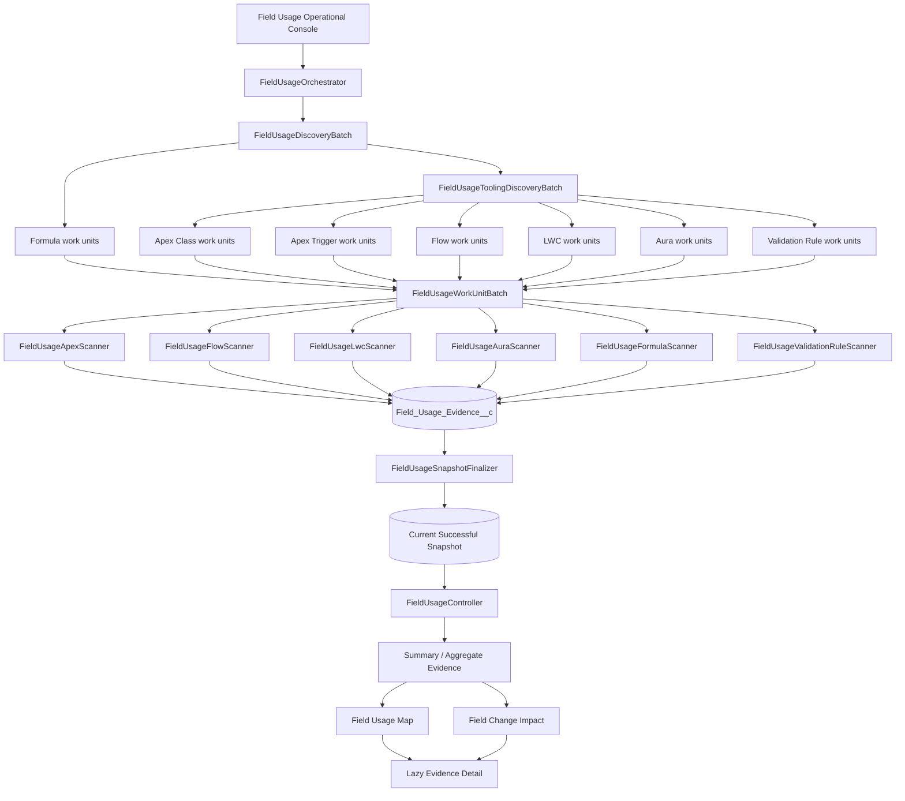
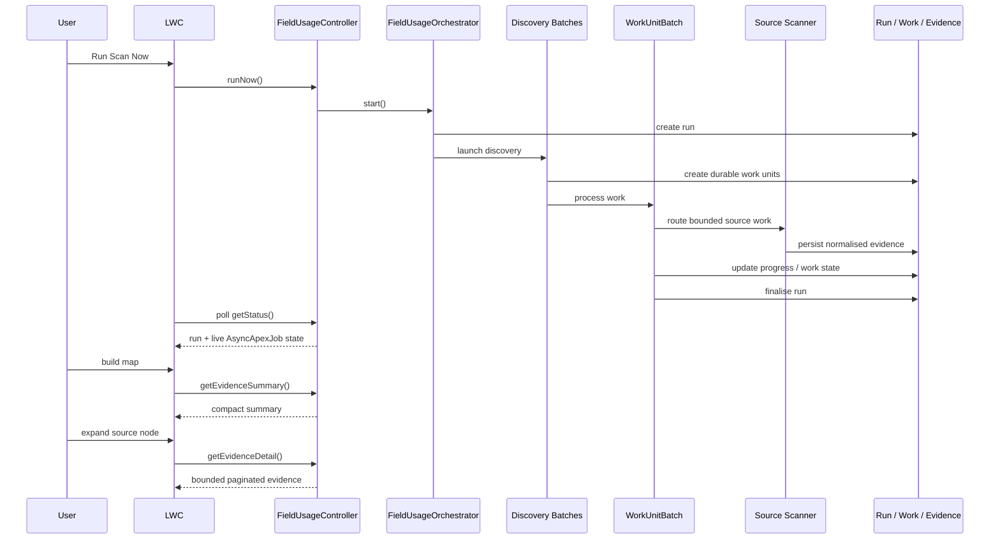
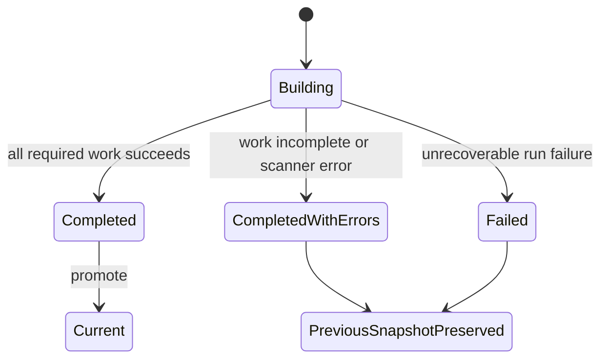

# Salesforce ER Modeller Studio V3 — Field Usage Architecture

**Author:** Vikas Cohen  
**Role:** Lead Architect

## Purpose

Version 3 Field Usage Intelligence is an asynchronous, persisted Salesforce dependency-analysis system. Its central architectural principle is:

> **Discovery, scanning, persistence, querying and visualisation are separate concerns.**

The browser is not a metadata scanner. Expensive work executes asynchronously in Salesforce, evidence is normalised and persisted, and interactive views query the latest successful snapshot.

## Architecture



## Runtime sequence



## Scanner coverage

Version 3 uses a common evidence contract for:

1. Apex Classes
2. Apex Triggers
3. Active Flows
4. Lightning Web Components
5. Aura components
6. Formula Fields
7. Validation Rules

OmniStudio is not a Version 3 release dependency and remains a future optional scanner family.

## Durable persistence model

### `Field_Usage_Run__c`
Represents one scan lifecycle. It stores status, timing, progress, dependency counts, error counts and persisted diagnostic information.

### `Field_Usage_Work_Unit__c`
Represents bounded, resumable scanner work. Work units isolate source processing so one failed component does not require unrelated work to be rediscovered.

### `Field_Usage_Evidence__c`
Stores sparse normalised dependency evidence. Version 3 does not create a dense record for every Salesforce field. Evidence exists only where a supported scanner detects a dependency.

### `Field_Usage_Schedule__c`
Stores human-readable automatic scan configuration while Apex owns the Salesforce scheduled-job implementation.

## Snapshot invariant

The most important correctness rule is:

> **Only a successfully finalised replacement snapshot can become current.**



A Salesforce `AsyncApexJob` may report `Completed` while the Field Usage run reports `Completed With Errors`. These states measure different things: Salesforce reports completion of that asynchronous job; Studio validates completion of the full dependency pipeline.

## Error architecture

Errors must remain observable. Scanner/API failures are persisted against the run/work context. The Settings → Field Usage history exposes failed and `Completed With Errors` runs so administrators can inspect the persisted error rather than relying solely on Setup → Apex Jobs.

The finalizer must not silently convert incomplete work into a successful current snapshot.

## Tooling API boundary

Tooling API transport belongs in dedicated client classes rather than scanners or LWC code.

### Named Credential

The expected Named Credential is:

```text
Salesforce_Tooling_API
```

Authentication is owned by the Salesforce org through External Credential / principal configuration. Secrets, tokens and session IDs must never be committed to the repository or persisted as scan evidence.

### Validation Rule transport

Validation Rule retrieval must use supported Tooling API query/resources directly. Salesforce does not permit Tooling API calls to be nested inside the standard Data API `/composite` resource. Transport implementation must respect that boundary.

## Scanner contract

Each scanner receives bounded source work and the current run context. A scanner should:

1. retrieve only the metadata/resources required by its work unit;
2. parse source-specific content;
3. resolve candidate references against Salesforce object/field context;
4. produce zero or more normalised evidence records;
5. preserve meaningful source/component context on failure.

A scanner must not promote snapshots, control UI polling or construct visual maps.

## Controller/read architecture

`FieldUsageController` is the LWC-facing service boundary. Important responsibilities include:

- starting scans;
- retrieving current run/live job status;
- Schema-driven object and field selectors;
- compact evidence summaries;
- bounded evidence detail;
- persisted evidence search;
- scan history;
- scheduling operations.

The map should begin from aggregate data rather than hydrating every evidence record.

## Summary-first map model

```text
Object
  → Field
      → Source Type + authoritative count
          → Component detail loaded on demand
              → Evidence
```

This allows a source node to display a large authoritative count while only loading bounded pages of component detail when expanded.

## Pagination

Interactive evidence retrieval must remain bounded. Detail uses keyset-style pagination rather than unbounded reads or large OFFSET-based navigation. This keeps map interaction viable for fields with large dependency sets.

## Live progress model

The operational console polls while a run is active. Progress has two useful signals:

- persisted pipeline progress (`Progress_Percent__c` / phase);
- live `AsyncApexJob` processed/total counts for the currently executing batch.

The UI may combine these signals for a responsive display, but the displayed progress should not move backwards when the pipeline chains into a subsequent batch with a different total size.

## Recent scan history

The console retains the latest scan executions with status, start/completion times, dependency count, error count and last phase. Error-bearing statuses expose persisted error detail inline.

This history is an operational diagnostic view; it is not a replacement for Salesforce Setup → Apex Jobs.

## Scheduling

Manual and scheduled scans use the same orchestration path. Run locking prevents intentional overlapping scans. Scheduling is expressed in human-readable configuration rather than requiring administrators to write CRON expressions.

## Performance guardrails

- No full-org interactive metadata scan.
- No intentional SOQL/DML in per-record loops.
- Keep Batch Apex scopes bounded.
- Treat callout, heap, CPU and response-size limits as architecture constraints.
- Aggregate counts in the database where practical.
- Use `Map`/`Set` indexing rather than repeatedly scanning large collections.
- Lazy-load detailed evidence.
- Keep previous successful data available while a replacement scan executes.
- Cache UI detail only within the identity of the current successful snapshot.
- Invalidate stale cache after successful snapshot replacement.

## Security guardrails

- Use Named Credentials / External Credentials for Salesforce API authentication.
- Do not persist secrets or access tokens.
- Validate dynamic metadata identifiers.
- Keep source retrieval server-side.
- Respect Salesforce object/field accessibility in user-facing selectors.
- Treat persisted evidence as architecture metadata and apply appropriate org permissions.

## Main Apex responsibilities

- `FieldUsageOrchestrator` — run creation, locking and launch.
- `FieldUsageDiscoveryBatch` — Schema/formula discovery.
- `FieldUsageToolingDiscoveryBatch` — Tooling-backed source discovery.
- `FieldUsageWorkUnitBatch` — bounded work routing and execution.
- `FieldUsageApexScanner` — Apex Class/Trigger dependency analysis.
- `FieldUsageFlowScanner` — Flow dependency analysis.
- `FieldUsageLwcScanner` — LWC dependency analysis.
- `FieldUsageAuraScanner` — Aura dependency analysis.
- `FieldUsageFormulaScanner` — Formula Field dependency analysis.
- `FieldUsageValidationRuleScanner` — Validation Rule dependency analysis.
- `FieldUsageToolingApiClient` / `FieldUsageUiToolingClient` — API transport boundaries.
- `FieldUsageSnapshotFinalizer` — successful-snapshot promotion guard.
- `FieldUsageController` — LWC query/operation boundary.
- `FieldUsageScheduleService` / `FieldUsageScheduler` — automatic execution.

## LWC responsibilities

The UI should remain presentation/orchestration focused:

- operational scan console;
- automatic polling;
- Field Usage Map;
- lazy evidence expansion;
- Field Change Impact;
- recent scan history/error detail;
- settings, diagnostics and themes.

Large feature logic should be extracted into focused modules rather than continually expanding a single monolithic `diagramStudio.js`.

## Future extension boundary

Version 3 deliberately leaves organisation-configurable governance rules and optional OmniStudio scanning for future phases. Future scanners should create durable work units and emit the same normalised evidence shape so existing summary/detail/map infrastructure can consume them without redesigning the persistence model.
