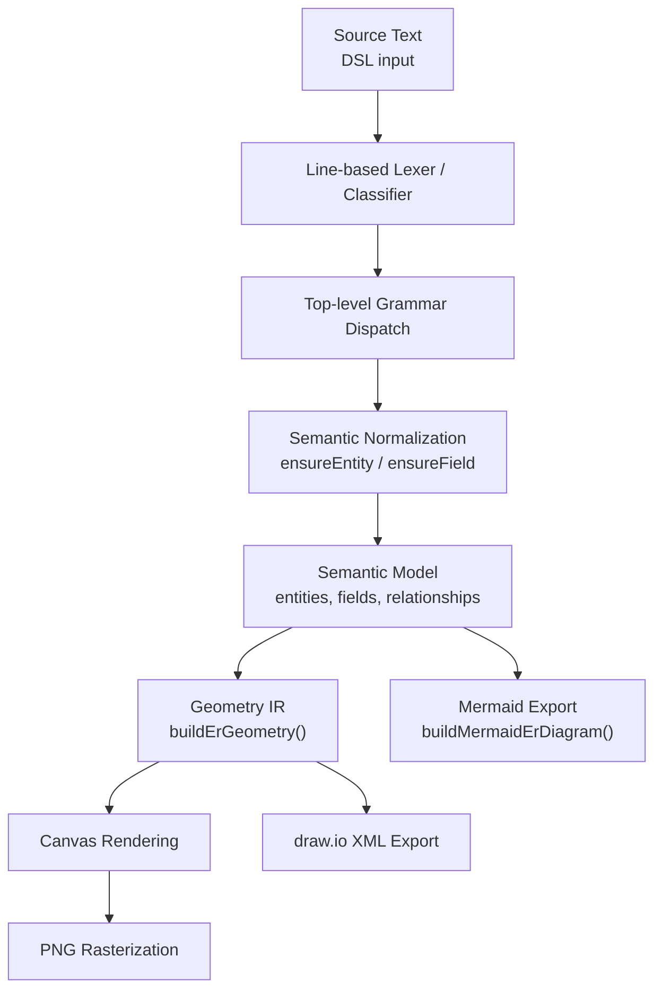

# The ER DSL Compiler Architecture

**Author:** Vikas Cohen  
**Compiler Architect and System Designer**

## Abstract

This document presents an implementation-oriented and academically structured account of the Entity-Relationship (ER) domain-specific language (DSL) compiler used by Salesforce ER Modeller Studio. The compiler translates line-oriented declarations into a normalized semantic graph and then into geometry and target-specific artifacts. Its design illustrates core compiler principles—recognition, semantic analysis, intermediate representations, diagnostics, code generation, and testing—without introducing machinery that the language does not require.

The semantic model is authoritative. Geometry, SVG, Mermaid, draw.io XML, and PNG are derived representations. This invariant allows all renderers to share one interpretation of the source.

---

## 1. The philosophy behind the compiler

The language is declarative rather than operational. A program specifies entities, fields, and relationships; it does not specify an execution sequence. Its meaning is therefore structural: the compiler constructs a labeled graph and translates that graph into visual targets.

A useful abstraction is:

```text
source text -> semantic model -> optional geometry IR -> target artifact
```

`parseEr()` combines line classification, syntactic recognition, and early semantic normalization because the grammar is flat. This is a deliberate application of proportionality. A token stream, parser generator, or AST would become valuable if the language acquired nesting, precedence, blocks, or multiline constructs; for the current grammar, they would add complexity without improving correctness.

## 2. Why the design is reusable

The architecture separates six concerns: source acquisition, syntactic recognition, semantic normalization, domain-model construction, geometry generation, and target rendering. Each boundary has a contract. The parser returns a model or diagnostics; the geometry builder returns coordinates and paths; exporters return target artifacts.

This separation is reusable because meaning is not mixed with presentation. A relationship's kind is semantic; its connector lane is geometric; Mermaid identifier sanitization is target-specific. The semantic model can consequently support the live canvas, Mermaid, draw.io, and PNG without duplicating interpretation logic.

## 3. The compiler pipeline



The stages are: split input into lines; classify each line; extract components; intern names and fields; normalize relationships; optionally compute geometry; and emit target syntax. Quoted Mermaid labels are intentional because braces, parentheses, slashes, and HTML breaks can otherwise be parsed as diagram syntax.

## 4. Main implementation modules

### 4.1 `erDiagramLogic.js`

This is the compiler core. It owns parsing, semantic construction, geometry generation, connector routing, Mermaid generation, draw.io generation, and domain helpers. Keeping these operations near the model makes them independently testable.

### 4.2 `diagramStudio.js`

This is the application host. It owns editor state, persisted positions, resizing, interaction, and compiler invocation. It supplies source text to `parseEr()` and layout overrides to `buildErGeometry()`.

### 4.3 `buildErGeometry()`

This creates the visual IR: entity boxes, dimensions, visible rows, hidden-field counts, connector paths, self-loops, lane offsets, and canvas bounds. Saved coordinates are presentation state, not source semantics.

### 4.4 Export generators

Mermaid consumes the semantic model and performs layout itself. Canvas and draw.io consume geometry. PNG rasterizes generated SVG through a separate utility. All targets derive from the same semantic interpretation.

## 5. What a compiler does in this domain

The compiler reads text, recognizes declarations, extracts names and annotations, resolves identities, normalizes duplicates, constructs a graph, diagnoses invalid input, and translates the graph to target languages. Entities are nodes, fields are node attributes, and relationships are directed edges.

The compiler does not execute business logic, query Salesforce, or calculate authorization. A feature belongs here when it changes accepted syntax, source meaning, or target meaning; user-interface behavior and pixel placement are downstream concerns.

## 6. Lexical analysis: scanning the text

The language is line-oriented. Blank lines and lines beginning with `#` are ignored. Recognition uses narrow patterns:

```js
const entityMatch = line.match(/^entity\s+(\w+)\s*(:\s*(.*))?$/i);
const relMatch = line.match(/^(\w+)\.(\w+)\s*(=>|~>|->)\s*(\w+)\s*$/);
```

The first captures an entity and optional field list; the second captures child entity, child field, operator, and parent entity. Because declarations do not span lines, classification and extraction can safely occur in one operation. Bracket metadata such as `AnnualRevenue[Currency, Required]` is then split into reserved markers and display type text.

## 7. Indentation and tree construction

Indentation has no semantic significance because the grammar has no blocks, nesting, or continuation lines. An AST is likewise omitted: each declaration contributes directly to a flat semantic graph. Building a tree only to flatten it would be unnecessary overhead.

If namespaces, inheritance blocks, aliases, or multiline declarations are added, an AST should be inserted between recognition and semantic analysis. The semantic-model contract can remain stable while the front end becomes more formal.

## 8. Grammar and top-level dispatch

An informal grammar is:

```text
program      ::= line*
line         ::= blank | comment | entity | relationship
entity       ::= "entity" identifier (":" field-list)?
relationship ::= identifier "." identifier operator identifier
operator     ::= "->" | "=>" | "~>"
field-list   ::= field ("," field)*
```

Dispatch handles blank/comment lines, then entity syntax, then relationship syntax, and otherwise reports an error. Ordering matters: a broad recognizer placed before a narrow one can introduce ambiguity. A written grammar is valuable even for a small DSL because it defines boundaries and guides negative tests.

## 9. Recursive descent parsing for conditions

Recursive descent is not applicable because the DSL has no boolean expressions, predicates, precedence, or nested condition nodes. The lesson is methodological: parsing strategy should follow grammar structure, not compiler fashion.

If expressions are added later, parse them into an AST with explicit precedence and analyze them separately. Do not encode nesting in increasingly complex regular expressions.

## 10. Name resolution and symbol tables

Entities are indexed case-insensitively while preserving first-seen display casing:

```js
const ensureEntity = (name) => {
  const key = name.toLowerCase();
  if (!entities.has(key)) entities.set(key, { name, fields: [] });
  return entities.get(key);
};
```

This establishes identity semantics: `Account`, `account`, and `ACCOUNT` denote one entity. Relationship targets can be referenced before declaration; implicit creation is a deliberate policy that supports forward references. A strict mode could instead diagnose undeclared targets.

A symbol table defines identity, lookup, normalization, and scope. This DSL has one global namespace; larger languages may require nested symbol tables.

## 11. Stateful interpretation and safe mutation

`parseEr()` incrementally updates an entity map, field arrays, relationship records, and a deduplication set. `ensureField()` creates a field once and merges later metadata, so entity declarations and relationship declarations refer to one stable object.

Exact duplicate relationships are identified by child entity, child field, parent entity, and kind. Controlled mutation is acceptable internally, but the returned model should have stable defaults such as `isRelationship`, `relatesTo`, `isRollupSummary`, `isRequired`, and `dataType`. Stable shape reduces downstream defensive code.

## 12. Intermediate representation and step generation

The semantic model is the primary IR:

```js
{ entities: [{ name, fields: [...] }],
  relationships: [{ childEntity, childField, parentEntity, kind }] }
```

It stores meaning rather than pixels. `buildErGeometry()` creates a second IR containing boxes, rows, paths, lane assignments, and SVG dimensions. Mermaid bypasses this IR because it has its own layout engine; canvas and draw.io require it.

Separate IRs localize failures: semantic errors can be tested without a browser, routing errors without reparsing, and escaping errors within one backend.

## 13. Semantic validation and domain-aware checks

Validation has lexical, syntactic, structural, domain, and target-aware levels. The parser validates line shape, normalizes case, creates missing relationship endpoints according to policy, preserves field metadata, rejects unknown top-level syntax, and deduplicates exact edges.

Unknown bracket content is retained as display metadata rather than checked against a closed type vocabulary. This distinction between preservation and type checking is important for imported Salesforce metadata. Every permissive behavior should be documented and tested; strict and permissive modes may be useful later.

## 14. User conditions vs. record criteria: two expression languages

This compiler does not parse filters or predicates. A condition language has truth values, operators, precedence, null semantics, and coercion; the ER DSL has declaration semantics. These should not be conflated.

Diagram filtering should normally remain a view concern. If filters become source syntax, they require an explicit grammar and semantic model rather than embedded JavaScript expressions.

## 15. Applying steps and graph expansion

The compiler does not execute a program step by step. A relationship declaration creates an edge; it does not trigger traversal or computation. Layout may traverse edges to route connectors, but that is a rendering algorithm, not source execution.

Future dependency or impact analysis should be implemented as explicit analyses over the semantic model, with derived outputs rather than hidden semantic mutations.

## 16. Access calculation and analysis

The compiler does not calculate authorization, sharing, or privilege. Structural association must not be interpreted as permission. If access analysis is introduced, it should use typed policy edges or a separate analysis model with documented inheritance and override rules.

A display may combine structural and policy information, but the underlying representations should distinguish their meanings.

## 17. Optimization and performance thinking

There is no conventional optimization pass such as constant folding because declarations do not produce executable instructions. Relevant costs are scanning, model construction, geometry, DOM rendering, and rasterization. Recognition is approximately linear in input size; entity lookup uses a map and field lookup uses arrays appropriate for expected diagrams.

The principal optimizations are visual: edge deduplication, lane fan-out, self-loop routing, and canvas-bound clamping. They must preserve semantic invariants. Measure parser, geometry, browser, and export time separately so bottlenecks are correctly located.

## 18. Diagnostics and error recovery

Failures include unrecognized lines, malformed declarations, and inconsistent input. A useful diagnostic contains severity, line/column, stable code, message, and correction guidance. The current exception-style API is adequate for synchronous compilation; a richer language service could return `{ model, diagnostics }` and continue after errors.

Recovery may skip a malformed line or retain an error node, but must not invent business meaning silently. A partial model with a visible diagnostic is safer than a plausible but incorrect diagram.

## 19. The code-generation model in the DSL

Each backend targets a different grammar. Mermaid requires identifier-safe type tokens; draw.io requires XML escaping, IDs, and coordinates; SVG consumes geometry; PNG rasterizes SVG separately. Escaping and sanitization therefore belong at target boundaries, not in the parser.

Generators should be deterministic. Stable ordering and IDs improve tests, caching, diffs, and trust. Test special characters, empty entities, all relationship kinds, self-relationships, and parallel edges.

## 20. Editor integration and language services

The semantic model supports entity and field completion, relationship suggestions, arrow completion, lint hints, and import assistance. The editor must reuse compiler normalization rules rather than implement a second parser.

Pure parsing and geometry functions can be debounced and cached. Context-sensitive completion should use the cursor position: after `Contact.` suggest fields, after an operator suggest entities, and inside brackets suggest markers or known types. Diagnostics and rendering must agree about case sensitivity and implicit declarations.

## 21. Testing the compiler properly

Tests should be layered: recognition, semantic normalization, geometry, backend emission, and end-to-end rendering/export. Semantic tests have the highest leverage because every target depends on the model.

Property-based tests can enforce invariants such as one entity per normalized identity, no exact duplicate edges, positive box dimensions, and non-degenerate self-loops. Golden files are useful for complete output but should be combined with structural assertions to avoid brittle formatting tests.

## 22. Complete example end-to-end

```text
entity Account : Name, AnnualRevenue[Currency]
Contact.AccountId -> Account
```

The first line creates `Account`, `Name`, and `AnnualRevenue` with type metadata. The second creates `Contact`, marks `AccountId` as a relationship field, resolves `Account`, and records a lookup edge. Geometry creates two boxes and a connector; Mermaid produces a dashed non-identifying relationship; draw.io emits positioned cells; SVG renders the live view; PNG rasterizes SVG. No backend reparses the original text.

## 23. Extending the language

Use this sequence: define syntax and ambiguity rules; update recognition; normalize into explicit model fields; update defaults and consumers; update geometry; update every backend; add positive, negative, semantic, and export tests; document compatibility.

A new marker is incomplete if only `parseEr()` recognizes it. It must survive field construction, geometry rows, Mermaid output, draw.io labels, and tests. Extend from the model outward, not from one renderer inward.

## 24. Current limitations and future improvements

The language is flat, lacks nested expressions and a closed type system, has no conventional optimization pass, and provides limited recovery. Types are primarily display metadata.

Potential improvements include a token stream and AST, structured source-range diagnostics, strict/permissive modes, a Salesforce type registry, schema versioning, stable IDs, incremental parsing, configurable layout, accessibility metadata, and cross-backend conformance tests. Each should be evaluated against complexity, compatibility, and user value.

## 25. Final architecture summary

The ER DSL compiler provides line-oriented recognition, shallow dispatch, case-insensitive symbol resolution, incremental semantic normalization, explicit entity/field/relationship structures, optional geometry IR, target-specific emission, diagnostics, language-service support, and layered tests.

Its essential invariant is that the semantic model is authoritative. Geometry, SVG, Mermaid, draw.io, and PNG are derived artifacts, allowing renderers to evolve independently without duplicating language semantics.

## 26. Design principles every compiler author can reuse

1. Match architecture to grammar.
2. Keep semantics authoritative.
3. Separate syntax from semantic decisions.
4. Make normalization policies explicit.
5. Use stable intermediate representations.
6. Design each backend around its target grammar.
7. Treat diagnostics as part of the language interface.
8. Test invariants as well as examples.
9. Extend from the model outward.
10. Prefer intentional simplicity over ceremonial complexity.

## 27. Closing thought

Compiler engineering applies to diagram languages as much as to general-purpose languages. Symbol tables, intermediate representations, diagnostics, code generation, and semantic invariants remain valuable even when the language contains only declarations. The scale of the language changes the amount of machinery required; it does not remove the need for architectural reasoning.

**Vikas Cohen**  
**Compiler Architect and System Designer**

---

This document describes the compiler-style architecture used by the ER DSL implementation as a conceptual and technical guide for transforming source declarations into semantic data, diagram geometry, and export artifacts.
