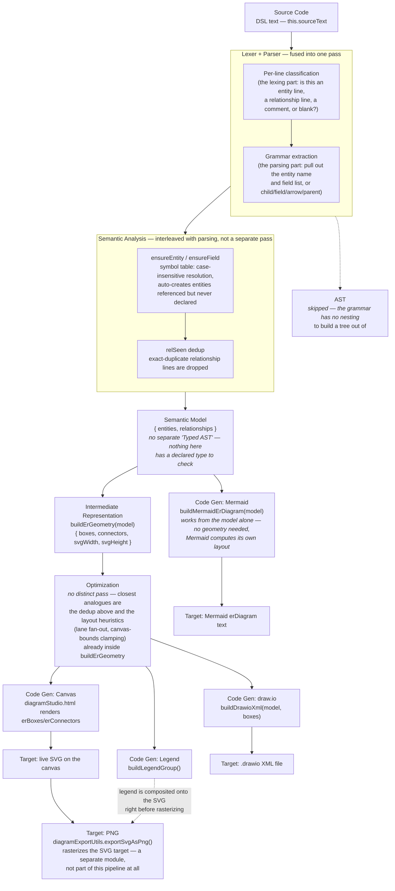

# The DSL "compiler" — architecture

This explains how `erDiagramLogic.js` turns DSL text into a diagram, using
the classic compiler pipeline as a lens:

```
Source Code → Lexer → Tokens → Parser → AST → Semantic Analysis →
Typed AST / Semantic Model → Intermediate Representation → Optimization →
Code Generation → Target Code
```

**This is not a real compiler, and this document says so at every stage
rather than pretending otherwise.** The DSL has no nested expressions, no
type system, and no reason to run in two passes when one does the job —
so several textbook stages are genuinely absent here, not just glossed
over. Where a stage doesn't apply, the honest version of this document
says "not applicable" and explains why, rather than inventing a mapping
to look complete. If you're here to extend the codebase, the "Where to
make a change" section at the end is probably more useful than the
theory — read that first if you just want to get something done.

If you haven't read [DSL.md](DSL.md) yet, read that first — it's the
syntax reference (what to type). This document is the opposite direction:
what happens *after* you type it.

## The pipeline, as it actually exists here



## Stage by stage

### Source Code

The DSL text sitting in the editor panel — `this.sourceText` in
`diagramStudio.js`, passed straight into `parseEr(text)`. Nothing
happens to it before this; there's no preprocessor, no include
mechanism, no macros.

### Lexer → Tokens

**Fused into the parser, not a separate pass.** A textbook lexer turns
raw text into a flat stream of tokens (`IDENT`, `ARROW`, `COLON`...)
*before* any grammar rule looks at them. This DSL never builds that
stream. Instead, `parseEr()` walks the input **line by line**
(`text.split('\n')`), and for each line, one of two regexes does lexing
and parsing in a single step:

```js
const entityMatch = line.match(/^entity\s+(\w+)\s*(:\s*(.*))?$/i);
const relMatch     = line.match(/^(\w+)\.(\w+)\s*(=>|~>|->)\s*(\w+)\s*$/);
```

Matching `entityMatch` simultaneously (a) recognizes that this line *is*
an entity declaration and (b) extracts the entity name and field list in
the same operation — a real lexer/parser split would do those as two
separate steps over two separate representations. Fusing them is a
deliberate simplification: this DSL is line-oriented with no
cross-line grammar (a relationship line never continues onto the next
line, an entity's field list never spans multiple lines), so a
statement-per-line regex classifier does the whole job in one pass with
far less code than building and walking a token array would cost, and
nothing downstream needs the intermediate token stream for anything.

### AST

**Skipped entirely.** A tree matters when a language has nesting —
expressions inside expressions, statements inside blocks. This DSL has
none of that: every line is one independent declaration, flat by
construction. Building a tree just to immediately flatten it back into
a list of entities and relationships would be pure overhead. What would
be an AST in a real compiler is, here, directly the semantic model
described below.

### Semantic Analysis

**Present, but interleaved with parsing rather than a distinct
post-parse pass.** As each line is recognized, `parseEr()` immediately
resolves and validates it against everything seen so far, via two
helpers acting as a symbol table:

```js
const ensureEntity = (name) => {
    const key = name.toLowerCase();
    if (!entities.has(key)) entities.set(key, { name, fields: [] });
    return entities.get(key);
};
```

This is doing real semantic work, not just bookkeeping: `Account` and
`account` on different lines resolve to the *same* entity (the
first-seen casing wins), and an entity referenced only as a
relationship target — `Contact.AccountId -> Account` with no
`entity Account : ...` line anywhere — gets **silently created** with
an empty field list the first time it's mentioned. That's a genuine
semantic decision (what does an undeclared-but-referenced entity mean?
here: assume it exists with no known fields), made inline at parse
time rather than flagged as an error in a later validation pass.

The other semantic-analysis-shaped piece is deduplication — a `Set` of
`childEntity|fieldName|parentEntity|kind` keys silently drops an exact
duplicate relationship line rather than drawing the same connector
twice.

### Typed AST / Semantic Model

**No separate type-checking step — there's nothing here with a
declared type to check against.** Fields don't have a static type in
the DSL's own grammar; a `[Type]` annotation (see below) is a display
label carried through for the exports, never validated or type-checked
against anything. So this stage collapses to just: the **semantic
model**, the actual return value of `parseEr()`:

```js
return { entities: Array.from(entities.values()), relationships };
```

Every downstream stage takes this shape as its input. It's the one
artifact in this whole pipeline that everything else depends on.

### Intermediate Representation

**Genuinely present, and genuinely optional** — this is the one stage
where "IR" is the right word, not a stretch. `buildErGeometry(model,
existingPositions, boxHeightOverrides, boxWidthOverrides)` takes the
semantic model and produces something the model itself has no concept
of: **pixel geometry** — box positions and sizes, which field rows are
visible vs. hidden, connector routing paths (including lane
assignments so relationships between the same two boxes fan out
instead of overlapping, and loop paths for self-relationships), and
overall canvas bounds:

```js
return { boxes, connectors, svgWidth: maxX + GRID_MARGIN, svgHeight: maxY + GRID_MARGIN };
```

The "optional" part matters: **not every backend needs this IR.** The
canvas renderer and the draw.io export both need real coordinates, so
both consume it. The Mermaid export doesn't — Mermaid's own renderer
computes its own layout wherever the text gets pasted, so
`buildMermaidErDiagram(model)` takes the semantic model directly and
never touches geometry at all. That's a real fork in the pipeline, not
a simplification for this document: two backends need the IR, one
doesn't.

### Optimization

**Not a distinct pass in this codebase.** There's no dead-code
elimination or constant folding here because there's nothing to
eliminate or fold — a DSL of flat declarations doesn't produce
"unreachable" ones. The two things that come closest, and are worth
knowing about if you're looking for them:

- **Deduplication** (relationship lines) — already done, during
  Semantic Analysis, not as a follow-up pass.
- **Layout heuristics** — lane fan-out for overlapping connectors, and
  clamping the canvas bounds so self-loops and fanned-out lines never
  get clipped — live *inside* `buildErGeometry()` itself, as part of
  building the IR, not as a separate refinement step afterward.

Neither is really "optimization" in the compiler-theory sense (making
equivalent output more efficient); they're both about making the
*visual* output more legible, which is a rendering concern this DSL
was built to serve, not a performance one.

### Code Generation → Target Code

Four backends, all taking the semantic model as their starting point,
two of them additionally needing the geometry IR:

| Backend | Function | Needs geometry? | Target |
|---|---|---|---|
| Canvas | `diagramStudio.html` template, rendering `erBoxes`/`erConnectors` | Yes | Live SVG on screen |
| draw.io | `buildDrawioXml(model, boxes)` | Yes | `.drawio` XML file |
| Mermaid | `buildMermaidErDiagram(model)` | No | `erDiagram` text |
| Legend | `buildLegendGroup(svgWidth, svgHeight)` | No (just needs canvas size) | A detached SVG `<g>`, composited onto the canvas SVG before rasterizing |

One more hop worth knowing about, because it sits *outside* this file
entirely: **PNG isn't a fifth backend of `erDiagramLogic.js`.** It's a
separate module, `diagramExportUtils.js`, whose `exportSvgAsPng()`
takes the *already-generated* SVG target (with the legend composited
in) and rasterizes it — the same relationship an assembler has to a
compiler's assembly output: a distinct tool, consuming a target this
pipeline already produced, not part of the pipeline itself.

Each backend's output has to satisfy a genuinely different grammar of
its own, which shapes the code more than anything else here — Mermaid's
`erDiagram` syntax requires an identifier-safe `type` token (no spaces,
slashes, or parentheses), so a friendly label like `Text Area (Long)`
gets collapsed to `TextAreaLong` via `mermaidSafeType()` before it's
safe to emit; draw.io's label is just HTML inside an `mxCell`, so the
same friendly label goes in verbatim, XML-escaped and nothing else.
Same semantic model, two different target-language constraints, two
different amounts of massaging required.

## A worked example

Tracing one small piece of DSL through every stage that actually does
something to it:

```
entity Account : Name, AnnualRevenue[Currency]
Contact.AccountId -> Account
```

**Source Code** — the two lines above, exactly as typed.

**Lexer + Parser (fused)** — line 1 matches the entity regex, capturing
name `Account` and field-list string `Name, AnnualRevenue[Currency]`.
Line 2 matches the relationship regex, capturing `childEntity=Contact`,
`childField=AccountId`, `arrow=->`, `parentEntity=Account`.

**AST** — skipped, as above.

**Semantic Analysis** — `Account` is created via `ensureEntity`. Its
field list is split on commas, and `AnnualRevenue[Currency]` is
recognized as carrying a bracket annotation — `Currency` isn't the
literal keyword `rollup`, so it's stored as a display-only
`dataType`, not a roll-up marker. Line 2 then calls `ensureEntity`
again for `Contact` (not yet seen — created fresh, empty field list)
and for `Account` (already exists — reused, not duplicated), and
`ensureField` creates `AccountId` on `Contact`, marking it as a
relationship field of kind `lookup`.

**Semantic Model** — the result:

```js
{
  entities: [
    { name: 'Account', fields: [
        { name: 'Name', isRelationship: false, dataType: null, isRollupSummary: false },
        { name: 'AnnualRevenue', isRelationship: false, dataType: 'Currency', isRollupSummary: false }
    ]},
    { name: 'Contact', fields: [
        { name: 'AccountId', isRelationship: true, kind: 'lookup', relatesTo: ['Account'] }
    ]}
  ],
  relationships: [
    { childEntity: 'Contact', childField: 'AccountId', parentEntity: 'Account', kind: 'lookup' }
  ]
}
```

**Intermediate Representation** — `buildErGeometry()` turns this into
two positioned boxes (`Account` at one grid slot, `Contact` at the
next) and one connector — an elbow path from `Contact`'s edge to
`Account`'s edge, with a blue stroke and an open-arrow marker (`lookup`,
not `master` or `poly`).

**Code Generation / Target Code**, three ways from the same model:

- *Canvas*: the two boxes and the connector render as live SVG,
  immediately visible.
- *Mermaid*: `buildMermaidErDiagram` emits
  `Account ||..o{ Contact : "AccountId (Lookup)"` for the relationship
  line (`..` because `lookup` isn't `master`), then an attribute block
  for each entity — `Account`'s block includes
  `Currency AnnualRevenue` (from `mermaidSafeType('Currency')`, already
  identifier-safe so it passes through unchanged).
- *draw.io*: `buildDrawioXml` emits an `mxCell` per entity positioned
  at the IR's exact coordinates, with `AnnualRevenue (Currency)` as
  plain HTML text inside the label — no identifier-safety constraint
  to satisfy here, so the friendly label goes in exactly as written.

## Where to make a change

A quick map from "I want to do X" to the function that owns it:

- **Add a new field annotation** (like `[rollup]` or the general
  `[Type]` syntax) → the bracket-parsing block inside `parseEr()`'s
  `entityMatch` branch. Remember to also update `ensureField`'s default
  shape and `buildErGeometry`'s field-row mapping so the new flag
  survives all the way to the canvas.
- **Change how relationship lines are recognized** → `parseEr()`'s
  `relMatch` regex and the block beneath it.
- **Change box layout, sizing, or connector routing** →
  `buildErGeometry()`, `elbowPath()`, or `selfLoopPath()`.
- **Add a new export format** → a new `buildXxx(model)` function,
  matching `buildMermaidErDiagram`'s shape if the target format has its
  own layout engine, or `buildDrawioXml(model, boxes)`'s shape if it
  needs this app's actual positions.
- **Change what the canvas actually draws** → that's not in this file
  at all — it's `diagramStudio.html`, consuming `erBoxes`/`erConnectors`
  as plain data.

Whichever of these you touch, `erDiagramLogic.js` is covered by the most
heavily tested suite in this app (`erDiagramLogic.test.js`, 30 tests as
of this writing) — run it before and after any change here, not just
after.
