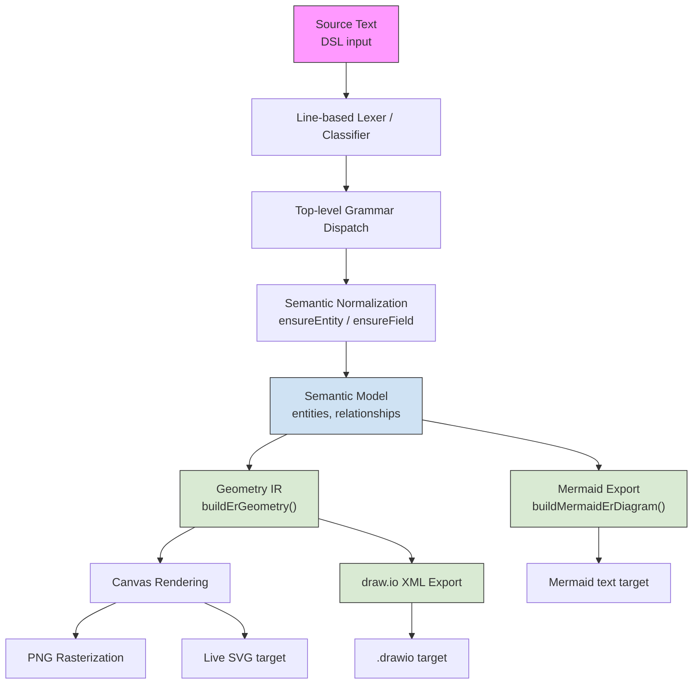

# The ER DSL Compiler Architecture

Author: Vikas Cohen  
Compiler Architect and System Designer

## 1. The philosophy behind the compiler

The ER DSL in this project is a small, declarative schema language whose purpose is to define business objects and their relationships. It is not a general-purpose programming language.

The architecture follows the broad compiler pattern: source text is classified, interpreted into a semantic model, transformed into geometry when needed, and emitted through one or more rendering back ends.

The implementation deliberately keeps the pipeline lightweight:

- the source is a line-oriented DSL,
- the grammar is shallow and flat,
- semantic interpretation happens early,
- geometry is generated only after the meaning is known,
- the final product is diagram output rather than executable code.

## 2. Why the design is reusable

The project separates concerns along natural compiler boundaries:

1. textual input,
2. syntactic recognition,
3. semantic normalization,
4. domain model construction,
5. geometry generation,
6. target rendering and export.

`parseEr()` performs recognition and early semantic work. The semantic model is a stable intermediate object, `buildErGeometry()` converts that model into diagram coordinates, and exporters such as Mermaid and draw.io consume the same underlying semantics.

The diagram geometry is not the source of truth; the semantic model is. This allows the live canvas, Mermaid export, draw.io XML export, and PNG output to share one interpretation of the source.

## 3. The compiler pipeline



Labels are quoted intentionally. Mermaid flowchart labels containing braces, parentheses, slashes, or HTML breaks can otherwise be interpreted as diagram syntax rather than label text.

## 4. Main implementation modules

### 4.1 `erDiagramLogic.js`

This is the compiler core. It owns the parser, semantic model construction, and essential domain logic.

### 4.2 `diagramStudio.js`

This provides the application host. It feeds raw DSL text into the parser and receives the semantic model and diagram data used by the editor and runtime canvas.

### 4.3 `buildErGeometry()`

This produces the geometry-oriented intermediate representation used for visual rendering, including boxes, connector routes, lane assignments, self-loop paths, and canvas bounds.

### 4.4 Export generators

The project generates Mermaid text, draw.io XML, SVG on the live canvas, and PNG through a separate rasterization step. Each target has different syntax and presentation constraints, but all depend on the same parsed semantics.

## 5. What a compiler does in this domain

The compiler:

1. reads source text,
2. recognizes entity and relationship declarations,
3. resolves them into a normalized semantic model,
4. emits diagram-oriented output for a display or export backend.

It therefore includes recognition, name and identity tracking, semantic normalization, structure building, validation, and target-specific translation, while omitting features that do not apply to this flat schema language.

## 6. Lexical analysis: scanning the text

The language is line-oriented. Each line is classified as an entity declaration, relationship declaration, blank line, comment, or invalid input. The parser effectively performs lexing and parsing in one step.

For example, entity declarations are recognized with a pattern such as:

```js
const entityMatch = line.match(/^entity\s+(\w+)\s*(:\s*(.*))?$/i);
```

Relationship declarations use a second pattern:

```js
const relMatch = line.match(/^(\w+)\.(\w+)\s*(=>|~>|->)\s*(\w+)\s*$/);
```

A full token stream is unnecessary because the DSL has no nested grammar or multi-line expression rules.

## 7. Indentation and tree construction

Indentation-based parsing and nested AST construction do not apply to the current DSL. There are no nested declarations, block scopes, or meaningful indentation levels. The architecture is intentionally flat because that reflects the actual language.

## 8. Grammar and top-level dispatch

Each line is processed by a narrow set of recognizers:

- entity pattern,
- relationship pattern,
- blank or comment pattern,
- otherwise, parse error.

This gives the implementation a simple and readable top-level dispatch structure.

## 9. Recursive descent parsing for conditions

This chapter does not apply. The ER schema language does not parse arbitrary boolean expressions, nested predicates, or condition trees. A recursive-descent condition parser would add complexity without representing any current language feature.

## 10. Name resolution and symbol tables

The parser maintains a symbol-table-like map of entities indexed case-insensitively. Conceptually, the operation is:

```js
const ensureEntity = (name) => {
  const key = name.toLowerCase();
  if (!entities.has(key)) entities.set(key, { name, fields: [] });
  return entities.get(key);
};
```

This normalizes entity names, provides stable identity, supports forward references, and allows referenced entities to be created implicitly.

## 11. Stateful interpretation and safe mutation

The semantic model is built incrementally as each line is parsed. Entities live in one map, fields are normalized consistently, duplicate relationships are discarded, and the parser does not need to undo earlier work. This is appropriate because declarations add information monotonically.

## 12. Intermediate representation and step generation

The semantic model is the primary artifact. The geometry builder creates an optional visual IR containing box positions, box sizes, connector paths, lane assignments, self-loop geometry, and canvas dimensions.

Mermaid generation can consume the semantic model directly because Mermaid performs layout itself. The canvas and draw.io exporters require the geometry IR. This provides one shared semantic model with several target-specific generators.

## 13. Semantic validation and domain-aware checks

The parser performs domain-aware validation, including case-insensitive entity matching, implicit creation of missing referenced entities, preservation of field metadata, rejection of unrecognized top-level forms, and deduplication of exact duplicate relationships.

## 14. User conditions vs record criteria: two expression languages

This chapter does not apply. The source language represents declarations rather than user conditions, record filters, or query predicates.

## 15. Applying steps and graph expansion

This chapter does not apply. The compiler does not evaluate a program step by step or expand a graph through sequential execution.

## 16. Access calculation and analysis

This chapter does not apply. The current design does not compute access control, privilege analysis, or authorization graphs.

## 17. Optimization and performance thinking

Optimization is modest and focused on rendering. Examples include deduplicating relationships, assigning lanes for overlapping connectors, clamping bounds, and reducing visual congestion in dense layouts.

## 18. Diagnostics and error recovery

The main failure modes are unrecognized lines, malformed entity declarations, malformed relationship declarations, and inconsistent semantic references. Diagnostics identify the offending line. Elaborate recovery is unnecessary for this flat and deterministic grammar.

## 19. The code-generation model in the DSL

The project has several target-generation paths:

- Mermaid export requires identifier-safe names and target type tokens,
- draw.io export writes XML with HTML label content,
- the canvas renders SVG from geometry structures,
- PNG export performs a separate rasterization step.

The semantics remain shared while each target applies its own grammar and escaping rules.

## 20. Editor integration and language services

The parser and semantic model support autocomplete for entity and field names, relationship suggestions, arrow completion, object suggestions, semantic linter hints, and import-based schema generation. The compiler is therefore a live editing substrate rather than only a batch translator.

## 21. Testing the compiler properly

The architecture supports parser recognition tests, semantic model tests, geometry layout tests, export generation tests, and end-to-end rendering tests. Semantic tests are especially important because rendering targets should consume trusted semantics rather than independently reimplementing them.

## 22. Complete example end-to-end

Consider:

```text
entity Account : Name, AnnualRevenue[Currency]
Contact.AccountId -> Account
```

The first line creates or reuses `Account`; the second creates or reuses `Contact`, adds the relationship field, and records the relationship. The resulting semantic model can then be passed to geometry generation and the selected export backend.

## 23. Extending the language

Extensions should follow the compiler pipeline:

1. syntax recognition,
2. semantic normalization,
3. model shape update,
4. geometry and visual representation,
5. export translation,
6. tests.

The semantic model should be updated before renderers are extended.

## 24. Current limitations and future improvements

The current constraints are a flat line-based grammar, no nested conditions or expressions, no separate type system, no elaborate optimization pipeline, and no extensive recovery strategy. Future improvements could add richer semantic validation, stronger diagnostics, multi-pass verification for imported schema data, additional targets, and a more explicit IR definition.

## 25. Final architecture summary

The ER DSL is a compact domain-specific compiler with lexical recognition, parsing, symbol resolution, semantic model construction, an optional intermediate representation, target generation, and diagnostics. It deliberately omits deep ASTs, nested expressions, a full type system, dedicated optimization passes, and general-purpose runtime semantics.

## 26. Design principles every compiler author can reuse

1. Match the architecture to the problem.
2. Keep the semantic model authoritative.
3. Use a lightweight front end when the grammar is simple.
4. Separate syntax from semantics.
5. Prefer stable intermediate artifacts over ad hoc mutations.
6. Design targets around grammar differences.
7. Test the compiler at the semantic layer.

## 27. Closing thought

The ER DSL is a small compiler, but it is a carefully designed translation system whose power comes from constraint, clarity, and intentional simplicity. It demonstrates that a system does not need the complexity of a general-purpose language ecosystem to benefit from compiler architecture.

Vikas Cohen  
Compiler Architect and System Designer

---

This document reflects the compiler-style architecture used in the ER DSL implementation, as a conceptual model for understanding how the source DSL is transformed into diagram output and export artifacts.
