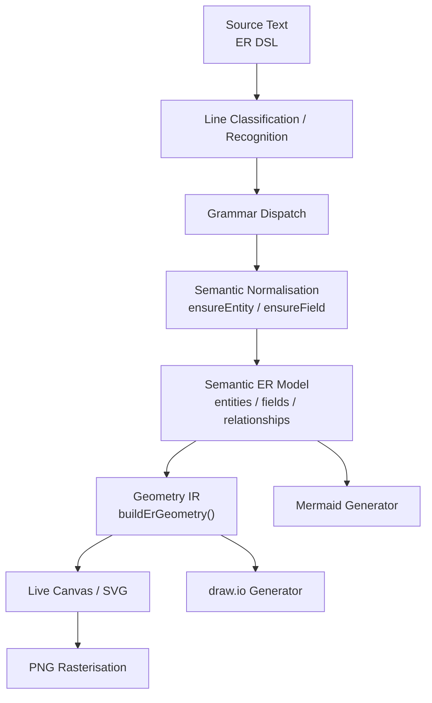

# ER DSL Compiler Architecture

**Author:** Vikas Cohen  
**Compiler Architect and System Designer**

## Overview

Salesforce ER Modeller Studio includes a lightweight compiler-style pipeline for its Entity-Relationship (ER) domain-specific language (DSL). In this document, **compiler** is used in the practical language-engineering sense: the implementation recognises source declarations, normalises their meaning into an authoritative semantic model, and generates multiple target representations from that model. It is not intended to imitate the machinery of a general-purpose native-code compiler where the grammar does not require it.

The central invariant is:

```text
Source DSL -> Semantic ER Model -> Geometry (where required) -> Renderer / Exporter
```

The semantic model owns meaning. Coordinates, connector lanes, SVG, Mermaid, draw.io XML, and PNG are derived representations. Saved coordinates are presentation state, not source semantics.

## 1. Design goals

The compiler is intentionally small and deterministic. Its goals are to:

- parse a compact, line-oriented ER language;
- represent entities, fields, metadata, and relationships consistently;
- preserve one semantic interpretation across the live canvas and exports;
- keep rendering concerns separate from language meaning;
- support forward references and predictable normalisation;
- provide a foundation for editor assistance such as completion and validation;
- remain independently testable outside the LWC presentation layer.

The grammar is currently flat: it has no nested blocks, operator precedence, expressions, or multiline declarations. A parser generator or heavyweight AST would therefore add complexity without corresponding value. If the language later gains nested syntax, expressions, aliases, or multiline constructs, the front end can evolve while retaining the semantic-model boundary.

## 2. Compiler pipeline


```mermaid
flowchart TD
    A["Source Text<br/>ER DSL"] --> B["Line Classification / Recognition"]
    B --> C["Grammar Dispatch"]
    C --> D["Semantic Normalisation<br/>ensureEntity / ensureField"]
    D --> E["Semantic ER Model<br/>entities / fields / relationships"]
    E --> F["Geometry IR<br/>buildErGeometry()"]
    E --> G["Mermaid Generator"]
    F --> H["Live Canvas / SVG"]
    F --> I["draw.io Generator"]
    H --> J["PNG Rasterisation"]
```

The main stages are:

1. split source into independent lines;
2. ignore blank lines and comments;
3. recognise entity or relationship declarations;
4. extract identifiers, operators, fields, and field metadata;
5. resolve and normalise entity/field identities;
6. build the semantic ER graph;
7. compute geometry when the target requires coordinates;
8. emit the requested target representation.

Mermaid deliberately bypasses the geometry IR because Mermaid performs its own layout. The canvas and draw.io representations require explicit geometry.

## 3. Main implementation modules

### `erDiagramLogic.js`

This is the language and diagram-logic core. It contains parsing, semantic construction, geometry generation, connector routing, Mermaid generation, draw.io generation, and related domain helpers. Keeping this logic independent of LWC state makes the important transformations directly testable.

### `diagramStudio.js`

This is the application host rather than the compiler itself. It owns editor state, interaction, resizing, persisted visual positions, and invocation of the compiler/geometry functions. It passes DSL source into `parseEr()` and presentation overrides into `buildErGeometry()`.

### `buildErGeometry()`

This function converts the semantic graph into a visual intermediate representation containing entity boxes, dimensions, visible field rows, hidden-field counts, connector paths, self-loops, lane offsets, and canvas bounds.

A critical boundary is that **geometry does not redefine semantics**. Moving an entity changes its coordinates but not its identity, fields, or relationships.

### Export generators

Each exporter consumes the appropriate derived representation:

- **Mermaid** consumes the semantic model and lets Mermaid perform layout.
- **Live canvas/SVG** consumes geometry.
- **draw.io** consumes semantic information plus geometry and emits XML.
- **PNG** is produced by rasterising the generated visual representation rather than reparsing the DSL.

No exporter should independently reinterpret the source language.

## 4. Current DSL grammar

The DSL is declarative. It describes a data model rather than an execution sequence.

An informal grammar is:

```text
program      ::= line*
line         ::= blank | comment | entity | relationship
entity       ::= "entity" identifier (":" field-list)?
relationship ::= identifier "." identifier operator identifier
operator     ::= "->" | "=>" | "~>"
field-list   ::= field ("," field)*
```

Examples:

```text
entity Account : Name, AnnualRevenue[Currency]
entity Contact : FirstName, LastName, AccountId
Contact.AccountId -> Account
```

Blank lines and lines beginning with `#` are ignored.

Recognition is deliberately narrow. Representative patterns are:

```js
const entityMatch = line.match(/^entity\s+(\w+)\s*(:\s*(.*))?$/i);
const relMatch = line.match(/^(\w+)\.(\w+)\s*(=>|~>|->)\s*(\w+)\s*$/);
```

Because declarations do not span lines, recognition and component extraction can safely happen together. There is currently no indentation-sensitive syntax.

## 5. Field metadata

Entity declarations may carry field metadata in brackets, for example:

```text
AnnualRevenue[Currency]
ExternalId__c[Text, Required]
```

The parser separates reserved markers from display/type information and normalises them into stable field properties. Unknown bracket content can be retained as metadata rather than rejected solely because it is not part of a closed type vocabulary. This is useful when representing imported Salesforce metadata.

A new field marker is not complete merely because the parser recognises it. It must survive semantic construction and every downstream consumer that needs it.

## 6. Semantic model

The semantic model is the primary intermediate representation (IR). Conceptually it resembles:

```js
{
  entities: [
    {
      name,
      fields: [/* normalised field records */]
    }
  ],
  relationships: [
    {
      childEntity,
      childField,
      parentEntity,
      kind
    }
  ]
}
```

It stores meaning rather than pixels.

Entities act as graph nodes, fields as node attributes, and relationships as typed directed edges. Downstream architecture analysis can therefore operate on the semantic graph without depending on DOM state or rendered coordinates.

## 7. Identity and name resolution

Entity identity is case-insensitive while first-seen display casing is retained. Conceptually:

```js
const ensureEntity = (name) => {
  const key = name.toLowerCase();
  if (!entities.has(key)) {
    entities.set(key, { name, fields: [] });
  }
  return entities.get(key);
};
```

This means `Account`, `account`, and `ACCOUNT` resolve to one semantic entity.

Relationship declarations can reference an entity before an explicit `entity` declaration. The compiler can create the required semantic endpoint and later merge explicit information into it. This supports forward references without requiring declaration order to carry meaning.

`ensureField()` performs the equivalent role for fields: a field receives one semantic identity and later declarations enrich that record rather than creating unrelated duplicates.

## 8. Relationship normalisation

A relationship declaration resolves:

- child entity;
- relationship field;
- relationship operator/kind;
- parent entity.

The relationship field is marked accordingly in the semantic model, and the relationship edge is stored separately for graph-oriented consumers.

Exact duplicate relationships are normalised so downstream renderers do not need to independently decide whether two identical declarations represent one or multiple edges.

Relationship meaning belongs in the semantic model. Connector lanes, curve direction, self-loop shape, and collision avoidance belong in geometry.

## 9. Geometry IR

`buildErGeometry()` creates a second intermediate representation for targets that need explicit positioning. It can contain:

- entity box positions and dimensions;
- visible field rows;
- hidden-field counts;
- connector endpoints and paths;
- parallel-edge lane assignments;
- self-loop geometry;
- canvas bounds.

This separation allows geometry algorithms to change without changing the DSL. Likewise, a parser change does not need to know how SVG paths are routed.

Persisted entity positions are inputs to presentation/layout. They are not written back into the semantic meaning of the ER source.

## 10. Target generation

### Live canvas / SVG

The live visual representation uses the semantic model plus generated geometry. Interaction such as dragging or resizing is application/presentation behaviour rather than DSL semantics.

### Mermaid

Mermaid generation operates from the semantic model. Identifier and label sanitisation occurs at the Mermaid boundary because Mermaid has its own grammar and escaping rules.

### draw.io

draw.io generation emits target-specific XML, IDs, labels, styles, and coordinates. XML escaping belongs in this generator rather than in the parser.

### PNG

PNG export is a rasterisation step over the generated visual output. It is not another DSL parser or semantic implementation.

The rule across all targets is simple: **interpret once, render many times**.

## 11. Diagnostics

The parser must reject or report source that cannot be recognised safely rather than silently inventing a plausible data model.

Useful diagnostics identify, where available:

- the offending source line;
- the nature of the malformed declaration;
- what syntax was expected;
- enough context for the editor to guide correction.

The current synchronous parsing model can use exception-style failure where appropriate. If richer language-service behaviour is introduced, diagnostics can evolve toward structured records such as:

```js
{
  severity,
  line,
  column,
  code,
  message
}
```

That evolution does not require changing the semantic-model contract.

## 12. Editor and IntelliSense integration

Editor assistance should reuse the same language rules as compilation rather than maintaining a second interpretation of the DSL.

The semantic model can support:

- entity completion;
- field completion;
- relationship suggestions;
- relationship-operator completion;
- field metadata hints;
- lint/diagnostic feedback;
- import assistance.

Context-sensitive completion can use cursor position. For example, after `Contact.` the editor can suggest fields, while after a relationship operator it can suggest known entities.

Parser, completion, diagnostics, and rendering must agree on identity and case-normalisation rules.

## 13. Performance characteristics

The DSL does not require conventional executable-code optimisation passes such as constant folding or dead-code elimination. Relevant costs are instead:

- source scanning and recognition;
- semantic-model construction;
- geometry calculation;
- browser/DOM rendering;
- target generation and rasterisation.

Line recognition and map-based entity lookup are naturally efficient for the expected workload. Geometry can be more expensive because it handles routing, lane fan-out, self-loops, bounds, and presentation constraints.

Performance measurements should distinguish parser time from geometry, rendering, and export time. Optimising the wrong layer can otherwise add complexity without improving the user-visible bottleneck.

## 14. Testing strategy

Tests should be layered around architectural boundaries.

### Parsing and recognition

Verify valid declarations, comments, blank lines, malformed syntax, field metadata, and all relationship operators.

### Semantic normalisation

Verify case-insensitive identity, forward references, field merging, relationship-field metadata, and duplicate-edge behaviour.

### Geometry

Verify positive dimensions, connector endpoints, parallel relationships, self-relationships, lane routing, saved-position handling, and canvas bounds.

### Target generation

Verify Mermaid escaping/identifiers, draw.io XML escaping and coordinates, SVG behaviour, and PNG generation boundaries.

### End-to-end behaviour

Verify that one DSL source produces semantically consistent representations across the live canvas and supported exports.

High-value invariants include:

- one semantic entity per normalised identity;
- no unintended exact duplicate relationship edges;
- semantic meaning is unchanged by coordinates;
- geometry has valid dimensions;
- self-loops are non-degenerate;
- exporters do not reinterpret the DSL independently.

## 15. End-to-end example

Source:

```text
entity Account : Name, AnnualRevenue[Currency]
Contact.AccountId -> Account
```

Processing is conceptually:

```text
Source
  |
  v
Recognise entity declaration
  |
  +--> Account
  |     +--> Name
  |     +--> AnnualRevenue [Currency]
  |
Recognise relationship declaration
  |
  +--> ensure Contact
  +--> ensure Contact.AccountId
  +--> resolve Account
  +--> create relationship edge
  |
  v
Semantic ER Model
  |
  +--> Geometry --> Canvas / draw.io --> visual output
  |
  +--> Mermaid generator --> Mermaid output
```

The relationship declaration can create `Contact` and `AccountId` even if `Contact` was not explicitly declared earlier. Later declarations enrich the same semantic records.

No backend reparses the original DSL to discover what the relationship means.

## 16. Extending the DSL safely

When adding syntax or semantics, work from the model outward:

1. define the new syntax and ambiguity rules;
2. update recognition/parsing;
3. normalise the feature into explicit semantic-model properties;
4. update stable defaults and downstream consumers;
5. update geometry if the feature affects visual structure;
6. update every relevant exporter;
7. update editor completion/diagnostics where applicable;
8. add positive, negative, semantic, geometry, and export tests;
9. document compatibility implications.

Avoid implementing a language feature only inside one renderer. That creates multiple competing interpretations of the DSL.

## 17. Architecture boundaries

Several product capabilities intentionally sit outside the DSL compiler.

**Salesforce metadata acquisition** discovers objects and fields before they are represented in the DSL/model. It is not parsing.

**Field Usage Intelligence** analyses dependencies such as Apex, Trigger, Flow, LWC, Aura, validation rules, and formulas. It is an analysis subsystem, not part of DSL syntax.

**Architecture Intelligence** can analyse the resulting semantic graph, but its metrics do not alter what the DSL means.

**Security analysis** and authorisation are separate domains and must not be inferred merely from structural relationships.

Keeping these boundaries explicit prevents the parser from becoming a catch-all service layer.

## 18. Current limitations and evolution points

The current language is deliberately small. It has:

- a flat line-oriented grammar;
- no nested expressions;
- no block scope;
- no conventional executable instruction stream;
- no closed Salesforce type system;
- limited error recovery compared with a full language server.

Potential future improvements include structured source-range diagnostics, strict/permissive parsing modes, a formal Salesforce type registry, schema/version markers, stable semantic IDs, incremental parsing, and broader cross-backend conformance tests.

A token stream or AST should be introduced only when new grammar complexity justifies it. Architecture should follow the language rather than forcing the language into a fashionable compiler structure.

## 19. Architecture summary

The ER DSL compiler is intentionally lightweight:

```text
DSL source
   |
   v
Recognition / parsing
   |
   v
Semantic normalisation
   |
   v
Authoritative ER graph
   |-----------------------|
   v                       v
Geometry IR             Mermaid
   |
   +--> Canvas / SVG
   +--> draw.io
   +--> PNG pipeline
```

Its most important properties are:

1. **One authoritative semantic model.**
2. **Case-normalised entity and field identity.**
3. **Presentation state separated from source meaning.**
4. **Geometry separated from parsing.**
5. **Target-specific escaping and generation at target boundaries.**
6. **No duplicate parser hidden inside exporters or UI code.**
7. **Tests aligned to architectural boundaries.**
8. **Complexity added only when the grammar requires it.**

## 20. Closing principle

The implementation is best understood as a small, purpose-built DSL compiler rather than a general-purpose compiler. Its job is not to produce machine code; its job is to turn concise ER declarations into one reliable semantic representation from which Salesforce ER Modeller Studio can consistently render, analyse, and export the model.

That simplicity is an architectural choice, not an absence of architecture.
